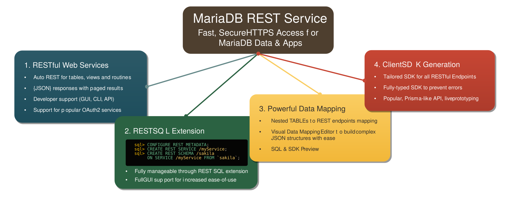
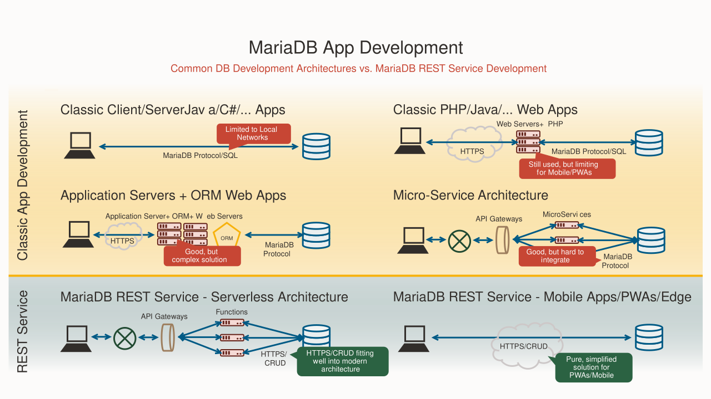

# MariaDB REST Service

The MariaDB REST Service (MRS) gives client applications fast and secure HTTPS access to the data stored in MariaDB Server. You define REST services and their endpoints for tables, views, procedures, functions, and static files, and the MariaDB REST Daemon serves them as RESTful web services that exchange JSON documents.

You define and manage REST services with REST SQL, an extension of SQL that runs in MariaDB Shell, or with the graphical editors of MariaDB Shell for VS Code. MRS also generates type-safe client SDKs for your REST services.

```sql
CONFIGURE REST METADATA;

CREATE REST SERVICE /myService;
CREATE REST SCHEMA /sakila ON SERVICE /myService FROM `sakila`;
CREATE REST VIEW /city ON SERVICE /myService SCHEMA /sakila
    AS `sakila`.`city`;
```

To try MRS hands-on, follow the [Quickstart](quickstart/README.md), or look at the MRS Notes example application in [Examples](developer-guide/examples.md#mrs-notes-example).

## What Is the MariaDB REST Service

MRS is a JSON document store solution that gives fast and secure HTTPS access to data stored in MariaDB Server. It focuses on ease of use, support of standards, and high performance.

MRS consists of four building blocks that together form an integrated solution for JSON document-based application development:

1. RESTful web services
2. The REST SQL extension
3. Powerful data mapping
4. Client SDK generation



### Benefits

- AutoREST endpoints for relational and document-oriented data, which you enable with a few clicks or one statement.
- The MariaDB REST Daemon serves the REST endpoints directly, so you need no additional middleware.
- A high-performance web server that serves RESTful web services as well as Progressive Web Apps (PWAs).
- Vertical scaling (scaling up) as well as horizontal scaling (scaling out) through the number of MariaDB REST Daemon instances.

### Experience

- Integration with MariaDB Shell for VS Code, with point-and-click, WYSIWYG editors and live querying of REST endpoints in TypeScript.
- The REST SQL extension in MariaDB Shell for scripting and for integration into your development process.
- Client SDK generation for popular languages, which makes project integration easier.
- Support for a local development environment and debugging.

### Features

- REST endpoints for database tables, views, procedures, and functions, in addition to static content such as PWAs.
- Built-in authentication, authorization (MariaDB accounts, MRS accounts, OAuth2), and session management.
- The REST SQL extension, which defines REST services and endpoints directly in SQL scripts.
- Client SDK generation with built-in support for authentication and document operations.

## Application Use Cases

### Applications That Use the MariaDB REST Service

MRS exposes RESTful web services over HTTPS for the data stored in MariaDB Server. This makes MRS a good choice for the following use cases:

- Mobile applications and Progressive Web Apps (PWAs) that access data across the public internet.
- Document-oriented applications that work with JSON documents rather than relational data.
- Extending existing applications with microservices.
- Offering REST endpoints to serverless architecture deployments.



### Applications That Use a MariaDB Connector

Connecting through the MariaDB client/server protocol with a MariaDB Connector is the established way to build high-performance database applications. Prefer a connector for the following use cases:

- Applications that need direct SQL access to the database.
- Applications that work with relational tables rather than JSON documents.
- Applications that do not benefit from an optimistic, ETag-based concurrency model.

## Feature Overview

| Feature | Description |
| --- | --- |
| REST service lifecycle management | Shared development of new REST services, and publishing of production-ready REST services. |
| AutoREST | Enabling REST access to a table, view, or procedure makes it available through RESTful services. AutoREST is a quick way to expose database tables as REST resources. |
| REST data mapping views | REST data mapping views combine the advantages of relational schemas with the ease of use of document databases. Your data is organized both relationally and hierarchically. |
| Serving static content | In addition to dynamic content from AutoREST, you can upload static content such as HTML, CSS, and image files. This feature does not replace dedicated HTTP servers with capabilities like server-side programming, but it speeds up the deployment of prototypes and proofs of concept. |
| End user authentication | MRS supports several authentication methods: MRS authentication specific to a REST service, MariaDB internal authentication with MariaDB accounts, and OAuth2 authentication (Sign in with Facebook and Google). |
| End user authorization | Built-in support for row-level security, role-based security, user-hierarchy-based security, group-based security, group-hierarchy-based security, and custom authorization. |
| REST service SDK generation | Live SDK updates for interactive prototyping in TypeScript, and SDK generation for application development. |

### About REST APIs

Representational State Transfer (REST) is a style of software architecture for distributed hypermedia systems such as the World Wide Web. An API is RESTful when it conforms to the principles of REST. A full discussion of REST is outside the scope of this documentation, but a REST API has the following characteristics:

- Data is modeled as a set of resources. Resources are identified by URIs.
- A small, uniform set of operations manipulates resources, for example PUT, POST, GET, and DELETE.
- A resource can have multiple representations, for example a blog can have an HTML representation and an RSS representation.
- Services are stateless. Since the client is likely to access related resources, the representation that the service returns identifies them, typically with hypertext links.

## Requirements

* **MariaDB Server** with the MRS metadata schema `mariadb_rest_service`. MariaDB Shell creates and updates this schema with the [CONFIGURE REST METADATA](rest-sql-reference/rest-metadata.md#configure-rest-metadata) statement. The same server holds the data of your REST applications.
* **The MariaDB REST Daemon**, which serves the REST endpoints and static content defined in the metadata schema over HTTPS. See [Architecture](architecture.md) and [Running the MariaDB REST Daemon](developer-guide/configuring-mrs.md#running-the-mariadb-rest-daemon).
* **MariaDB Shell**, which runs the REST SQL statements that configure MRS and define REST services, and generates client SDKs. See [MariaDB Shell](../mariadb-shell/README.md).
* Optionally, **MariaDB Shell for VS Code**, which adds graphical editors for REST services and starts a local MariaDB REST Daemon for development.


The installation and bootstrap of the MariaDB REST Daemon are documented with its release.


## In This Section




[Quickstart](quickstart/README.md)




A hands-on walkthrough: set up MRS, define REST endpoints for the sakila sample database, and access them.






[Architecture](architecture.md)




The building blocks of MRS, and how development and production deployments are set up.






[Developer Guide](developer-guide/README.md)




How to configure MRS, add and deploy REST services, map data, serve static content, and secure your endpoints.






[REST SQL Reference](rest-sql-reference/README.md)




The syntax of every REST SQL statement that MariaDB Shell runs to define and manage REST services.






[Core REST API](rest-api/README.md)




The core REST APIs of MRS endpoints: authentication, queries, and the filter grammar.






[Client SDK](client-sdk/README.md)




How to generate and use the TypeScript and Python client SDKs for your REST services.


