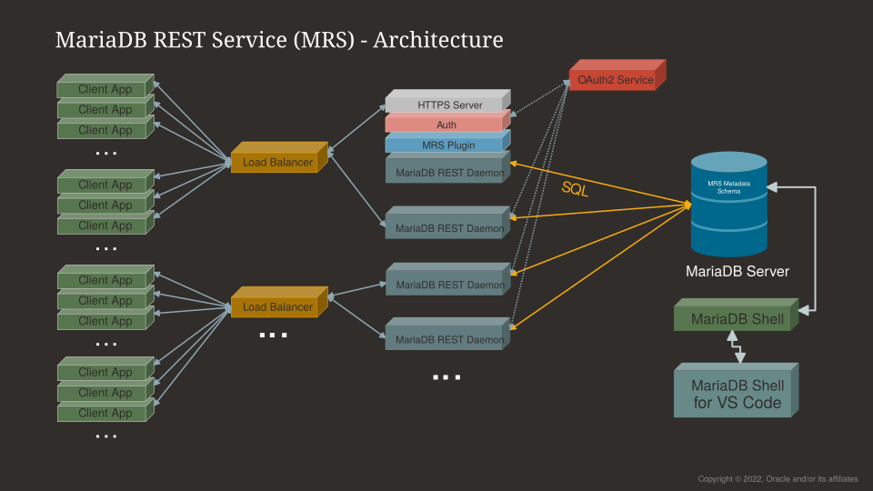

# Architecture

## Building Blocks

The MariaDB REST Service (MRS) consists of the following components:

- **MariaDB Server**
  - Holds the metadata schema `mariadb_rest_service`, which stores the MRS configuration: REST services, their endpoints, authentication apps, and users.
  - Holds the data of the REST applications.
- **The MariaDB REST Daemon**
  - One or more instances serve the HTTPS REST interface. Each instance reads the REST services and endpoints from the metadata schema and registers itself in it, so that [SHOW REST DAEMONS](rest-sql-reference/rest-daemons.md#show-rest-daemons) lists it.
  - Each instance runs either in development mode or in production mode.
- **MariaDB Shell and MariaDB Shell for VS Code**
  - Run the [REST SQL](rest-sql-reference/README.md) statements that configure MRS and manage REST endpoints.
  - Manage MRS through a graphical user interface (GUI) in VS Code.
  - Generate client SDKs for a REST service.

## Development Setup

Keep two types of setups apart when you work with MRS:

1. **A local development setup**, which you use to develop new REST services. It consists of:
   - A local MariaDB Shell installation, which connects to the server and runs REST SQL statements.
   - A local MariaDB REST Daemon, running in development mode.
2. **The production deployment**, which serves the REST services that have been published. It consists of:
   - The MariaDB Server that holds the metadata schema and the data of the REST applications.
   - One or more MariaDB REST Daemon instances, running in production mode.

Each of these setups serves a different set of REST services, depending on the [lifecycle state](developer-guide/adding-rest-services.md#rest-service-lifecycle-management) of each REST service.

The recommended way to set up an MRS development environment is [VS Code](https://code.visualstudio.com/) or [VSCodium](https://vscodium.com/) with the MariaDB Shell for VS Code extension installed. The extension takes care of tasks such as installing the HTTPS certificates and starting a MariaDB REST Daemon in development mode.

## Deployments

You can deploy MRS in different ways, depending on the requirements of your project.

### Deployments for Development

The smallest possible development environment consists of a single MariaDB Server instance and a MariaDB REST Daemon running on the same machine. See the [Quickstart](quickstart/setting-up.md) for how to set it up with VS Code.

### Production Deployments

In a production environment, run several MariaDB REST Daemon instances against the MariaDB Server that holds the metadata schema. Use a load balancer to expose the HTTPS port of the MariaDB REST Daemon instances to the public internet.


The installation and bootstrap of the MariaDB REST Daemon are documented with its release.

