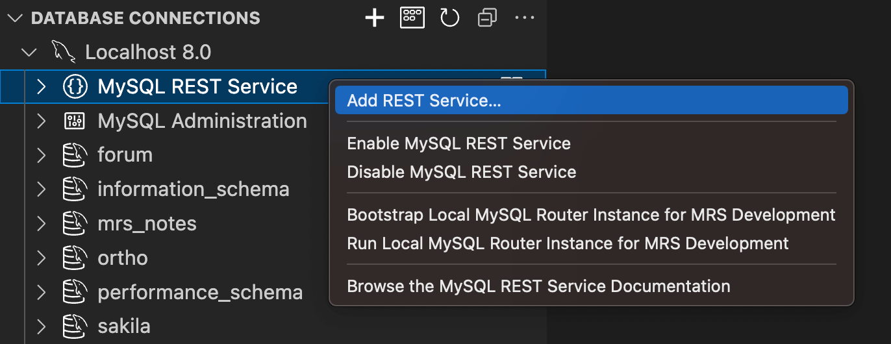
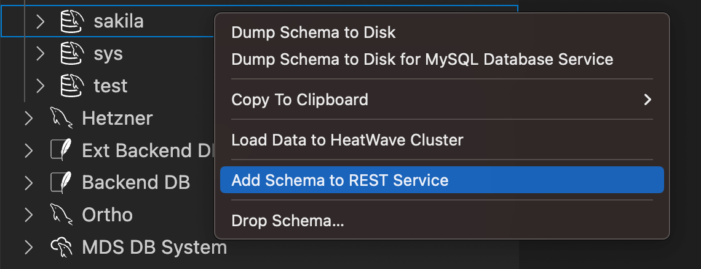
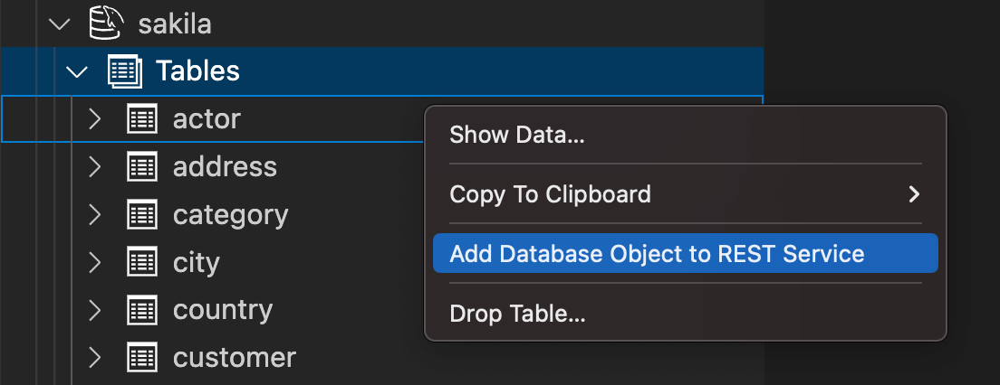

# Adding REST Services and Database Objects

The MariaDB REST Service (MRS) supports any number of REST services. Each REST service has its own URL path, authentication options, and other settings, and exposes a selected list of REST schemas and REST objects, which map to database schemas and database objects.

Set up a separate REST service for each application that consumes a set of REST endpoints.

## REST Service Lifecycle Management

A REST service goes through several states during its lifecycle.

### Development State

A new REST service is visible to developers only. In this state, you add REST schemas and objects, grant privileges, and test the REST endpoints.

To access REST services in development state, you need a MariaDB REST Daemon instance in developer mode. This setup is called a [development setup](../architecture.md#development-setup).

### Published State

When a REST service is ready, you publish it by setting the corresponding flag on the REST service. A published REST service is accessible to all authenticated clients.

### Disabled State

To retire a REST service, disable it by setting the corresponding flag on the REST service.

## Preconditions for Adding a REST Service

Before you set up a REST service, make sure that:

- MRS is configured on the MariaDB Server. See [Configuring MRS](configuring-mrs.md).
- The MariaDB account that you connect with has the `mysql_rest_service_admin` role or a superset of its privileges.

To grant the `mysql_rest_service_admin` role and make it the account's default role, run the following statements:

```sql
GRANT 'mysql_rest_service_admin' TO 'user_account'@'%';
SET DEFAULT ROLE mysql_rest_service_admin FOR 'user_account'@'%';
```

## Setting Up a New REST Service

You add a REST service in one of the following ways:

- MariaDB Shell for VS Code provides a dialog that creates the REST service.
- MariaDB Shell runs the [REST SQL](../rest-sql-reference/README.md) statements, for example `CREATE REST SERVICE`, in SQL mode.
- Python scripts and plugins for MariaDB Shell run the same statements with `session.run_sql()`.

### Adding a REST Service Using MariaDB Shell for VS Code

When MRS is configured on a server, its DB connection in the DATABASE CONNECTIONS view shows the tree item **MariaDB REST Service** when expanded.

1. Right-click the **MariaDB REST Service** tree item and select **Add REST Service...** to open the REST service dialog.
2. Enter the required values and click **OK** to add the REST service.



### Adding a REST Service Using MariaDB Shell

MariaDB Shell runs the [`CREATE REST SERVICE`](../rest-sql-reference/rest-services.md#create-rest-service) statement in SQL mode, like any SQL statement:

```sql
CREATE REST SERVICE /myService
    COMMENT "My first REST service";
```

In Python mode, a script runs the same statement with `session.run_sql()`:

```python
session.run_sql("CREATE REST SERVICE /myService COMMENT 'My first REST service'")
```

## REST Service Definitions

### About MRS AutoREST

AutoREST is a quick way to expose the tables, views, and procedures of a database schema as REST resources.

### REST APIs

Representational State Transfer (REST) is a style of software architecture for distributed hypermedia systems such as the World Wide Web. An API is RESTful when it conforms to the tenets of REST. A full discussion of REST is outside the scope of this guide, but a REST API has the following characteristics:

- Data is modeled as a set of resources. Resources are identified by URIs.
- A small, uniform set of operations manipulates the resources, for example PUT, POST, GET, and DELETE.
- A resource can have multiple representations. For example, a blog can have an HTML representation and an RSS representation.
- Services are stateless. Since the client is likely to access related resources, the representation that a service returns identifies them, typically with hypertext links.

### RESTful Services Terminology

This guide uses the following terms:

- **RESTful service:** An HTTP web service that conforms to the tenets of the RESTful architectural style.
- **Resource module:** An organizational unit that groups related resource templates.
- **Resource template:** An individual RESTful service that serves requests for a set of URIs (Uniform Resource Identifiers). The URI pattern of the resource template defines the set of URIs.
- **URI pattern:** A pattern for the resource template. It is either a route pattern or a URI template. Route patterns are recommended.
- **Route pattern:** A pattern that decomposes the path portion of a URI into its component parts. For example, the pattern `/:object/:id?` matches `/emp/101`, a request for the item with the id 101 in the `emp` resource, and also matches `/emp/`, a request for the `emp` resource, because the `?` modifier makes the `:id` parameter optional.
- **HTTP operation:** HTTP (HyperText Transfer Protocol) defines standard methods on resources: GET retrieves the resource contents, POST stores a new resource, PUT updates an existing resource, and DELETE removes a resource.

## Adding a Database Schema to a REST Service

For each database schema, you can create a REST schema and add it to a REST service. To add the same database schema to several REST services, create a REST schema for it in each of them.

You create a REST schema with MariaDB Shell for VS Code or with MariaDB Shell.


Adding a database schema as a REST schema does not expose its tables and views through the REST service. It makes MRS aware that the schema exists and that it can have REST objects to expose over HTTPS.


### Preconditions for Adding Database Schemas and Objects

Before you add REST schemas and objects, make sure that:

- The REST service exists. See [Setting Up a New REST Service](#setting-up-a-new-rest-service).
- The MariaDB account that you connect with has the `mysql_rest_service_schema_admin` role or a superset of its privileges.

To grant the `mysql_rest_service_schema_admin` role and make it the account's default role, run the following statements:

```sql
GRANT 'mysql_rest_service_schema_admin' TO 'user_account'@'%';
SET DEFAULT ROLE mysql_rest_service_schema_admin FOR 'user_account'@'%';
```

### Adding a Schema with REST SQL

In MariaDB Shell, run the [`CREATE REST SCHEMA`](../rest-sql-reference/rest-schemas.md#create-rest-schema) statement with the database schema in its `FROM` clause.

The following example adds a REST schema for the `sakila` database schema to the REST service `/myService`:

```sql
CREATE OR REPLACE REST SCHEMA /sakila ON SERVICE /myService
    FROM `sakila`
    COMMENT "The sakila schema";
```

### Adding a Schema Using MariaDB Shell for VS Code

1. Right-click the schema in the DATABASE CONNECTIONS view and select **Add Schema to REST Service**. A dialog with all REST schema settings opens.
2. Click **OK** to add the schema.



## Adding a Table, View, or Procedure

When you add database objects such as tables, views, or procedures to MRS, they become accessible through RESTful web services. The database schema that holds the objects must be added as a REST schema first.

The following figure shows a REST schema and its REST objects:


Tables and views are added as [REST data mapping views](rest-data-mapping-views.md), stored procedures as REST procedures.


REST data mapping views let application developers take a document-centric approach to their applications. See [REST Data Mapping Views](rest-data-mapping-views.md) for their advantages.


You add database objects with MariaDB Shell for VS Code or with MariaDB Shell.

### Adding a Database Object with REST SQL

In MariaDB Shell, run the [`CREATE REST VIEW`](../rest-sql-reference/rest-views.md#create-rest-view) statement to add a table or view as a REST object, and the [`CREATE REST PROCEDURE`](../rest-sql-reference/rest-routines.md#create-rest-procedure) statement to add a stored procedure.

The following example adds a REST data mapping view for the table `sakila.city`:

```sql
CREATE REST VIEW /city
ON SERVICE /myService SCHEMA /sakila
AS `sakila`.`city` {
    cityId: city_id @SORTABLE,
    city: city,
    countryId: country_id,
    lastUpdate: last_update
}
AUTHENTICATION REQUIRED;
```

The next example adds a REST procedure for the stored procedure `sakila.film_in_stock`:

```sql
CREATE OR REPLACE REST PROCEDURE /filmInStock
AS `sakila`.`film_in_stock`
PARAMETERS {
    pFilmId: p_film_id @IN,
    pStoreId: p_store_id @IN,
    pFilmCount: p_film_count @OUT
}
RESULT MyServiceSakilaFilmInStock {
    inventoryId: inventory_id @DATATYPE("int")
}
AUTHENTICATION REQUIRED;
```

### Adding a Database Object Using MariaDB Shell for VS Code

1. Right-click the database object in the DATABASE CONNECTIONS view and select **Add Database Object to REST Service**. The [REST object dialog](vs-code-dialog-reference.md#mrs-object-dialog) opens.
2. Adjust the REST object settings.
3. Click **OK** to add the database object.


