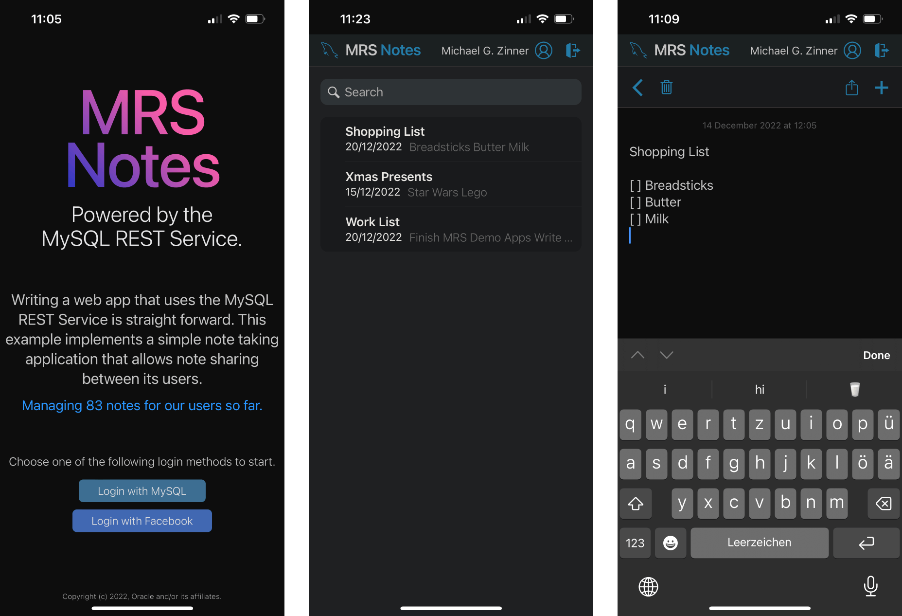
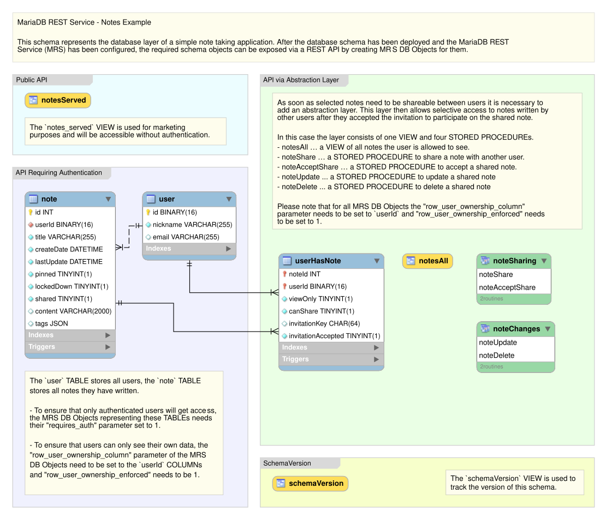

# Examples

The mrs plugin of MariaDB Shell comes with example projects that show what you can build with the MariaDB REST Service (MRS). You find them in the [examples folder](https://github.com/mariadb-corporation/mariadb-shell-plugins/tree/main/mrs_plugin/examples) of the repository.

- **MRS Notes** implements a simple [progressive web app (PWA)](https://en.wikipedia.org/wiki/Progressive_web_app) that shows the features of MRS.
- **MRS Scripts** is a set of MRS scripts, including two examples of server-side rendering of HTML pages.

## MRS Notes Example

The [MRS Notes example](https://github.com/mariadb-corporation/mariadb-shell-plugins/tree/main/mrs_plugin/examples/mrs_notes) is a simple note-taking application, built as a progressive web app, in which users share notes with each other.



### Developer Showcase

The example shows the following features:

- Accessing MRS REST endpoints from JavaScript and TypeScript code.
- Using the authentication REST endpoints of an MRS service for user management.
- Using [JSON Web Tokens (JWT)](https://jwt.io/) to manage user sessions.

### Quick Guide

To set up, build, and deploy the MRS Notes example, follow these steps. The sections below describe the example in more detail.

1. Save the [`mrs_notes`](https://github.com/mariadb-corporation/mariadb-shell-plugins/tree/main/mrs_plugin/examples/mrs_notes) project folder to disk and open it in VS Code.
2. [Configure MRS](configuring-mrs.md) on your MariaDB Server.
3. Create a REST service, for example `/myService`. See [Adding REST Services](adding-rest-services.md).
4. Deploy the `mrs_notes` database schema with the script `db_schema/mrs_notes.sql`. See [Deploying the Database Schema](#deploying-the-database-schema).
5. Load the REST schema definition `mrs_schema/mrsNotes.mrs.json` into the REST service.
6. Make sure that a MariaDB REST Daemon instance is running. See [Running the MariaDB REST Daemon](configuring-mrs.md#running-the-mariadb-rest-daemon).
7. Build and deploy the app, as described in [Deploying the App](#deploying-the-app).


`mrsNotes.mrs.json` is a REST schema dump in the JSON format of earlier MRS releases. Neither REST SQL nor the functions of the mrs plugin load this format. If your tools can't load it, create the REST schema and its objects for the `mrs_notes` schema with REST SQL, as described in [Adding REST Services and Database Objects](adding-rest-services.md).


### Deploying the App

The MRS Notes project implements a TypeScript app in which users create, change, and share notes.

1. If you haven't done so in the quick guide, save the `mrs_notes` project folder to disk and open it in VS Code.
2. In the **NPM SCRIPTS** view of the sidebar, right-click `package.json` and select **Run Install**. Alternatively, run `npm install` in the **TERMINAL** tab to install the required node modules.
3. In the **NPM SCRIPTS** view, run the `build` script of `package.json`. It creates the folder `dist` with all files needed for the deployment.
4. Right-click the `dist` folder in the folders view and select **Upload Folder to MariaDB REST Service**.
5. In the REST content set dialog, set the **Request Path** of the app, for example `/app`, and click **OK** to upload the files to the REST service.
6. Open the full path of the app in a web browser, for example `https://localhost:8443/myService/app/index.html`.

Instead of steps 4 and 5, you can upload the `dist` folder with `mrs.load.content_set()` in MariaDB Shell. See [Static Content and MRS Scripts](static-content-and-mrs-scripts.md#serving-a-web-app).

### Deploying the Database Schema

The `mrs_notes` database schema is the center of the project. It defines the structure of the data, and its tables store all the information that the users enter in the app.

To create the schema, run the SQL script `db_schema/mrs_notes.sql` with MariaDB Shell or with MariaDB Shell for VS Code. On the command line, run the following command in the `mrs_plugin` directory:

```sh
mariadb-shell dba@localhost --sql -f examples/mrs_notes/db_schema/mrs_notes.sql
```

### Database Schema Diagram

The following diagram shows all components of the `mrs_notes` schema:



The most important table is `note`. It stores all notes that the users create.

The `user` table holds the nickname of each user, and the email address that receives the invitations to shared notes.

The `user_has_note` table manages the sharing of notes between users.

To make notes shareable between users, the schema adds an abstraction layer. It gives a user access to notes written by other users after the user has accepted the invitation to a shared note. The layer consists of one view and four stored procedures:

- `notes_all`: a view of all notes the user is allowed to see.
- `note_share`: a stored procedure that shares a note with another user.
- `note_accept_share`: a stored procedure that accepts a shared note.
- `note_update`: a stored procedure that updates a shared note.
- `note_delete`: a stored procedure that deletes a shared note.

## MRS Scripts Example

The [MRS Scripts example](https://github.com/mariadb-corporation/mariadb-shell-plugins/tree/main/mrs_plugin/examples/mrs_scripts) implements a set of simple MRS scripts, including two examples of server-side rendering with MRS.

### Quick Guide

To set up, build, and deploy the MRS Scripts example, follow these steps:

1. Save the [`mrs_scripts`](https://github.com/mariadb-corporation/mariadb-shell-plugins/tree/main/mrs_plugin/examples/mrs_scripts) project folder to disk and open it in VS Code.
2. [Configure MRS](configuring-mrs.md) on your MariaDB Server.
3. Create a REST service, for example `/myService`. See [Adding REST Services](adding-rest-services.md).
4. Make sure that a MariaDB REST Daemon instance is running. See [Running the MariaDB REST Daemon](configuring-mrs.md#running-the-mariadb-rest-daemon).
5. Build and deploy the MRS scripts, as described in the next section.

### Deploying the MRS Scripts

The MRS scripts are written in TypeScript, so you build them before you upload them to MRS:

1. If you haven't done so in the quick guide, save the `mrs_scripts` project folder to disk and open it in VS Code.
2. In the **NPM SCRIPTS** view of the sidebar, right-click `package.json` and select **Run Install**. Alternatively, run `npm install` in the **TERMINAL** tab to install the required node modules.
3. In the **NPM SCRIPTS** view, run the `build` script of `package.json`. It creates the folder `build` with all files needed for the deployment.
4. Right-click the background below the last file in the folders view and select **Upload Folder to MariaDB REST Service**.
5. In the REST content set dialog, make sure that the **Enable MRS Scripts** checkbox is selected, and click **OK** to upload the files to the REST service.
6. Open a page of the example in a web browser, for example `https://localhost:8443/myService/testScripts/preactTestPage.html`.

### Deploying the MRS Scripts with MariaDB Shell

Instead of MariaDB Shell for VS Code, you can upload the built project with the `mrs.load.content_set()` function of MariaDB Shell. It uploads the project folder to a content set and registers the MRS scripts. See [Static Content and MRS Scripts](static-content-and-mrs-scripts.md#mrs-scripts).

```sh
mariadb-shell dba@localhost --py -e 'mrs.load.content_set(directory="~/path_to_project_folder/mrs_scripts", content_set_path="/mrsScriptsContent", service_path="/myService", replace=True)'
```
