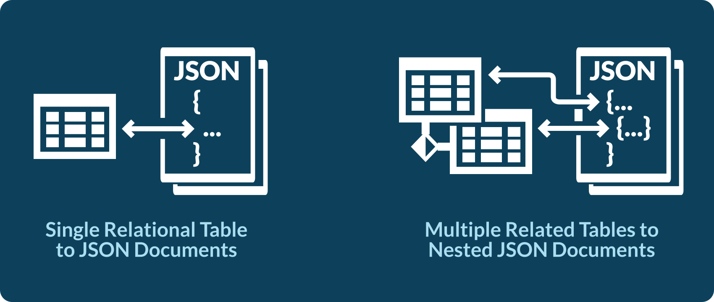
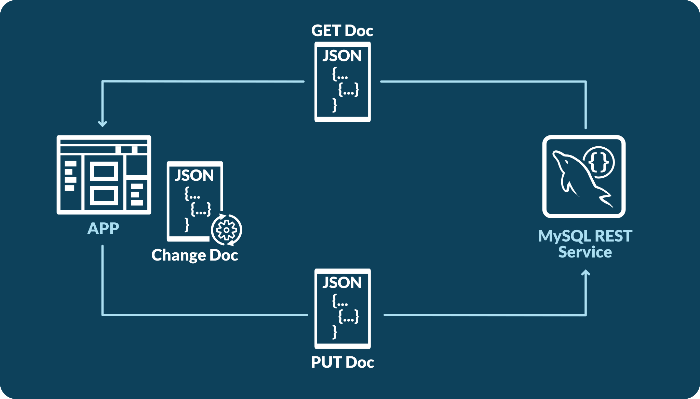
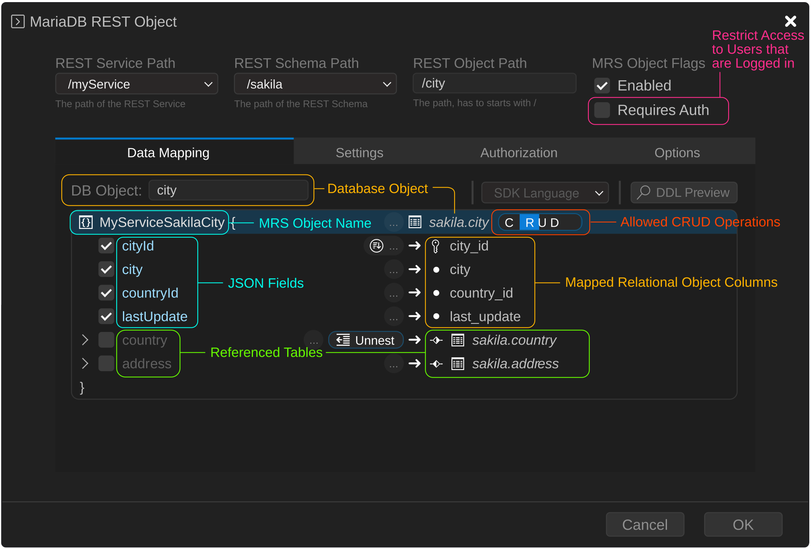
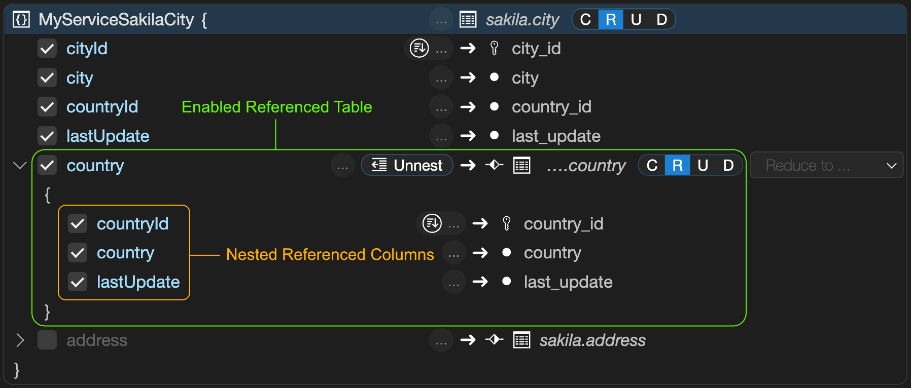
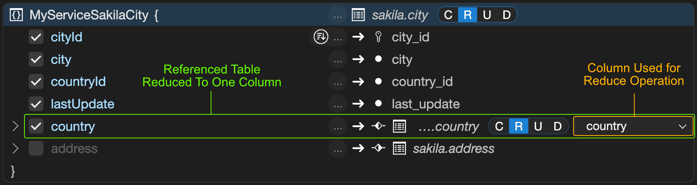

# REST Data Mapping Views

## Introduction to REST Data Mapping Views

REST data mapping views combine the advantages of relational schemas with the ease of use of document databases. Your data is organized both relationally and hierarchically. You can base different REST data mapping views on the same tables, providing different JSON hierarchies over the same, shared data. Applications can access (create, query, modify) the same data as a collection of JSON documents or as a set of related tables and columns, and use both approaches at the same time.

### Use Cases

The MariaDB REST Service (MRS) supports REST data mapping views for both the relational use case (1) and the document-centric use case (2):

1. Make a single relational table or view available through a REST endpoint.
    - Exposes the rows of a table as a set of **flat** JSON documents.
    - Lets the application take a traditional relational approach where needed.
2. Create a single REST endpoint for a set of related tables.
    - Exposes the related tables as **nested** JSON objects inside a set of JSON documents.
    - Lets the application take a document-oriented approach.

The following figure shows the two use cases:



### REST Data Mapping View Workflow

You create REST data mapping views with the [`CREATE REST VIEW`](../rest-sql-reference/rest-views.md#create-rest-view) statement or [interactively in the REST object dialog](#interactive-rest-view-design) of MariaDB Shell for VS Code.

Once a REST data mapping view exists, the following workflow applies:

- GET a document from the REST data mapping view.
- Make the changes you need to the document, including changes to the nested JSON objects.
- PUT the document back into the REST data mapping view.

The next figure shows a typical JSON document update cycle:



The database detects the changes in the new document and modifies the underlying rows, including all nested tables. All REST data mapping views that share the same data reflect the change immediately. Unlike with traditional document databases, you don't have to worry about inconsistencies.

## Lock-Free Optimistic Concurrency Control

REST data mapping views can be updated concurrently without locks. MRS computes a checksum, called ETag, for each object fetched from the database and includes it in the returned object, in the `_metadata.etag` field.

When the client submits the object back to MRS with PUT, MRS compares the ETag of the original object with the current one. If the rows of the object have changed since it was fetched, the ETags don't match, and the request fails with HTTP status code 412. The client then fetches the object again and resubmits its update based on the current version of the object.

The checksum includes all fields of the source row and of all joined rows, even filtered fields. To exclude a field from the checksum, give it the `@NOCHECK` annotation.

### Example

`GET /myService/sakila/city/1` returns the following JSON document to the client:

```json
{
    "city": "A Corua (La Corua)",
    "links": [
        {
            "rel": "self",
            "href": "/myService/sakila/city/1"
        }
    ],
    "cityId": 1,
    "country": {
        "country": "Spain",
        "countryId": 87,
        "lastUpdate": "2006-02-15 04:44:00.000000"
    },
    "countryId": 87,
    "lastUpdate": "2006-02-15 04:45:25.000000",
    "_metadata": {
        "etag": "FFA2187AD4B98DF48EC40B3E807E0561A71D02C2F4F5A3B953AA6CB6E41CAD16"
    }
}
```

The client changes the city name to `A Coruña (La Coruña)` and submits the object with `PUT /myService/sakila/city/1`:

```json
{
    "city": "A Coruña (La Coruña)",
    "links": [
        {
            "rel": "self",
            "href": "/myService/sakila/city/1"
        }
    ],
    "cityId": 1,
    "country": {
        "country": "Spain",
        "countryId": 87,
        "lastUpdate": "2006-02-15 04:44:00.000000"
    },
    "countryId": 87,
    "lastUpdate": "2006-02-15 04:45:25.000000",
    "_metadata": {
        "etag": "FFA2187AD4B98DF48EC40B3E807E0561A71D02C2F4F5A3B953AA6CB6E41CAD16"
    }
}
```

If the object changed between the `GET` and the `PUT` request, for example because another user updated it, the ETag check fails, and the PUT returns the error `412 Precondition Failed`.

## Interactive REST View Design

You can write [`CREATE REST VIEW`](../rest-sql-reference/rest-views.md#create-rest-view) statements by hand, but it is often easier to design REST data mapping views in a visual editor.

MariaDB Shell for VS Code includes the REST object dialog with a **Data Mapping** designer, in which you build even complex, nested REST data mapping views within seconds. The **DDL Preview** button shows the REST SQL statement for the REST data mapping view as you design it.

### Building a REST Data Mapping View

A REST data mapping view for a single table or view is straightforward. When you [add the table in MariaDB Shell for VS Code](adding-rest-services.md#adding-a-database-object-using-mariadb-shell-for-vs-code), the REST data mapping view is created with all columns of the table in a **flat** JSON object.



This is equal to a [`CREATE REST VIEW`](../rest-sql-reference/rest-views.md#create-rest-view) statement without a GraphQL definition, which also adds all columns of the table as a **flat** JSON object:

```sql
CREATE OR REPLACE REST VIEW /city
AS `sakila`.`city`
AUTHENTICATION REQUIRED;

SHOW CREATE REST VIEW /city;
```

```text
+-----------------------------------------------+
| CREATE REST VIEW                              |
+-----------------------------------------------+
| CREATE OR REPLACE REST VIEW /city             |
|     ON SERVICE /myTestService SCHEMA /sakila  |
|     AS sakila.city {                          |
|         cityId: city_id,                      |
|         city: city,                           |
|         countryId: country_id,                |
|         lastUpdate: last_update               |
|     }                                         |
|     AUTHENTICATION REQUIRED;                  |
+-----------------------------------------------+
```


To access the REST object without authentication, clear the **Requires Auth** checkbox in the REST object dialog, or use the `AUTHENTICATION NOT REQUIRED` clause in the REST SQL statement. Do this only during development or for a REST endpoint that is meant to be public.


#### Enabling CRUD Operations

By default, only the READ operation is enabled, as the highlighted `R` next to the table shows, so the REST object accepts only read requests. In the REST object dialog, toggle each of the letters `C` (Create), `R` (Read), `U` (Update), and `D` (Delete) to enable or disable the operation.

In REST SQL, you enable the operations with annotations:

```sql
CREATE OR REPLACE REST VIEW /city
AS `sakila`.`city` @INSERT @UPDATE @DELETE
AUTHENTICATION REQUIRED;
```

The following table maps the CRUD operations to SQL operations:

| Letter | CRUD Operation | SQL Operation |
| --- | --- | --- |
| C | CREATE | INSERT |
| R | READ | SELECT |
| U | UPDATE | UPDATE |
| D | DELETE | DELETE |

### Creating a Nested REST Data Mapping View

When you enable a referenced table, its columns are included as a nested object in the JSON result. This works with 1:1 and 1:n relationships.



The result is the following:

```text
GET /myService/sakila/city/1
```

```json
{
    "city": "A Corua (La Corua)",
    "links": [
        {
            "rel": "self",
            "href": "/myService/sakila/city/1"
        }
    ],
    "cityId": 1,
    "country": {
        "country": "Spain",
        "countryId": 87,
        "lastUpdate": "2006-02-15 04:44:00.000000"
    },
    "countryId": 87,
    "lastUpdate": "2006-02-15 04:45:25.000000",
    "_metadata": {
        "etag": "FFA2187AD4B98DF48EC40B3E807E0561A71D02C2F4F5A3B953AA6CB6E41CAD16"
    }
}
```

### Creating a REST Data Mapping View with an Unnested Referenced Table

To add a column of the referenced table to the level above instead, select it in the **Unnest...** drop-down list. The referenced table is then reduced to that column.



The result is the following:

```text
GET /myService/sakila/city/1
```

```json
{
    "city": "A Corua (La Corua)",
    "links": [
        {
            "rel": "self",
            "href": "/myService/sakila/city/1"
        }
    ],
    "cityId": 1,
    "country": "Spain",
    "countryId": 87,
    "lastUpdate": "2006-02-15 04:45:25.000000",
    "_metadata": {
        "etag": "48889BABCBBA1491D25DFE0D7A270FA3FDF8A16DA8E44E42C61759DE1F0D6E35"
    }
}
```

### REST View Object Identifiers

When a REST view maps to a table, the primary key of the table is the identifier of the REST documents. If the table has a composite primary key, the identifier is a comma-separated string of the values of the primary key columns.

```sql
CREATE TABLE IF NOT EXISTS sakila.my_table (id1 INT, id2 INT, name VARCHAR(3), PRIMARY KEY (id1, id2));
INSERT INTO sakila.my_table VALUES (1, 1, "foo");

CREATE OR REPLACE REST VIEW /myTable
    AS `sakila`.`my_table` @UPDATE;
```

To retrieve a specific REST document, use its identifier:

```text
GET /myService/sakila/myTable/1,1
```

```json
{
    "id1": 1,
    "id2": 1,
    "links": [
        {
            "rel": "self",
            "href": "/myService/sakila/myTable/1,1"
        }
    ],
    "name": "foo",
    "_metadata": {
        "etag": "48819BABCBBA1491DBBDFE0D7A270FA3FDF8A16DA8E44E42C61759DE1F0D6A38"
    }
}
```

To update a specific REST document, use its identifier as well:

```text
PUT /myService/sakila/myTable/1,1
{
    "id1": 1,
    "id2": 2,
    "name": "bar"
}
```

```json
{
    "id1": 1,
    "id2": 1,
    "links": [
        {
            "rel": "self",
            "href": "/myService/sakila/myTable/1,1"
        }
    ],
    "name": "bar",
    "_metadata": {
        "etag": "48819BABCBBA1491DBBDFE0D7A270FA3FDF8A16DA8E44E4AA62559DE1F0D6A42"
    }
}
```

A table without a primary key has no identifier, so you can't access or modify specific documents through its REST view. The same applies to a database view, which has no concept of a primary key. In both cases, the REST view needs an explicit mapping between its fields and the columns that identify a document:

- For a table, map one or more REST view fields to the identifying table columns.
- For a database view, map **all** primary key columns of every table that the view uses. The view must include these columns in its result set.

You mark the identifying fields with the `@KEY` annotation:

```sql
CREATE TABLE IF NOT EXISTS sakila.my_table (id1 INT, id2 INT, name VARCHAR(3));

CREATE OR REPLACE REST VIEW /myTable
AS `sakila`.`my_table` @UPDATE {
    id1: id1 @KEY,
    id2: id2 @KEY,
    name: name
};
```
