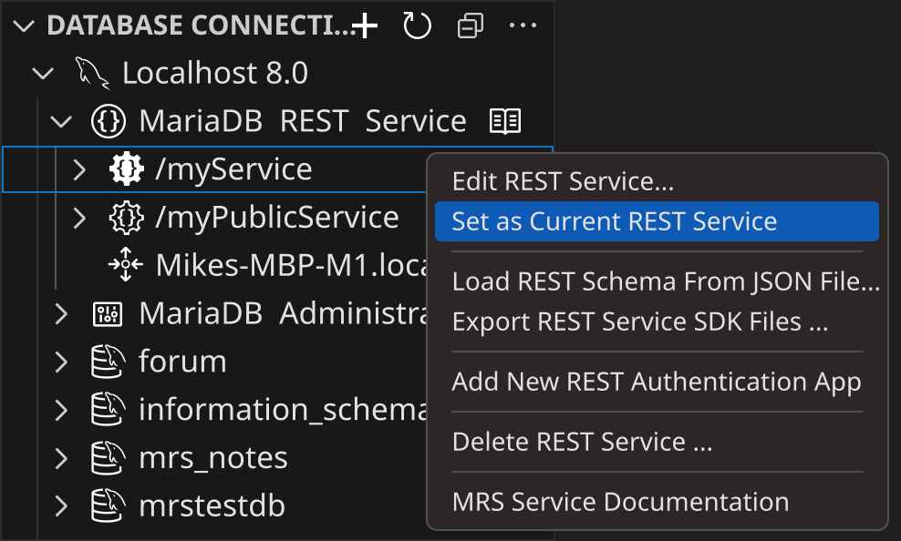

# Working Interactively with REST Services

MariaDB Shell for VS Code features a live, interactive workflow for designing REST services of the MariaDB REST Service (MRS). You test new or changed REST data mapping views and REST procedures right away, with the MRS TypeScript client API in a DB Notebook.


The interactive workflow needs a MariaDB REST Daemon instance that serves the REST services in development. See [Running the MariaDB REST Daemon](configuring-mrs.md#running-the-mariadb-rest-daemon) and [Development Setup](../architecture.md#development-setup).


## Switching to TypeScript Mode

When you open a database connection in MariaDB Shell for VS Code, the DB Notebook opens. If it is in SQL mode, switch it to TypeScript mode with `\ts`.


## Choosing a REST Service

To work with a REST service in a DB Notebook, set it as the current REST service. This is similar to the SQL statement `USE db_name`, which sets the current database schema.

To get information about the current REST service, call the `mrs.getStatus()` function of the global `mrs` object. It prints the MRS status. The current REST service has the property `isCurrent` set to `true`.

```typescript
ts> mrs.getStatus();
{
    "configured": true,
    "info": "2 REST services available.",
    "services": [
        {
            "serviceName": "myService",
            "url": "https://localhost:8443/myService",
            "isCurrent": true
        },
        {
            "serviceName": "myPublicService",
            "url": "https://localhost:8443/myPublicService",
            "isCurrent": false
        }
    ]
}
```

Once a current REST service is set, the [MRS TypeScript client API](../client-sdk/typescript-client-api.md) for it is generated on the fly and made available to the TypeScript code blocks of the DB Notebook.

You access the current REST service through a global variable with the name that `mrs.getStatus()` lists in the `serviceName` property. The `serviceName` is derived from the URL context root of the REST service, converted to camel case without slashes. For example, a REST service with the URL context root `/myService` is accessible as `myService`.

```typescript
ts> myService.url;
https://localhost:8443/myService
```

You set the current REST service in a DB Notebook with TypeScript, or in the VS Code user interface.

### Setting the Current REST Service with TypeScript

The global `mrs` object has a property for each available REST service, named after its `serviceName`, as described in the previous section.

To make a REST service the current one, call its `setAsCurrent()` function. VS Code auto-completion helps you select the `serviceName`.

```typescript
ts> mrs.myPublicService.setAsCurrent();
```


The new current REST service is available only after the whole TypeScript code block has run, with `Cmd+Return` on macOS or `Ctrl+Return` on Linux and Windows. The change goes through an asynchronous message pipeline that can't be awaited, so the methods of the new current REST service don't work in the same code block that changes it.


### Setting the Current REST Service in VS Code

In the DATABASE CONNECTIONS view of VS Code's primary sidebar, expand the DB connection and its **MariaDB REST Service** tree item, right-click the REST service, and select **Set as Current REST Service**.



The current REST service has a solid, filled icon. All other REST services have an outlined icon.

## Authentication

If REST objects require authentication and the REST service has a REST authentication app, call the `authenticate()` function of the REST service's client API object. It shows a login dialog, in which you enter the credentials of a user account.

```typescript
ts> myService.authenticate();
```


The `authenticate()` function works only with the built-in `MRS` authentication vendor. Use this vendor for the REST authentication app.


## Querying a REST Object

The following examples use a REST view on the table `sakila.city`.

```typescript
ts> myService.sakila.city.findFirst();
{
   "city": "A Corua (La Corua)",
   "cityId": 1,
   "countryId": 87,
   "lastUpdate": "2006-02-15 04:45:25.000000",
}
```

You can select fields and add a conditional `where` clause. See the [MRS client SDK](../client-sdk/README.md) for more information.

```typescript
ts> myService.sakila.city.find({select: ["city", "cityId"], where: {city: {$like: "NE%"}}});
[
    {
        "city": "Newcastle",
        "cityId": 364,
    },
    {
        "city": "Nezahualcyotl",
        "cityId": 365,
    }
]
```

To edit a REST object in the [REST object dialog](vs-code-dialog-reference.md#mrs-object-dialog), call its `edit()` function. The function is available in DB Notebooks only.

```typescript
ts> myService.sakila.city.edit()
```
