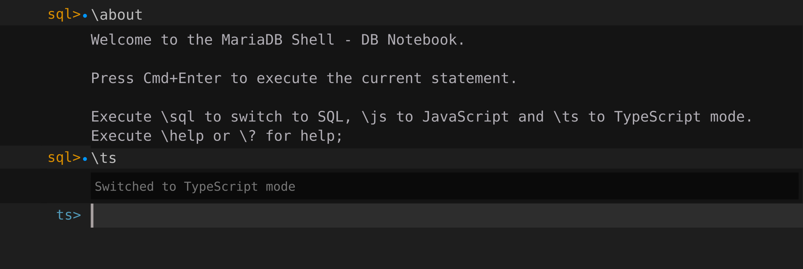

# Accessing REST Endpoints

The MariaDB REST Service (MRS) serves REST endpoints through a MariaDB REST Daemon. While you develop a REST service, make sure that a [MariaDB REST Daemon runs in development mode](setting-up.md#starting-a-mariadb-rest-daemon-for-development).

## Web Browser Access

To access a REST endpoint, expand the REST service entry in the `DATABASE CONNECTIONS` tree view until you reach the REST object. Right-click the `city` REST endpoint and select `Open REST Object Request Path in Web Browser` from the context menu.

A web browser opens the REST endpoint URL `https://localhost:8443/myService/sakila/city` and shows the JSON document that the REST endpoint returns for the GET method.


The port number in the URL depends on the internal ID of the DB connection and is different for each connection.


```json
{
    "items": [
        {
            "city": "A Coruña (La Coruña)",
            "links": [
                {
                    "rel": "self",
                    "href": "/myService/sakila/city/1"
                }
            ],
            "cityId": 1,
            "countryId": 87,
            "lastUpdate": "2006-02-15 04:45:25.000000",
            "_metadata": {
                "etag": "09785343A8A790724C995E20AE6844EA2A78E9CFD57BE64063B2FC56E12D8FFC"
            }
        },
        {
            "city": "Abha",
            "links": [
                {
                    "rel": "self",
                    "href": "/myService/sakila/city/2"
                }
            ],
            "cityId": 2,
            "countryId": 82,
            "lastUpdate": "2006-02-15 04:45:25.000000",
            "_metadata": {
                "etag": "B069A2EEC4663506F97019A369BD77AB086A9BA5FB1DD224C36B67CF687A6B14"
            }
        },
        ...
    ],
    "limit": 25,
    "offset": 0,
    "hasMore": true,
    "count": 25,
    "links": [
        {
            "rel": "self",
            "href": "/myService/sakila/city/"
        },
        {
            "rel": "next",
            "href": "/myService/sakila/city/?offset=25"
        }
    ]
}
```

## TypeScript Prompt

MariaDB Shell for VS Code supports an interactive workflow to prototype REST access in TypeScript.

When you open a database connection in MariaDB Shell for VS Code, the DB Notebook opens. If it is in SQL mode, switch it to TypeScript mode with `\ts`.



First, check the status of MRS with the `mrs.getStatus()` command. Since the automatically generated client SDK is fully type-safe, auto-completion supports you all the way.

```typescript
ts> mrs.getStatus();
{
    "configured": true,
    "info": "1 REST service available.",
    "services": [
        {
            "serviceName": "myService",
            "url": "https://localhost:8443/myService",
            "isCurrent": true
        }
    ]
}
```

Next, run a `findFirst()` operation on the `/myService/sakila/city` endpoint to fetch the first city in the list. Again, auto-completion guides you.

```typescript
ts> myService.sakila.city.findFirst();
{
    "city": "A Coruña (La Coruña)",
    "cityId": 1,
    "countryId": 87,
    "lastUpdate": "2006-02-15 04:45:25.000000"
}
```

To search for a specific city, use the `find()` method with a `where` clause.

```typescript
ts> myService.sakila.city.find({where: {city: { '$like': 'Van%'}}})
[
    {
        "city": "Vancouver",
        "cityId": 565,
        "countryId": 20,
        "lastUpdate": "2006-02-15 04:45:25.000000"
    }
]
```

The client SDK provides many more methods. See the [SDK Cheat Sheet](../client-sdk/README.md#sdk-cheat-sheet) for details.

## Access with curl

Instead of a web browser, you can access the REST endpoint with any other HTTP client.

`curl` is a popular tool to fetch data over HTTP from the command line. It is installed by default on macOS and is available for Linux and Windows.

To access the `city` REST endpoint, run the following command in a terminal. The `jq` tool formats the JSON data.

```sh
curl -s "https://localhost:8443/myService/sakila/city" | jq
```

```json
{
  "items": [
    {
      "city": "A Coruña (La Coruña)",
      "links": [
        {
          "rel": "self",
          "href": "/myService/sakila/city/1"
        }
      ],
      "cityId": 1,
      "countryId": 87,
      "lastUpdate": "2006-02-15 04:45:25.000000",
      "_metadata": {
        "etag": "09785343A8A790724C995E20AE6844EA2A78E9CFD57BE64063B2FC56E12D8FFC"
      }
    },
    {
      "city": "Abha",
      "links": [
        {
          "rel": "self",
          "href": "/myService/sakila/city/2"
        }
      ],
      "cityId": 2,
      "countryId": 82,
      "lastUpdate": "2006-02-15 04:45:25.000000",
      "_metadata": {
        "etag": "B069A2EEC4663506F97019A369BD77AB086A9BA5FB1DD224C36B67CF687A6B14"
      }
    },
    ...
  ],
  "limit": 25,
  "offset": 0,
  "hasMore": true,
  "count": 25,
  "links": [
    {
      "rel": "self",
      "href": "/myService/sakila/city/"
    },
    {
      "rel": "next",
      "href": "/myService/sakila/city/?offset=25"
    }
  ]
}
```

To run a find operation, add the `q` parameter. To learn more about the syntax of the core REST APIs, see [Core REST API](../rest-api/README.md).

```sh
url=https://localhost:8443/myService/sakila/city
curl -s "$url?q=$(echo '{"city":{"$like":"Van%"}}'|jq -sRr @uri)" | jq
```

```json
{
  "items": [
    {
      "city": "Vancouver",
      "links": [
        {
          "rel": "self",
          "href": "/myService/sakila/city/565"
        }
      ],
      "cityId": 565,
      "countryId": 20,
      "lastUpdate": "2006-02-15 04:45:25.000000",
      "_metadata": {
        "etag": "E5162E0999E4A016B8AEA25FE6E5C79C6F171B3A207B4143C20B1D3380C6BABA"
      }
    }
  ],
  "limit": 25,
  "offset": 0,
  "hasMore": false,
  "count": 1,
  "links": [
    {
      "rel": "self",
      "href": "/myService/sakila/city/"
    }
  ]
}
```

## Deploying a Web App

MRS serves static files in addition to dynamic data from database schemas. You can use this to upload a Progressive Web App (PWA) and have the MariaDB REST Daemon serve it, so you need no additional web server.

One popular PWA is the OpenAPI Web UI, also called [Swagger UI](https://github.com/swagger-api/swagger-ui). It provides a user-friendly interface to work with REST endpoints based on their OpenAPI definition.

To deploy an OpenAPI Web UI for the REST service that you created before, right-click the REST service entry in the `DATABASE CONNECTIONS` view and select `Deploy OpenAPI Web UI` from the context menu.


This operation needs an internet connection that can reach `github.com`.


The `MRS Content Set` dialog opens. Leave all settings unchanged and click `OK`.

The extension downloads the OpenAPI Web UI from `github.com`, adds a dark mode, and enables authentication with MRS. When the operation is complete, a notification reports that the MRS static content set has been added and how many files have been uploaded.

In the `DATABASE CONNECTIONS` view, right-click the `/openApiUi` REST content set entry under the REST service and select `Open Content Set Request Path in Web Browser` from the context menu.

A web browser opens the URL `https://localhost:8443/myService/openApiUi/` and shows the OpenAPI Web UI for `/myService`, which gives you access to the HTTP methods of the `/myService/sakila/city` endpoint.


To upload a directory of static files such as your own web app as a content set, use the `mrs.load.content_set()` function of MariaDB Shell. See [Static Content and MRS Scripts](../developer-guide/static-content-and-mrs-scripts.md).

