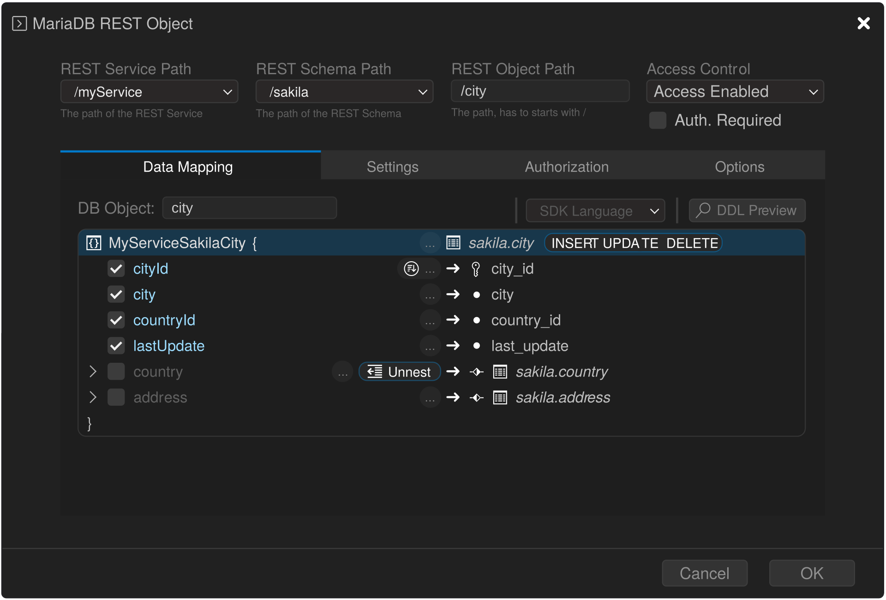

# Defining REST Endpoints

After you configure a MariaDB Server for MariaDB REST Service (MRS) support, you can define REST services and their endpoints. You can do this in the graphical user interface of the MariaDB Shell for VS Code extension, or with the REST SQL extension of MariaDB Shell.

## Deploying the Sakila Schema

The rest of this quickstart uses the sakila sample database. To follow along, install it:

1. Get the scripts of the sakila sample database, `sakila-schema.sql` and `sakila-data.sql`.
2. In the `DATABASE CONNECTIONS` view in the Primary Side Bar, right-click the DB connection entry `MRS Development` that you created before. Select `Load SQL Script from Disk...` from the context menu and select the `sakila-schema.sql` script.
3. After the script has loaded, click the first lightning bolt in the toolbar to execute the full script. Watch the output until it reports that the script execution has completed and all statements were executed successfully.
4. Select `Load SQL Script from Disk...` again, select the `sakila-data.sql` script, and execute it the same way.

The `sakila` schema now appears in the `DATABASE CONNECTIONS` view in the Primary Side Bar as a child entry of the `MRS Development` connection.

## Creating a REST Service

To create a REST service, right-click the `MariaDB REST Service` child entry of the `MRS Development` connection in the `DATABASE CONNECTIONS` view in the Primary Side Bar, and select `Add REST Service...`.


The REST service dialog opens. You can set a REST service path and a REST service name, or accept the default `/myService` for now.

MRS creates the REST service without publishing it, and links the REST authentication app `MRS` to it by default. To allow logins with MariaDB accounts as well, link the authentication app that uses MariaDB internal authentication (vendor `MySQL Internal`). [SHOW REST AUTH APPS](../rest-sql-reference/rest-authentication.md#show-rest-auth-apps) lists the authentication apps.

Click `OK` to create the REST service.

The new REST service appears as a child of the `MariaDB REST Service` entry in the tree view.

### Creating a REST Service with REST SQL

Instead of the graphical user interface, you can create the REST service with the [CREATE REST SERVICE](../rest-sql-reference/rest-services.md#create-rest-service) statement:

```sql
CREATE OR REPLACE REST SERVICE /myService
    ADD AUTH APP 'MRS';
```

## Adding a REST Endpoint

After you create a REST service, you can add REST endpoints to it. A REST endpoint can serve a table, a view, a procedure, or a function of a database schema, or static files.

In the `DATABASE CONNECTIONS` view in the Primary Side Bar, expand the `sakila` schema entry and its `Tables` entry under the DB connection.

Right-click the `city` table and select `Add Database Object to REST Service` from the context menu.


A notification in the lower-right area of the window asks the following question:

```text
The database schema sakila has not been added to the REST service.
Do you want to add the schema now?
```

Before you add an object of a database schema as a REST endpoint, you must add its database schema to the REST service as a REST schema. Click `Yes` to add the database schema as a REST schema.

The REST object dialog opens.



The dialog shows the full request path of the REST endpoint, which consists of the `REST Service Path`, the `REST Schema Path`, and the `REST Object Path`. In this case, the path is `/myService/sakila/city`.


For this quickstart, the REST endpoint does not require authentication. Turn off the `Auth. Required` option in the `Access Control` section in the upper-right area of the dialog.


The `Data Mapping` tab shows how the JSON fields map to the table columns. You can rename JSON fields or add referenced tables as nested JSON documents. See [REST Data Mapping Views](../developer-guide/rest-data-mapping-views.md) for details.

To allow write access through the REST endpoint, click the `INSERT`, `UPDATE`, and `DELETE` buttons next to the database schema name.

Click `OK` to create the REST endpoint.

### Adding a REST Endpoint with REST SQL

You can do the same with REST SQL. First, add the database schema to the REST service as a REST schema with [CREATE REST SCHEMA](../rest-sql-reference/rest-schemas.md#create-rest-schema):

```sql
CREATE OR REPLACE REST SCHEMA /sakila ON SERVICE /myService
    FROM `sakila`;
```

Then add the `sakila.city` table with [CREATE REST VIEW](../rest-sql-reference/rest-views.md#create-rest-view):

```sql
CREATE OR REPLACE REST VIEW /city ON SERVICE /myService SCHEMA /sakila
    AS `sakila`.`city` @INSERT @UPDATE @DELETE
    AUTHENTICATION NOT REQUIRED;
```
