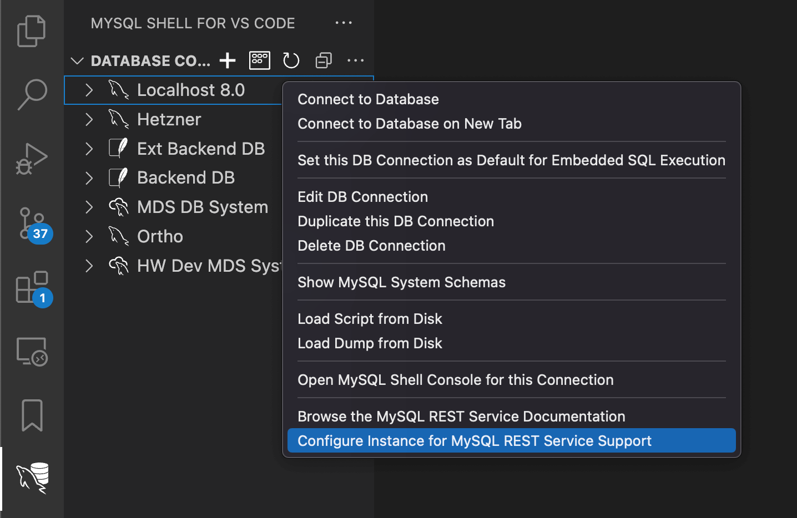

# Setting Up the MariaDB REST Service

To get started with the MariaDB REST Service (MRS), you need a MariaDB Server. This guide uses a local MariaDB Server installation. If you have an existing MariaDB Server, you can use it instead.

## Setting Up a Local MariaDB Server

Install MariaDB Server for your operating system as described in the [MariaDB Server documentation](https://mariadb.com/docs/server/). Alternatively, deploy a local [sandbox instance](../../mariadb-shell/sandbox-instances.md) with MariaDB Shell, for example `sandbox.deploy(3310, {"password": "..."})` in Python mode.

After the server is installed, make sure that it is running and that you can connect to it with the MariaDB Shell for VS Code extension.

## Setting Up VS Code

The recommended way to set up an MRS development environment is [VS Code](https://code.visualstudio.com/) or [VSCodium](https://vscodium.com/) with the MariaDB Shell for VS Code extension installed.

After you install VS Code, select the Extensions icon in the Activity Bar on the left-hand side, enter `MariaDB Shell`, and click the `Install` button.

To use VSCodium, first [enable the Microsoft Marketplace](#enabling-the-microsoft-marketplace-on-vscodium). Then select the Extensions icon in the Activity Bar on the left-hand side, enter `MariaDB Shell`, and click the `Install` button.

### MariaDB Shell Welcome Wizard

When you launch the MariaDB Shell for VS Code extension for the first time, it shows a Welcome Wizard. Follow its steps to configure the extension.

If you run into an issue, reset the extension: open the VS Code Command Palette and select `Reset MariaDB Shell for VS Code Extension`, or select the corresponding context menu item of the `DATABASE CONNECTIONS` view in the Primary Side Bar.

### Adding a DB Connection

After you configure the extension, select its icon in the VS Code Activity Bar on the left-hand side. Then click the `DB Connection Overview` entry in the `OPEN EDITORS` view in the Primary Side Bar.

On the `DB Connection Overview` page, click the `New Connection` tile in the `Database Connections` list. The `Database Connection Configuration` dialog opens.

1. Choose a `Caption` for the new DB connection, for example `MRS Development`.
2. Set the `User Name` to `root`.
3. Click `OK` to create the DB connection.

A new DB connection tile appears in the `DB Connection Overview`, and a new DB connection entry appears in the `DATABASE CONNECTIONS` view in the Primary Side Bar.

### Opening a DB Connection

Click the new tile to open the database connection. Enter the password and select whether to store it.

A new `DB Notebook` page opens with an SQL prompt.

## Configuring MariaDB Server for MRS

You configure MRS support explicitly on a MariaDB Server before you can use it. The configuration creates the metadata schema `mysql_rest_service_metadata`, which holds all information about the REST services and their endpoints.

You can configure MRS either in the MariaDB Shell for VS Code extension or with the REST SQL extension of MariaDB Shell. See [Configuring MRS](../developer-guide/configuring-mrs.md) for details.

### Configuring MRS in MariaDB Shell for VS Code

In the `DATABASE CONNECTIONS` view in the Primary Side Bar, right-click the DB connection entry `MRS Development` that you created above. Select `Configure Instance for MariaDB REST Service Support` from the context menu. The `MariaDB REST Service` dialog opens.



In the dialog, enter a `REST User Name` and a `REST User Password`. The password must have at least 8 characters and contain a lowercase letter, an uppercase letter, a number, and a special character. You can use this REST user later to log in to REST services.

Click `OK` to configure the instance for MRS support.

After the configuration, a new `MariaDB REST Service` child entry appears when you expand the DB connection entry in the `DATABASE CONNECTIONS` view in the Primary Side Bar.

### Configuring MRS with REST SQL

Instead of the dialog, you can run REST SQL statements in the DB Notebook in SQL mode, or in MariaDB Shell in SQL mode. [CONFIGURE REST METADATA](../rest-sql-reference/rest-metadata.md#configure-rest-metadata) creates the metadata schema. The REST user belongs to a REST authentication app with the vendor `MRS`, which [CREATE REST AUTH APP](../rest-sql-reference/rest-authentication.md#create-rest-auth-app) creates, and [CREATE REST USER](../rest-sql-reference/rest-users-and-roles.md#create-rest-user) adds the user to it.

```sql
CONFIGURE REST METADATA;

CREATE REST AUTH APP IF NOT EXISTS 'MRS' VENDOR MRS;
CREATE REST USER 'restUser'@'MRS' IDENTIFIED BY '********';
```

To check the configuration, run [SHOW REST STATUS](../rest-sql-reference/rest-metadata.md#show-rest-status):

```sql
SHOW REST STATUS;
```

## Assigning REST User Privileges

Use the `root` account for configuration only. For general administrative and development tasks, create dedicated MariaDB accounts.

### DBA Account

The following statements create a database administrator account named `dba` with full privileges on all databases. To limit the account to some databases, change the `GRANT ALL ON *.*` statement accordingly.

```sql
CREATE USER 'dba'@'%' IDENTIFIED BY '********';
GRANT ALL ON *.* TO 'dba'@'%' WITH GRANT OPTION;
```

After you create the account, update the DB connection and replace the `User Name` `root` with `dba`. To do this, right-click the DB connection entry and select `Edit DB Connection`.

### Granting REST Service Admin Privileges

To make a MariaDB account a REST service administrator, grant it the `mysql_rest_service_admin` role. Make the role the account's default role, so that it is active when the account connects.

```sql
GRANT mysql_rest_service_admin TO 'dba'@'%';
SET DEFAULT ROLE mysql_rest_service_admin FOR 'dba'@'%';
```


The `mysql_rest_service_admin` role exists only after you configure the server for MRS support.


MRS provides several roles to manage fine-grained access for administrators and developers. See [MRS User Roles](../developer-guide/configuring-mrs.md#mrs-user-roles) for details.

## Starting a MariaDB REST Daemon for Development

When you develop REST services, run a local MariaDB REST Daemon in development mode. It lets you test the REST services you are working on locally, without publishing them on the production systems. See [REST Service Lifecycle Management](../developer-guide/adding-rest-services.md#rest-service-lifecycle-management) for details.

To start a local MariaDB REST Daemon in development mode, right-click the `MariaDB REST Service` entry of the DB connection and select the item that starts a local MariaDB REST Daemon from the context menu.

A terminal opens and shows the log output of the MariaDB REST Daemon in real time. This log output helps you debug REST endpoints.

To check that the daemon has registered itself in the metadata, run [SHOW REST DAEMONS](../rest-sql-reference/rest-daemons.md#show-rest-daemons):

```sql
SHOW REST DAEMONS;
```


The installation and bootstrap of the MariaDB REST Daemon are documented with its release.


## Enabling the Microsoft Marketplace on VSCodium

To use extensions from the Microsoft Marketplace in [VSCodium](https://vscodium.com/), create a configuration file:

1. Open an editor of your choice and paste the following content:

    ```json
    {
        "nameShort": "Visual Studio Code",
        "nameLong": "Visual Studio Code",
        "extensionsGallery": {
            "serviceUrl": "https://marketplace.visualstudio.com/_apis/public/gallery",
            "cacheUrl": "https://vscode.blob.core.windows.net/gallery/index",
            "itemUrl": "https://marketplace.visualstudio.com/items"
        }
    }
    ```

2. Save the file at the following location:
   - macOS: `$HOME/Library/Application Support/VSCodium/product.json`
   - Windows: `$HOME\AppData\Roaming\VSCodium\product.json`
3. Restart VSCodium.


To return to the default marketplace of VSCodium, delete the `product.json` file and restart VSCodium.

