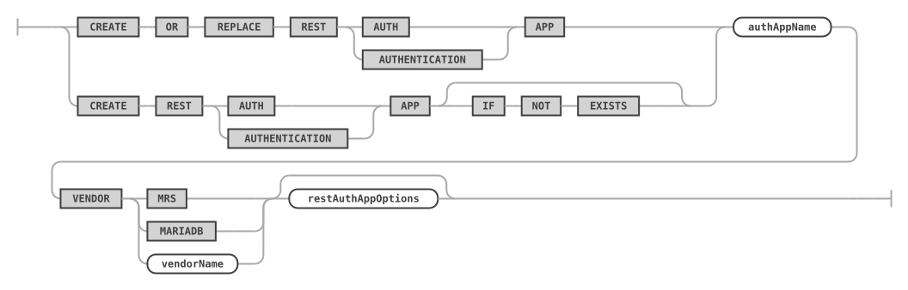
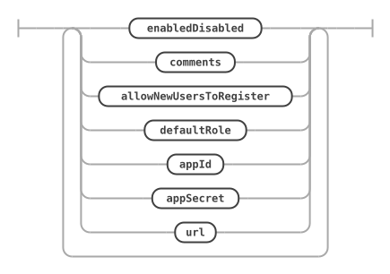
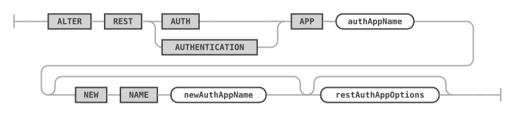
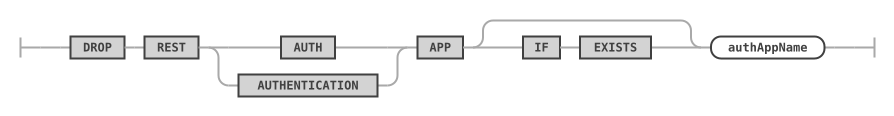
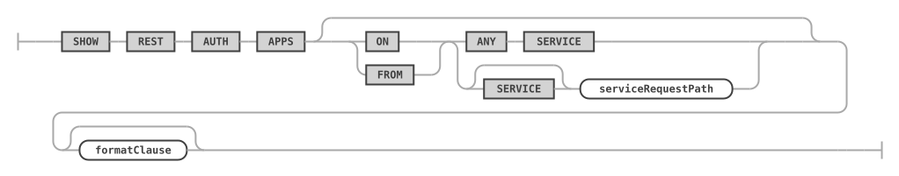

# REST Authentication Apps

A REST authentication app of the MariaDB REST Service (MRS) authenticates the users of the REST services it is linked to. Each app uses one authentication vendor. The users of an app are managed with the statements in [REST Users and Roles](rest-users-and-roles.md). For an overview, see [Authentication and Authorization](../developer-guide/authentication-and-authorization.md).

In the statements, `AUTH APP` and `AUTHENTICATION APP` are synonyms.

## CREATE REST AUTH APP

The `CREATE REST AUTH APP` statement creates a new REST authentication app. The MariaDB REST Service supports a list of authentication vendors, including dedicated MRS authentication, MariaDB internal authentication with MariaDB accounts, and OAuth2 vendors like Facebook and Google.

Once a REST authentication app has been created, link it to REST services to enable authentication for them. The [CREATE REST SERVICE](rest-services.md#create-rest-service) and [ALTER REST SERVICE](rest-services.md#alter-rest-service) statements add or remove REST authentication apps with the `ADD AUTH APP` and `REMOVE AUTH APP` clauses.

### Syntax

```antlr
createRestAuthAppStatement:    (
        CREATE OR REPLACE REST (
            AUTH
            | AUTHENTICATION
        ) APP
        | CREATE REST (
            AUTH
            | AUTHENTICATION
        ) APP (IF NOT EXISTS)?
    ) authAppName VENDOR (
        MRS
        | MARIADB
        | vendorName
    ) restAuthAppOptions?
;

restAuthAppOptions: (
        enabledDisabled
        | comments
        | allowNewUsersToRegister
        | defaultRole
        | appId
        | appSecret
        | url
    )+
;

allowNewUsersToRegister:
    (DO NOT)? ALLOW NEW USERS (
        TO REGISTER
    )?
;

defaultRole:
    DEFAULT ROLE textOrIdentifier
;

appId:
    (APP | CLIENT) ID textStringLiteral
;

appSecret:
    (APP | CLIENT) SECRET textStringLiteral
;

url:
    URL textStringLiteral
;

authAppName:
    textOrIdentifier
;
```

`createRestAuthAppStatement ::=`



`restAuthAppOptions ::=`



`allowNewUsersToRegister ::=`


`defaultRole ::=`


`appId ::=`


`appSecret ::=`


`url ::=`


`authAppName ::=`


For `enabledDisabled`, see [Enabling or Disabling the MariaDB REST Service](rest-metadata.md#enabling-or-disabling-the-mariadb-rest-service). For `comments`, see [REST Service Comments](rest-services.md#rest-service-comments).

### Examples

The following example creates a REST authentication app that uses the MRS authentication vendor, and links it to the REST service `/myService`.

```sql
CREATE REST AUTHENTICATION APP "MRS" VENDOR MRS;

ALTER REST SERVICE /myService ADD AUTH APP "MRS";
```

The following example creates a REST authentication app for the Google OAuth2 service. Replace the placeholders with the values of your registration at Google.

```sql
CREATE REST AUTHENTICATION APP "Google"
    VENDOR Google
    URL "<url of the OAuth2 server>"
    CLIENT ID "<client id>"
    CLIENT SECRET "<client secret>";
```

### REST Authentication App Vendors

`VENDOR` accepts the following settings. [SHOW REST AUTH VENDORS](#show-rest-auth-vendors) lists the vendors of the REST metadata.

| Vendor | Type | Description |
| --- | --- | --- |
| `MRS` | MRS | Built-in MRS authentication with dedicated MRS account management. |
| `MARIADB` | MariaDB Server | MariaDB internal authentication, vendor `MariaDB Internal`, which authenticates MariaDB accounts. This method suits tooling and other applications with hardcoded accounts that access the MariaDB REST Service. |
| `Facebook` | OAuth2 | Authentication against the Facebook OAuth2 servers, using `Login with Facebook`. |
| `Google` | OAuth2 | Authentication against the Google OAuth2 servers, using `Login with Google`. |

### Configuring a REST Authentication App for OAuth2 Access

Before you create a REST authentication app for an OAuth2 vendor, register the application with the OAuth2 vendor. See the documentation of the vendor for details.

The registration generates an APP ID (also called CLIENT ID) and an APP SECRET (also called CLIENT SECRET) that identify the application. Specify the APP ID, the APP SECRET, and the URL of the OAuth2 server when you create the REST authentication app; all three are required for an OAuth2 vendor.

For the redirection URL to register with the vendor, see [Configuring the Redirection URL of a REST Service](../developer-guide/authentication-and-authorization.md#configuring-the-redirection-url-of-a-rest-service).

## ALTER REST AUTH APP

The `ALTER REST AUTH APP` statement changes the attributes of an existing authentication app. See [`CREATE REST AUTH APP`](#create-rest-auth-app) for the supported options.

### Syntax

```antlr
alterRestAuthAppStatement:
    ALTER REST (
        AUTH
        | AUTHENTICATION
    ) APP authAppName (
        NEW NAME newAuthAppName
    )? restAuthAppOptions?
;
```

`alterRestAuthAppStatement ::=`



### Examples

The following example allows new users to register with the REST authentication app `MRS`.

```sql
ALTER REST AUTH APP "MRS" ALLOW NEW USERS TO REGISTER;
```

## DROP REST AUTH APP

The `DROP REST AUTH APP` statement drops an existing REST authentication app.

### Syntax

```antlr
dropRestAuthAppStatement:
    DROP REST (AUTH | AUTHENTICATION) APP (
        IF EXISTS
    )? authAppName
;
```

`dropRestAuthAppStatement ::=`



### Examples

```sql
DROP REST AUTH APP IF EXISTS "MRS";
```

## SHOW REST AUTH APPS

The `SHOW REST AUTH APPS` statement lists all REST auth apps of the given or the current REST service.

### Syntax

```antlr
showRestAuthAppsStatement:
    SHOW REST AUTH APPS (
        (ON | FROM) SERVICE? serviceRequestPath
    )?
;
```

`showRestAuthAppsStatement ::=`



### Examples

The following example lists all REST auth apps of the given REST service.

```sql
SHOW REST AUTH APPS FROM SERVICE /myService;
```

## SHOW REST AUTH VENDORS

The `SHOW REST AUTH VENDORS` statement lists the vendors a REST auth app can be created for, for example `MRS`, `MariaDB Internal`, or an OAuth2 vendor. The vendor is given in the `VENDOR` clause of the [`CREATE REST AUTH APP`](#create-rest-auth-app) statement.

### Syntax

```antlr
showRestAuthVendorsStatement:
    SHOW REST AUTH VENDORS
;
```

`showRestAuthVendorsStatement ::=`


### Examples

The following example lists all REST auth vendors.

```sql
SHOW REST AUTH VENDORS;
```

## SHOW CREATE REST AUTH APP

The `SHOW CREATE REST AUTH APP` statement shows the DDL statement for the given REST auth app.

### Syntax

```antlr
showCreateRestAuthAppStatement:
    SHOW CREATE REST AUTH APP authAppName formatClause?
;
```

`showCreateRestAuthAppStatement ::=`


For `formatClause`, see [SHOW CREATE ... FORMAT=JSON](rest-metadata.md).

### Examples

The following example shows the DDL statement for the given REST auth app.

```sql
SHOW CREATE REST AUTH APP "MRS";
```
