# REST Content Sets and Files

A REST content set of the MariaDB REST Service (MRS) serves static content, such as a web app, from a REST service. Its files are stored in the REST metadata. A content set can also hold MRS scripts, which are registered as REST endpoints. See [Static Content and MRS Scripts](../developer-guide/static-content-and-mrs-scripts.md) for a guide.


No REST SQL statement reads files from the client machine. To upload all files of a directory, use the `mrs.load.content_set()` function of the mrs plugin. It creates the content set, sends one [`CREATE REST CONTENT FILE`](#create-rest-content-file) statement per file, and registers the MRS scripts of the files with [`ALTER REST CONTENT SET ... LOAD TYPESCRIPT SCRIPTS`](#alter-rest-content-set).

```python
mrs.load.content_set(directory="~/myApp/dist", content_set_path="/app",
                     service_path="/myService")
```


## CREATE REST CONTENT SET

The `CREATE REST CONTENT SET` statement adds REST endpoints for static content.

### Syntax

```antlr
createRestContentSetStatement:    (
        CREATE OR REPLACE REST CONTENT SET
        | CREATE REST CONTENT SET (
            IF NOT EXISTS
        )?
    ) contentSetRequestPath (
        ON SERVICE? serviceRequestPath
    )? restContentSetOptions?
;

restContentSetOptions: (
        enabledDisabledPrivate
        | authenticationRequired
        | jsonOptions
        | comments
    )+
;
```

`createRestContentSetStatement ::=`

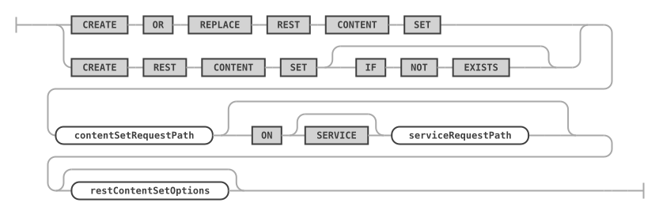

`restContentSetOptions ::=`

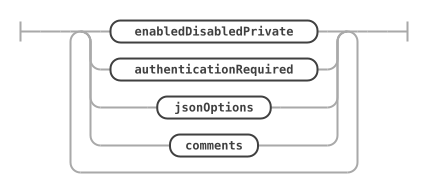

The statement creates an empty content set. Add its files with [CREATE REST CONTENT FILE](#create-rest-content-file).

If the files hold MRS scripts, register them as REST endpoints with [ALTER REST CONTENT SET ... LOAD SCRIPTS](#alter-rest-content-set) once the files have been added.

The options are described with other statements: [`enabledDisabledPrivate`](rest-schemas.md#enabling-or-disabling-a-rest-object), [`authenticationRequired`](rest-views.md#requiring-authentication), [`jsonOptions`](rest-metadata.md#rest-configuration-json-options), and [`comments`](rest-services.md#rest-service-comments).

### Examples

```sql
CREATE REST CONTENT SET /web ON SERVICE /myService
    COMMENT "Static web content";
```

## CREATE REST CONTENT FILE

The `CREATE REST CONTENT FILE` statement adds a file to a content set.

### Syntax

```antlr
createRestContentFileStatement:    (
        CREATE OR REPLACE REST CONTENT FILE
        | CREATE REST CONTENT FILE (
            IF NOT EXISTS
        )?
    ) contentFileRequestPath ON (
        SERVICE? serviceRequestPath
    )? CONTENT SET contentSetRequestPath BINARY? CONTENT textStringLiteral
        restContentFileOptions?
;

restContentFileOptions: (
        enabledDisabledPrivate
        | authenticationRequired
        | jsonOptions
    )+
;
```

`createRestContentFileStatement ::=`

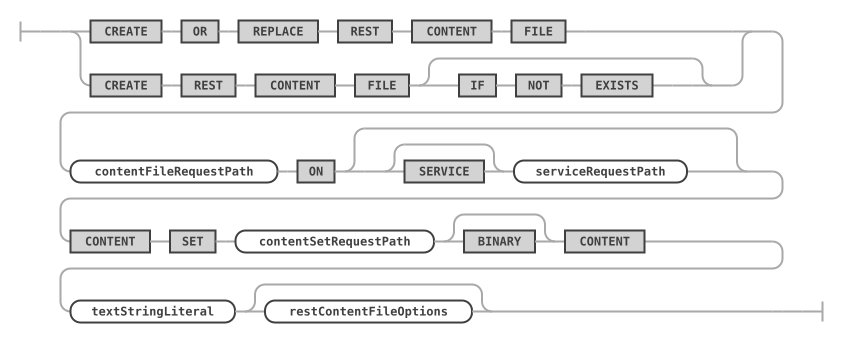

`restContentFileOptions ::=`

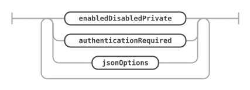

The content of the file is given inline as a string. With `BINARY CONTENT`, the string holds the Base64-encoded bytes of the file. `SHOW CREATE` writes text content as `CONTENT` only when it holds no backslash, so the statement reads the same with and without the `NO_BACKSLASH_ESCAPES` SQL mode; other content is written as `BINARY CONTENT`. Because the statement doesn't read files from disk, it works the same way from any client that sends it to MariaDB Shell.

Request paths that contain dots must be quoted with backticks.

### Examples

```sql
CREATE REST CONTENT FILE `/index.html` ON SERVICE /myService CONTENT SET /web
    CONTENT '<html><body>Hello</body></html>';

CREATE REST CONTENT FILE `/logo.png` ON SERVICE /myService CONTENT SET /web
    BINARY CONTENT 'iVBORw0KGgoAAAANSUhEUgAAAAEAAAABCAYAAAAfFcSJAAAADUlEQVR42mNkYPhfDwAChwGA60e6kgAAAABJRU5ErkJggg==';
```

## ALTER REST CONTENT SET

The `ALTER REST CONTENT SET` statement changes an existing REST content set, and registers the MRS scripts it holds.


`mrs.load.content_set()` of the mrs plugin uploads an MRS scripts project directory and runs `ALTER REST CONTENT SET ... LOAD TYPESCRIPT SCRIPTS` for it in one call. See [Static Content and MRS Scripts](../developer-guide/static-content-and-mrs-scripts.md#mrs-scripts).

```python
mrs.load.content_set(directory="~/myScripts", content_set_path="/scripts",
                     service_path="/myService")
```


### Syntax

```antlr
alterRestContentSetStatement:
    ALTER REST CONTENT SET contentSetRequestPath (
        ON SERVICE? serviceRequestPath
    )? (
        NEW REQUEST PATH newContentSetRequestPath
    )? alterRestContentSetOptions?
;

newContentSetRequestPath:
    requestPathIdentifier
;

alterRestContentSetOptions: (
        enabledDisabledPrivate
        | authenticationRequired
        | jsonOptions
        | comments
        | loadScripts
    )+
;

loadScripts:
    LOAD TYPESCRIPT? SCRIPTS
;
```

`alterRestContentSetStatement ::=`

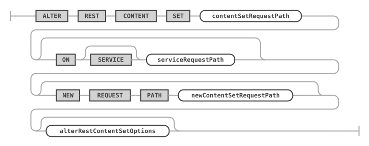

`newContentSetRequestPath ::=`


`alterRestContentSetOptions ::=`

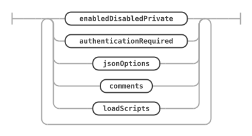

`loadScripts ::=`


`LOAD SCRIPTS` registers the MRS scripts held by the files of the content set as REST endpoints. Add the files to the content set first. The statement analyzes the stored TypeScript files for the `@Mrs.module`, `@Mrs.script`, and `@Mrs.trigger` decorators, and creates a REST schema for each MRS module and a REST endpoint for each MRS script. Scripts registered by an earlier `LOAD SCRIPTS` on the same content set are replaced.

Only the files in static folders (`static`, `assets`, `media`, `web`, `js`, `css`, or `images`) stay public. The sources and the build output are made private; the MariaDB REST Daemon still reads them. Upload a web app as its own content set, or build it into a static folder, not into the build output folder of the scripts project. `LOAD TYPESCRIPT SCRIPTS` also records TypeScript as the scripting language of the content set.

`SHOW CREATE REST CONTENT SET` and `SHOW CREATE REST SERVICE` write an `ALTER REST CONTENT SET ... LOAD TYPESCRIPT SCRIPTS` statement after the files of a content set that holds MRS scripts, so that the scripts are registered again when the script runs.

### Examples

```sql
ALTER REST CONTENT SET /scripts ON SERVICE /myService
    LOAD TYPESCRIPT SCRIPTS;
```

## DROP REST CONTENT SET

The `DROP REST CONTENT SET` statement drops an existing REST content set.

### Syntax

```antlr
dropRestContentSetStatement:
    DROP REST CONTENT SET (
        IF EXISTS
    )? contentSetRequestPath (
        FROM SERVICE? serviceRequestPath
    )?
;
```

`dropRestContentSetStatement ::=`

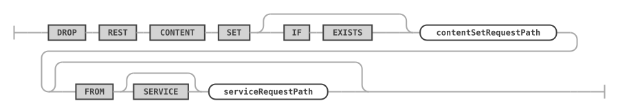

### Examples

```sql
DROP REST CONTENT SET /web FROM SERVICE /myService;
```

## DROP REST CONTENT FILE

The `DROP REST CONTENT FILE` statement removes a file from a REST content set.

### Syntax

```antlr
dropRestContentFileStatement:
    DROP REST CONTENT FILE (
        IF EXISTS
    )? contentFileRequestPath FROM (
        SERVICE? serviceRequestPath
    )? CONTENT SET contentSetRequestPath
;
```

`dropRestContentFileStatement ::=`

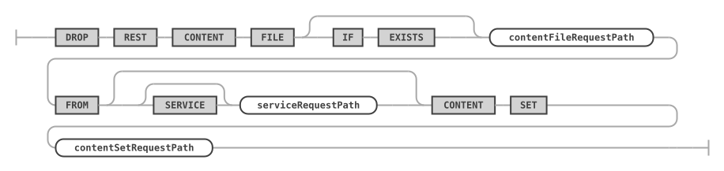

### Examples

```sql
DROP REST CONTENT FILE `/index.html` FROM SERVICE /myService CONTENT SET /web;
```

## SHOW REST CONTENT SETS

The `SHOW REST CONTENT SETS` statement lists all REST content sets of the given or the current REST service.

### Syntax

```antlr
showRestContentSetsStatement:
    SHOW REST CONTENT SETS (
        (ON | FROM) SERVICE? serviceRequestPath
    )? formatClause?
;
```

`showRestContentSetsStatement ::=`

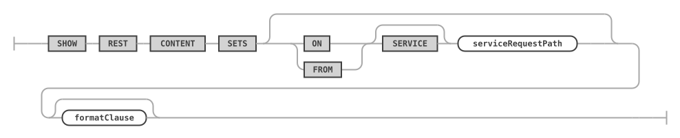

With `FORMAT=JSON`, the result is one JSON array of the REST content sets; see [Lists in JSON](rest-metadata.md#lists-in-json).

### Examples

The following example lists all REST content sets of the given REST service.

```sql
SHOW REST CONTENT SETS FROM SERVICE /myService;
```

## SHOW REST CONTENT FILES

The `SHOW REST CONTENT FILES` statement lists all REST content files of the given content set.

### Syntax

```antlr
showRestContentFilesStatement:
    SHOW REST CONTENT FILES (
        ON
        | FROM
    ) (SERVICE? serviceRequestPath)? CONTENT SET contentSetRequestPath formatClause?
;
```

`showRestContentFilesStatement ::=`

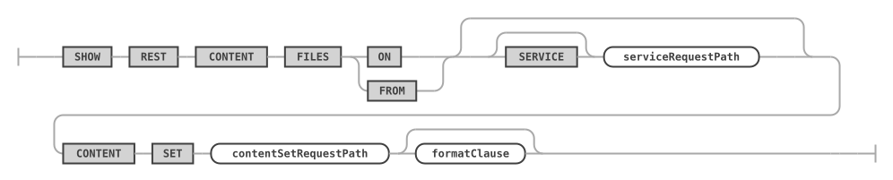

With `FORMAT=JSON`, the result is one JSON array of the REST content files, without their content; see [Lists in JSON](rest-metadata.md#lists-in-json).

### Examples

```sql
SHOW REST CONTENT FILES FROM SERVICE /myService CONTENT SET /web;
```

## SHOW REST SCRIPTS

The `SHOW REST SCRIPTS` statement lists the MRS scripts that [`ALTER REST CONTENT SET ... LOAD SCRIPTS`](#alter-rest-content-set) registered as REST endpoints in the given or the current REST schema. Each MRS module is a REST schema of the type `SCRIPT_MODULE`; `SHOW REST SCHEMAS` lists them.

### Syntax

```antlr
showRestScriptsStatement:
    SHOW REST SCRIPTS (
        (ON | FROM) serviceSchemaSelector
    )? formatClause?
;
```

`showRestScriptsStatement ::=`

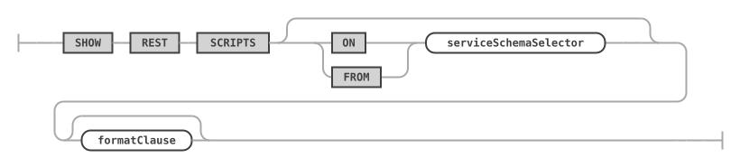

The result has the columns `REST DB Object`, the request path of the script, and `enabled`. With `FORMAT=JSON`, the result is one JSON array of the REST objects of the scripts (`object_type` `SCRIPT`), without their data mappings; see [Lists in JSON](rest-metadata.md#lists-in-json).

### Examples

The following example lists the MRS scripts of the MRS module `/sales`.

```sql
SHOW REST SCRIPTS FROM SERVICE /myService SCHEMA /sales;
```

## SHOW CREATE REST CONTENT SET

The `SHOW CREATE REST CONTENT SET` statement shows the statements that create the given content set and its files.

### Syntax

```antlr
showCreateRestContentSetStatement:
    SHOW CREATE REST CONTENT SET contentSetRequestPath (
        (ON | FROM) SERVICE? serviceRequestPath
    )? formatClause?
;
```

`showCreateRestContentSetStatement ::=`


For `formatClause`, see [SHOW CREATE ... FORMAT=JSON](rest-metadata.md).

### Examples

```sql
SHOW CREATE REST CONTENT SET /web ON SERVICE /myService;
```

## SHOW CREATE REST CONTENT FILE

The `SHOW CREATE REST CONTENT FILE` statement shows the `CREATE` statement for the given content file.

### Syntax

```antlr
showCreateRestContentFileStatement:
    SHOW CREATE REST CONTENT FILE contentFileRequestPath (
        ON
        | FROM
    ) (SERVICE? serviceRequestPath)? CONTENT SET contentSetRequestPath formatClause?
;
```

`showCreateRestContentFileStatement ::=`


For `formatClause`, see [SHOW CREATE ... FORMAT=JSON](rest-metadata.md).

### Examples

```sql
SHOW CREATE REST CONTENT FILE `/index.html` ON SERVICE /myService CONTENT SET /web;
```
