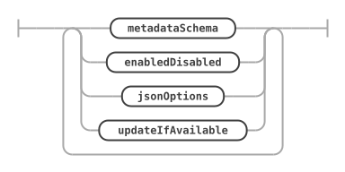
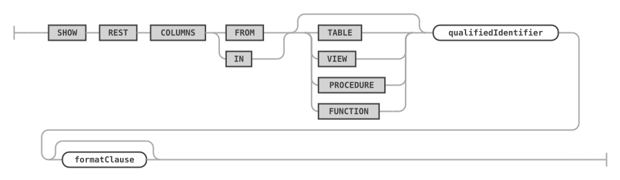

# REST Metadata

The MariaDB REST Service (MRS) stores its configuration and all REST objects in the metadata schema `mysql_rest_service_metadata`. The statements on this page create and update that schema, report its status, and work across all object types.

## CONFIGURE REST METADATA

The `CONFIGURE REST METADATA` statement performs the initial configuration of the MariaDB REST Service on a MariaDB Server.

It creates the `mysql_rest_service_metadata` database schema. The MariaDB account that runs the statement needs the privileges to create database schemas.

### Syntax

```antlr
configureRestMetadataStatement:
    CONFIGURE REST METADATA restMetadataOptions?
;

restMetadataOptions: (
        enabledDisabled
        | jsonOptions
        | updateIfAvailable
    )+
;
```

`configureRestMetadataStatement ::=`


`restMetadataOptions ::=`



### Examples

```sql
CONFIGURE REST METADATA;
```

### Enabling or Disabling the MariaDB REST Service

The `enabledDisabled` option specifies whether the MariaDB REST Service is enabled or disabled after the configuration. By default, the MariaDB REST Service is enabled.

The same option enables or disables [REST services](rest-services.md#create-rest-service) and [REST authentication apps](rest-authentication.md#create-rest-auth-app).

```antlr
enabledDisabled:
    ENABLED
    | DISABLED
;
```

`enabledDisabled ::=`


The following example configures the MariaDB REST Service, enables it, and updates the metadata schema if an update is available.

```sql
CONFIGURE REST METADATA
    ENABLED
    UPDATE IF AVAILABLE;
```

The following example configures the MariaDB REST Service, enables it and the GTID cache, and sets authentication options.

```sql
CONFIGURE REST METADATA
    ENABLED
    OPTIONS {
        "gtid": {
            "cache": {
                "enable": true,
                "refreshRate": 5,
                "refreshWhenIncreasesBy": 500
            }
        },
        "authentication": {
            "throttling": {
                "perAccount": {
                    "minimumTimeBetweenRequestsInMs": 1500,
                    "maximumAttemptsPerMinute": 5
                },
                "perHost": {
                    "minimumTimeBetweenRequestsInMs": 1500,
                    "maximumAttemptsPerMinute": 5
                },
                "blockWhenAttemptsExceededInSeconds": 120
            }
        }
    };
```

### REST Configuration JSON Options

The `jsonOptions` set a number of specific options for the MariaDB REST Service. Specify the `MERGE` keyword to merge the given options with the existing options. Without `MERGE`, the given options replace all existing options.

The same rule sets the options of REST services, schemas, objects, content sets and files, users, and roles. The pages of these objects list the keys they support.

```antlr
jsonOptions:
    MERGE? OPTIONS jsonValue
;
```

`jsonOptions ::=`


The options of the MariaDB REST Service can include the following JSON keys.

* `authentication`
  * Defines global authentication parameters, valid for all MariaDB REST Daemon instances.
  * `throttling`
    * Limits the authentication attempts to prevent brute force attacks on account information.
    * `perAccount`
      * Settings that apply per MRS account.
      * `minimumTimeBetweenRequestsInMs`
        * The minimum time between connection attempts, in milliseconds. If a client tries to authenticate faster than that, the request is rejected.
      * `maximumAttemptsPerMinute`
        * The maximum number of attempts per minute. If a client tries to authenticate more often than that, further attempts are blocked for the number of seconds given in `blockWhenAttemptsExceededInSeconds`.
    * `perHost`
      * Settings that apply per host from where a client tries to connect.
      * `minimumTimeBetweenRequestsInMs`
      * `maximumAttemptsPerMinute`
    * `blockWhenAttemptsExceededInSeconds`
      * The time the account or client host is blocked from authentication, in seconds.
* `gtid`
  * Defines global settings for the GTID handling, using the following fields.
  * `cache`
    * Configures the GTID cache of the MariaDB REST Daemon.
    * `enable`
      * If set to `true`, the MariaDB REST Daemon caches GTIDs.
    * `refreshRate`
      * How often the GTID cache is refreshed, in seconds, for example `5`.
    * `refreshWhenIncreasesBy`
      * In addition to the time-based refresh, the GTID cache can be refreshed based on the number of transactions since the last refresh, for example `500`.
* `responseCache`
  * Global options for the REST endpoint response cache, which keeps an in-memory cache of responses to GET requests on tables, views, procedures, and functions. To enable caching of an endpoint, you must also set the `cacheTimeToLive` option for each object to cache.
  * `maxCacheSize`
    * The maximum size of the cache. The default is 1M.
* `fileCache`
  * Global options for the static file data cache, which keeps an in-memory cache of responses to GET requests on content set files.
  * `maxCacheSize`
    * The maximum size of the cache. The default is 1M.
* `defaultStaticContent`
  * Defines static content for the root path `/` that is returned for file paths matching the given JSON keys. The MariaDB REST Daemon serves a JSON key `index.html` as `/index.html`. The file content needs to be Base64 encoded. If the same JSON key is used in `defaultStaticContent` and in `defaultRedirects`, the redirect takes priority.
* `defaultRedirects`
  * Defines internal redirects performed by the MariaDB REST Daemon. Use it to expose content of a REST service on the root path `/`. A JSON key `index.html` holding the value `/myService/myContentSet/index.html` exposes the file from the given path as `/index.html`.
* `directoryIndexDirective`
  * An ordered list of files to return when a directory path is requested. The first matching file that is available is returned. The `directoryIndexDirective` applies recursively to all directory paths that the MariaDB REST Daemon exposes. To change it for a given REST service or REST content set, set the corresponding option of that object.

All other keys are ignored and can store custom metadata. Include a unique prefix in custom keys, so that future MRS options don't overwrite them.

The following JSON value defines the static content for `/index.html`, `/favicon.ico`, and `/favicon.svg`. It also directs the MariaDB REST Daemon to return the contents of `/index.html` if the root path `/` is requested, for example `https://my.example.com/`.

```json
{
    "defaultStaticContent": {
        "index.html": "PCFET0NUW...",
        "favicon.ico": "AAABAAMAM...",
        "favicon.svg": "PD94bWwmV..."
    },
    "directoryIndexDirective": [
        "index.html"
    ]
}
```

In the following example, an internal redirect of `/index.html` to `/myService/myContentSet/index.html` serves the `index.html` page of `/myService/myContentSet` directly. This overrides the `index.html` definition in `defaultStaticContent`, and is useful to serve a specific app on the root path `/`.

```json
{
    "defaultStaticContent": {
        "index.html": "PCFET0NUW...",
        "favicon.ico": "AAABAAMAM...",
        "favicon.svg": "PD94bWwmV..."
    },
    "defaultRedirects": {
        "index.html": "/myService/myContentSet/index.html"
    },
    "directoryIndexDirective": [
        "index.html"
    ]
}
```

### Updating the Metadata Schema

With `updateIfAvailable`, the configuration includes an update of the `mysql_rest_service_metadata` database schema.

```antlr
updateIfAvailable:
    UPDATE (IF AVAILABLE)?
;
```

`updateIfAvailable ::=`


The current version of the metadata schema is 5.0.0, which stores all ids as MariaDB `UUID` values. A schema of version 4.1.6 is updated to 5.0.0 in place, and its ids keep their values. Older versions can't be updated. Without `UPDATE IF AVAILABLE`, `CONFIGURE REST METADATA` leaves an older schema as it is and reports that it needs to be updated, and the other REST statements refuse to work on it.

The schema is deployed with the MariaDB Schema Management (`msm`) plugin when it is loaded, and with the same procedure built into MariaDB Shell otherwise. Before an update, the schema is dumped to the `plugin_data/msm_plugin/backups` folder of the MariaDB Shell user configuration, and loaded back if the update fails. The steps are logged to `plugin_data/msm_plugin/msm_schema_update_log.txt`.

```sql
CONFIGURE REST METADATA UPDATE IF AVAILABLE;
```

## USE REST

The `USE REST` statement sets the current REST service, and optionally the current REST schema, for the following statements of the session. Statements that take an optional service or schema request path use the current one when you leave it out.

### Syntax

```antlr
useStatement:
    USE REST serviceAndSchemaRequestPaths
;

serviceAndSchemaRequestPaths:
    SERVICE serviceRequestPath
    | serviceSchemaSelector
;
```

`useStatement ::=`


`serviceAndSchemaRequestPaths ::=`


For `serviceRequestPath`, see [CREATE REST SERVICE](rest-services.md#create-rest-service). For `serviceSchemaSelector`, see [CREATE REST VIEW](rest-views.md#create-rest-view).

### Examples

The following example makes the REST service with the request path `/myService` the current REST service.

```sql
USE REST SERVICE /myService;
```

After the current REST service has been set, the following statement sets the current REST schema.

```sql
USE REST SCHEMA /sakila;
```

The following example sets the current REST service and REST schema in a single statement.

```sql
USE REST SERVICE /myService SCHEMA /sakila;
```

## SHOW REST STATUS

The `SHOW REST STATUS` statement returns basic information about the current status of the MariaDB REST Service. `SHOW REST METADATA STATUS` is a synonym.

### Syntax

```antlr
showRestMetadataStatusStatement:
    SHOW REST METADATA? STATUS formatClause?
;
```

`showRestMetadataStatusStatement ::=`


The result reports whether the metadata schema is configured and enabled, the number of enabled REST services, the current and the available version of the metadata schema, and whether it can be updated.

The `metadata_version` column holds the id of the last entry in the audit log of the metadata. It changes whenever the REST metadata changes, so a client can poll it and refresh its view of the REST services only when the value has changed.

With `FORMAT=JSON`, the result is a single JSON document with the same values, plus `available_metadata_versions`, the released versions of the metadata schema that MariaDB Shell can deploy, and `configuration_options`, the options set with `CONFIGURE REST METADATA OPTIONS`. The `FORMAT` clause is described under SHOW CREATE ... FORMAT=JSON below.

### Examples

The following example shows the status of the MariaDB REST Service.

```sql
SHOW REST STATUS;
```

The following example returns the status as a JSON document.

```sql
SHOW REST METADATA STATUS FORMAT=JSON;
```

## SHOW REST COLUMNS

The `SHOW REST COLUMNS` statement lists what a REST object can expose from a database object. For a table or a view, these are its columns and its references to and from other tables (its foreign keys in both directions), which can be added to the data mapping of a [REST view](rest-views.md). For a procedure or a function, these are its parameters and, for a function, its return type.

The object type is optional. Without it, the type is detected. Without a schema name, the database schema of the current REST schema is used, or the current database of the session.

### Syntax

```antlr
showRestColumnsStatement:
    SHOW REST COLUMNS (FROM | IN) (
        TABLE
        | VIEW
        | PROCEDURE
        | FUNCTION
    )? qualifiedIdentifier formatClause?
;
```

`showRestColumnsStatement ::=`



The result has one row per column, reference, or parameter, with the columns `position`, `name`, `kind`, `datatype`, `not_null`, `is_primary`, `id_generation`, and `reference`:

* A column has the kind `COLUMN`.
* A reference has the kind `REFERENCE`. Its `reference` column describes it, for example `n:1 sakila.country (country_id = country_id)` for a reference to one row of another table, or `1:n sakila.address (city_id = city_id)` for a reference to many rows.
* A parameter has its mode as kind: `IN`, `OUT`, or `INOUT`.
* The return value of a function has the kind `RETURN`.

With `FORMAT=JSON`, the result is a single JSON document. For a table or a view, it holds the `columns` with their `db_column` and `reference_mapping` documents, the same documents that the data mapping of a REST view stores. For a procedure or a function, it holds the `parameters` and the `return_type`.

### Examples

The following example lists the columns and references of the `sakila.city` table.

```sql
SHOW REST COLUMNS FROM sakila.city;
```

The following example returns the parameters of the `film_in_stock` procedure as a JSON document.

```sql
SHOW REST COLUMNS FROM PROCEDURE sakila.film_in_stock FORMAT=JSON;
```

## SHOW CREATE ... FORMAT=JSON

Every `SHOW CREATE REST` statement ends with an optional `FORMAT` clause, as the `EXPLAIN` statement of MariaDB Server does. `FORMAT=TRADITIONAL`, the default, returns the statement that creates the REST object. `FORMAT=JSON` returns a JSON document of the REST object instead, for tools that work with the REST objects, for example an editor for the data mapping of a REST view. `SHOW REST STATUS`, `SHOW REST COLUMNS`, and `SHOW REST DAEMONS` take the same clause.

### Syntax

```antlr
formatClause:
    FORMAT EQUAL_OPERATOR (JSON | textOrIdentifier)
;
```

`formatClause ::=`


The format name can be written in any case and in quotes, for example `FORMAT=JSON`, `FORMAT = json`, or `FORMAT='json'`.

The JSON document holds the values of the REST object as the REST metadata stores them, with the column names as keys. Ids are UUID strings, and option documents are embedded as JSON. In addition:

* A REST service lists the names of its REST auth apps. With `INCLUDING DATABASE ENDPOINTS`, it holds its REST schemas, each with its REST objects.
* A REST view, procedure, or function holds its data mapping as `objects`, each with its `fields`. A field that represents a reference to another table holds it as `object_reference`, and the fields below the reference point to it with their `parent_reference_id`. Columns that are not part of the data mapping are stored as disabled fields.
* A REST auth app lists the REST services it is linked to. Its app secret is never returned; `has_app_secret` tells whether one is set.
* A REST user lists the REST roles granted to it. Its password is never returned; `has_password` tells whether one is set.
* A REST role lists its privileges.
* A REST content file holds its size, not its content.

### Examples

The following example returns the REST view `/city` with its data mapping as a JSON document.

```sql
SHOW CREATE REST VIEW /city ON SERVICE /myService SCHEMA /sakila FORMAT=JSON;
```
