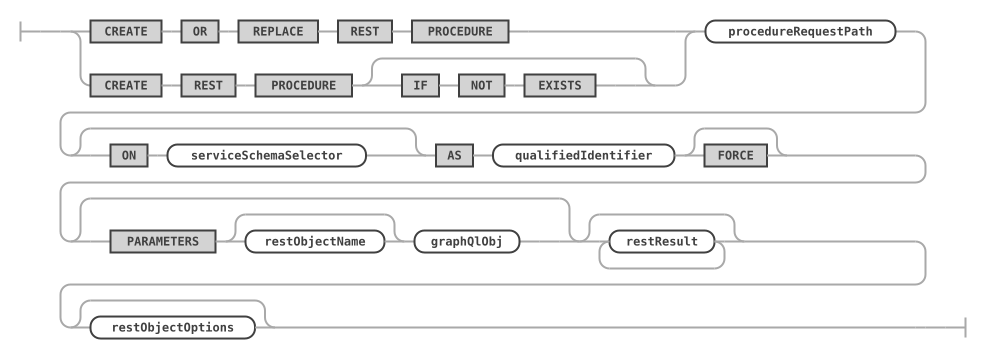
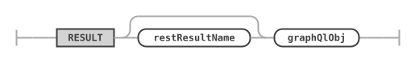
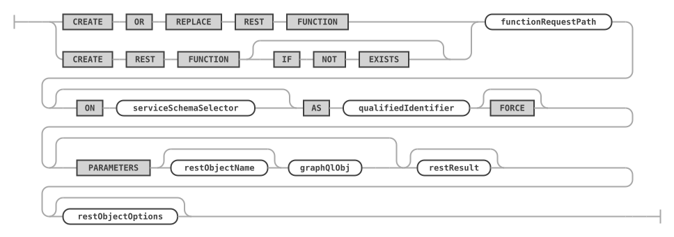
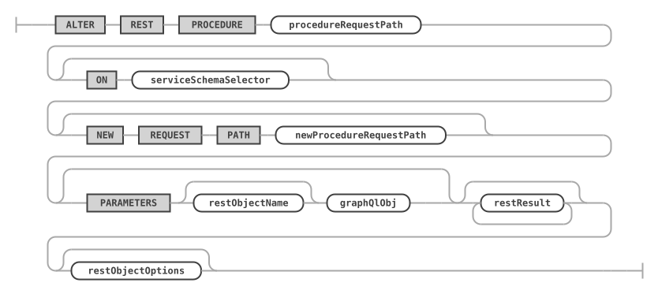
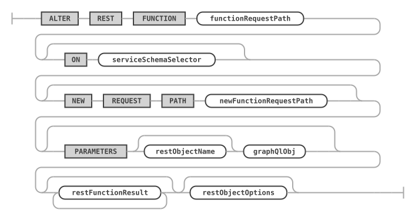
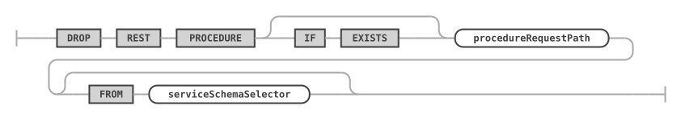
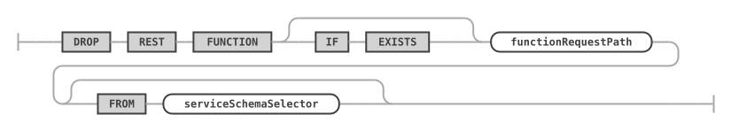
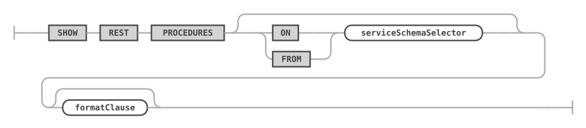
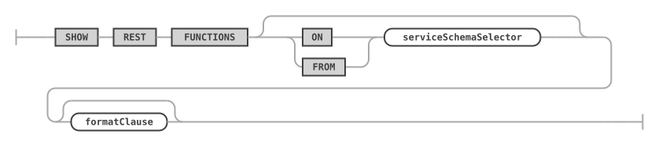
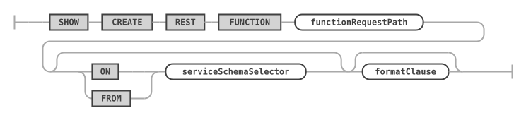

# REST Procedures and Functions

REST procedures and REST functions of the MariaDB REST Service (MRS) add REST endpoints for the stored procedures and stored functions of a database schema. They belong to a [REST schema](rest-schemas.md), and use the same [extended GraphQL syntax](rest-views.md#defining-the-graphql-definition-for-a-rest-view) as REST data mapping views to describe their parameters and results.

## CREATE REST PROCEDURE

The `CREATE REST PROCEDURE` statement adds REST endpoints for database schema stored procedures. It uses the [extended GraphQL syntax](rest-views.md#defining-the-graphql-definition-for-a-rest-view) of REST data mapping views to describe the parameters and result sets of the REST procedure.

### Syntax

```antlr
createRestProcedureStatement:    (
        CREATE OR REPLACE REST PROCEDURE
        | CREATE REST PROCEDURE (
            IF NOT EXISTS
        )?
    ) procedureRequestPath (ON serviceSchemaSelector)? AS qualifiedIdentifier
        FORCE? (
        PARAMETERS restObjectName? graphQlObj
    )? restResult* restObjectOptions?
;

restResult:
    RESULT restResultName? graphQlObj
;
```

`createRestProcedureStatement ::=`



`restResult ::=`



A procedure has a `RESULT` for each of its result sets.

For `serviceSchemaSelector` and `restObjectOptions`, see [CREATE REST VIEW](rest-views.md#create-rest-view). The JSON options are described in [JSON Options for REST Objects](rest-views.md#json-options-for-rest-objects).

### Examples

The following example adds a REST procedure for the `sakila.rewards_report` database schema procedure. It assumes that a REST service `/myService` and a REST schema `/sakila` exist.

```sql
CREATE OR REPLACE REST PROCEDURE /rewardsReport
ON SERVICE /myService SCHEMA /sakila
AS sakila.rewards_report;
```

The following example adds a REST procedure for the `sakila.film_in_stock` database schema procedure, and specifies the list of parameters and the result returned by the procedure explicitly.

```sql
CREATE OR REPLACE REST PROCEDURE /filmInStock
ON SERVICE /myService SCHEMA /sakila
AS sakila.film_in_stock
PARAMETERS MyServiceSakilaFilmInStockParams {
    pFilmId: p_film_id @IN,
    pStoreId: p_store_id @IN,
    pFilmCount: p_film_count @OUT
}
RESULT MyServiceSakilaFilmInStock {
    inventoryId: inventory_id @DATATYPE("int")
};
```

### The FORCE Flag for Procedures

In some cases, a REST procedure needs to be created before the database schema procedure exists. To make `CREATE REST PROCEDURE` succeed in this case, specify the `FORCE` flag.

## CREATE REST FUNCTION

The `CREATE REST FUNCTION` statement adds REST endpoints for database schema stored functions. It uses the [extended GraphQL syntax](rest-views.md#defining-the-graphql-definition-for-a-rest-view) of REST data mapping views to describe the parameters and the result of the REST function.

### Syntax

```antlr
createRestFunctionStatement:    (
        CREATE OR REPLACE REST FUNCTION
        | CREATE REST FUNCTION (
            IF NOT EXISTS
        )?
    ) functionRequestPath (ON serviceSchemaSelector)? AS qualifiedIdentifier
        FORCE? (
        PARAMETERS restObjectName? graphQlObj
    )? restResult? restObjectOptions?
;
```

`createRestFunctionStatement ::=`



A function has at most one `RESULT`. For `restResult`, see [CREATE REST PROCEDURE](#create-rest-procedure). For `serviceSchemaSelector` and `restObjectOptions`, see [CREATE REST VIEW](rest-views.md#create-rest-view). The JSON options are described in [JSON Options for REST Objects](rest-views.md#json-options-for-rest-objects).

### Examples

The following example adds a REST function for the `sakila.inventory_in_stock` database schema function.

```sql
CREATE OR REPLACE REST FUNCTION /inventoryInStock
ON SERVICE /myService SCHEMA /sakila
AS sakila.inventory_in_stock;
```

### The FORCE Flag for Functions

In some cases, a REST function needs to be created before the database schema function exists. To make `CREATE REST FUNCTION` succeed in this case, specify the `FORCE` flag.

## ALTER REST PROCEDURE

The `ALTER REST PROCEDURE` statement changes the REST endpoints of database schema stored procedures.

It uses the [extended GraphQL syntax](rest-views.md#defining-the-graphql-definition-for-a-rest-view) of REST data mapping views to describe the parameters and result sets of the REST procedure.

### Syntax

```antlr
alterRestProcedureStatement:
    ALTER REST PROCEDURE procedureRequestPath (
        ON serviceSchemaSelector
    )? (
        NEW REQUEST PATH newProcedureRequestPath
    )? (PARAMETERS restObjectName? graphQlObj)? restResult* restObjectOptions?
;
```

`alterRestProcedureStatement ::=`



For `serviceSchemaSelector` and `restObjectOptions`, see [CREATE REST VIEW](rest-views.md#create-rest-view).

## ALTER REST FUNCTION

The `ALTER REST FUNCTION` statement changes the REST endpoints of database schema stored functions.

It uses the [extended GraphQL syntax](rest-views.md#defining-the-graphql-definition-for-a-rest-view) of REST data mapping views to describe the parameters and the result of the REST function.

### Syntax

```antlr
alterRestFunctionStatement:
    ALTER REST FUNCTION functionRequestPath (
        ON serviceSchemaSelector
    )? (
        NEW REQUEST PATH newFunctionRequestPath
    )? (PARAMETERS restObjectName? graphQlObj)? restResult* restObjectOptions?
;
```

`alterRestFunctionStatement ::=`



For `serviceSchemaSelector` and `restObjectOptions`, see [CREATE REST VIEW](rest-views.md#create-rest-view).

## DROP REST PROCEDURE

The `DROP REST PROCEDURE` statement drops an existing REST procedure.

### Syntax

```antlr
dropRestProcedureStatement:
    DROP REST PROCEDURE (
        IF EXISTS
    )? procedureRequestPath (FROM serviceSchemaSelector)?
;
```

`dropRestProcedureStatement ::=`



### Examples

```sql
DROP REST PROCEDURE /filmInStock
FROM SERVICE /myService SCHEMA /sakila;
```

## DROP REST FUNCTION

The `DROP REST FUNCTION` statement drops an existing REST function.

### Syntax

```antlr
dropRestFunctionStatement:
    DROP REST FUNCTION (
        IF EXISTS
    )? functionRequestPath (FROM serviceSchemaSelector)?
;
```

`dropRestFunctionStatement ::=`



### Examples

```sql
DROP REST FUNCTION /inventoryInStock
FROM SERVICE /myService SCHEMA /sakila;
```

## SHOW REST PROCEDURES

The `SHOW REST PROCEDURES` statement lists all REST procedures of the given or the current REST schema.

### Syntax

```antlr
showRestProceduresStatement:
    SHOW REST PROCEDURES (
        (ON | FROM) serviceSchemaSelector
    )? formatClause?
;
```

`showRestProceduresStatement ::=`



With `FORMAT=JSON`, the result is one JSON array of the REST procedures, without their data mappings; see [Lists in JSON](rest-metadata.md#lists-in-json).

### Examples

The following example lists all REST procedures of the given REST schema.

```sql
SHOW REST PROCEDURES FROM SERVICE /myService SCHEMA /sakila;
```

## SHOW REST FUNCTIONS

The `SHOW REST FUNCTIONS` statement lists all REST functions of the given or the current REST schema.

### Syntax

```antlr
showRestFunctionsStatement:
    SHOW REST FUNCTIONS (
        (ON | FROM) serviceSchemaSelector
    )? formatClause?
;
```

`showRestFunctionsStatement ::=`



With `FORMAT=JSON`, the result is one JSON array of the REST functions, without their data mappings; see [Lists in JSON](rest-metadata.md#lists-in-json).

### Examples

The following example lists all REST functions of the given REST schema.

```sql
SHOW REST FUNCTIONS FROM SERVICE /myService SCHEMA /sakila;
```

## SHOW CREATE REST PROCEDURE

The `SHOW CREATE REST PROCEDURE` statement shows the DDL statement for the given REST procedure.

### Syntax

```antlr
showCreateRestProcedureStatement:
    SHOW CREATE REST PROCEDURE procedureRequestPath (
        (ON | FROM) serviceSchemaSelector
    )? formatClause?
;
```

`showCreateRestProcedureStatement ::=`


For `formatClause`, see [SHOW CREATE ... FORMAT=JSON](rest-metadata.md).

### Examples

The following example shows the DDL statement for the given REST procedure.

```sql
SHOW CREATE REST PROCEDURE /filmInStock ON SERVICE /myService SCHEMA /sakila;
```

## SHOW CREATE REST FUNCTION

The `SHOW CREATE REST FUNCTION` statement shows the DDL statement for the given REST function.

### Syntax

```antlr
showCreateRestFunctionStatement:
    SHOW CREATE REST FUNCTION functionRequestPath (
        (ON | FROM) serviceSchemaSelector
    )? formatClause?
;
```

`showCreateRestFunctionStatement ::=`



For `formatClause`, see [SHOW CREATE ... FORMAT=JSON](rest-metadata.md).

### Examples

The following example shows the DDL statement for the given REST function.

```sql
SHOW CREATE REST FUNCTION /inventoryInStock ON SERVICE /myService SCHEMA /sakila;
```
