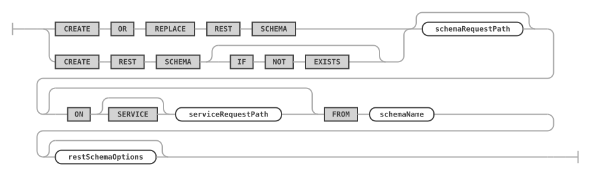
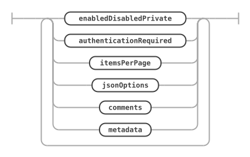
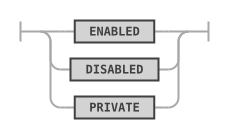
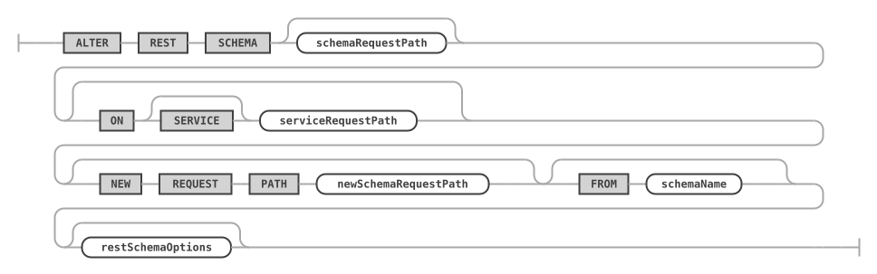
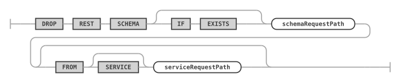
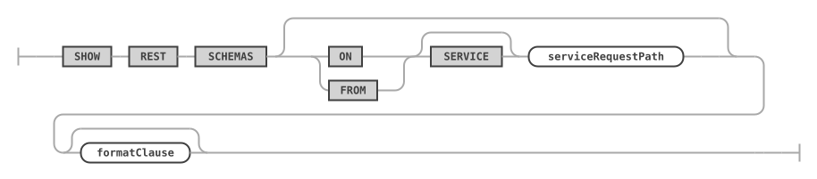
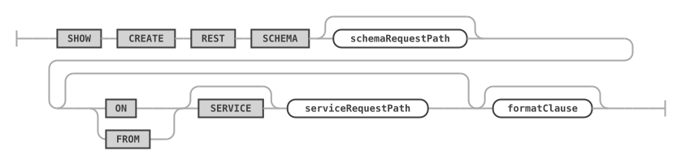

# REST Schemas

A REST schema of the MariaDB REST Service (MRS) maps a database schema into a REST service. It is the parent of the [REST views](rest-views.md) and [REST procedures and functions](rest-routines.md) that expose the objects of the database schema.

## CREATE REST SCHEMA

The `CREATE REST SCHEMA` statement creates a new REST schema or replaces an existing one. Each REST schema maps directly to a database schema and allows the database schema objects (tables, views, and stored routines) to be exposed through REST endpoints.


Adding a REST schema to a REST service doesn't expose any database schema objects through REST by itself. To expose a database schema object, run the corresponding [`CREATE REST VIEW`](rest-views.md#create-rest-view), [`CREATE REST PROCEDURE`](rest-routines.md#create-rest-procedure), or [`CREATE REST FUNCTION`](rest-routines.md#create-rest-function) statement.


Each REST schema belongs to a REST service, which has to be created first. One REST service can hold many REST schemas. Without a service request path, the REST schema is created in the current REST service, see [USE REST](rest-metadata.md#use-rest).

Each REST schema can have its own options.

### Syntax

```antlr
createRestSchemaStatement:    (
        CREATE OR REPLACE REST SCHEMA
        | CREATE REST SCHEMA (
            IF NOT EXISTS
        )?
    ) schemaRequestPath? (
        ON SERVICE? serviceRequestPath
    )? FROM schemaName restSchemaOptions?
;

restSchemaOptions: (
        enabledDisabledPrivate
        | authenticationRequired
        | itemsPerPage
        | jsonOptions
        | comments
        | metadata
    )+
;
```

`createRestSchemaStatement ::=`



`restSchemaOptions ::=`



For `serviceRequestPath`, see [CREATE REST SERVICE](rest-services.md#building-a-service-request-path). `authenticationRequired` is described under [Requiring Authentication](rest-views.md#requiring-authentication), `comments` under [REST Service Comments](rest-services.md#rest-service-comments), and `metadata` under [REST Service Metadata](rest-services.md#rest-service-metadata).

### Examples

The following example creates a REST schema `/sakila` on the REST service `/myService`.

```sql
CREATE OR REPLACE REST SCHEMA /sakila ON SERVICE /myService
    FROM `sakila`
    COMMENT "The sakila schema";
```

### Enabling or Disabling a REST Object

The `enabledDisabledPrivate` option specifies whether the REST schema is enabled, disabled, or private when it is created. The same option applies to [REST views](rest-views.md#create-rest-view), [REST procedures and functions](rest-routines.md), and [content sets and files](rest-content.md).

Setting a REST schema to private disables public access through HTTPS, but keeps the schema available for private access from MRS scripts.

```antlr
enabledDisabledPrivate:
    ENABLED
    | DISABLED
    | PRIVATE
;
```

`enabledDisabledPrivate ::=`



### Specifying the Default Page Size

The `itemsPerPage` option specifies the default number of items returned for queries run against this REST schema.

```antlr
itemsPerPage:
    ITEMS PER PAGE itemsPerPageNumber
;
```

`itemsPerPage ::=`


You can also specify the number of items per page for each REST object individually.

### REST Schema JSON Options

The [`jsonOptions`](rest-metadata.md#rest-configuration-json-options) set a number of specific options for the schema. Specify the `MERGE` keyword to merge the given options with the existing options. Without `MERGE`, the given options replace all existing options.

The options can include the following JSON keys.

* `defaultStaticContent`: serves the same purpose as described in [REST Configuration JSON Options](rest-metadata.md#rest-configuration-json-options).
* `defaultRedirects`: serves the same purpose as described in [REST Configuration JSON Options](rest-metadata.md#rest-configuration-json-options).
* `directoryIndexDirective`: serves the same purpose as described in [REST Configuration JSON Options](rest-metadata.md#rest-configuration-json-options).
* `sqlQuery`: see [REST Service JSON Options](rest-services.md#rest-service-json-options).

All other keys are ignored and can store custom metadata about the schema. Include a unique prefix in custom keys, so that future MRS options don't overwrite them.

### REST Schema Comments and Metadata

The comments hold a description of the REST schema, of up to 512 characters. See [REST Service Comments](rest-services.md#rest-service-comments).

The metadata holds any JSON data. A front end can consume it to render certain attributes dynamically, for example a specific icon or color. See [REST Service Metadata](rest-services.md#rest-service-metadata).

## ALTER REST SCHEMA

The `ALTER REST SCHEMA` statement changes an existing REST schema. It uses the same `restSchemaOptions` as the [`CREATE REST SCHEMA`](#create-rest-schema) statement, which describes them.

### Syntax

```antlr
alterRestSchemaStatement:
    ALTER REST SCHEMA schemaRequestPath? (
        ON SERVICE? serviceRequestPath
    )? (
        NEW REQUEST PATH newSchemaRequestPath
    )? (FROM schemaName)? restSchemaOptions?
;
```

`alterRestSchemaStatement ::=`



### Examples

The following example changes the request path of the REST schema `/sakila` of the REST service `/myService` to `/myPublicService`.

```sql
ALTER REST SCHEMA /sakila ON SERVICE /myService
    NEW REQUEST PATH /myPublicService;
```

## DROP REST SCHEMA

The `DROP REST SCHEMA` statement drops an existing REST schema.

### Syntax

```antlr
dropRestSchemaStatement:
    DROP REST SCHEMA (
        IF EXISTS
    )? schemaRequestPath (
        FROM SERVICE? serviceRequestPath
    )?
;
```

`dropRestSchemaStatement ::=`



### Examples

The following example drops the REST schema `/sakila` of the REST service `/myService`.

```sql
DROP REST SCHEMA /sakila FROM SERVICE /myService;
```

## SHOW REST SCHEMAS

The `SHOW REST SCHEMAS` statement lists all REST schemas of the given or the current REST service.

### Syntax

```antlr
showRestSchemasStatement:
    SHOW REST SCHEMAS (
        (ON | FROM) SERVICE? serviceRequestPath
    )? formatClause?
;
```

`showRestSchemasStatement ::=`



With `FORMAT=JSON`, the result is one JSON array of the REST schemas; see [Lists in JSON](rest-metadata.md#lists-in-json).

### Examples

The following example lists all REST schemas of the REST service with the request path `/myService`.

```sql
SHOW REST SCHEMAS FROM SERVICE /myService;
```

## SHOW CREATE REST SCHEMA

The `SHOW CREATE REST SCHEMA` statement shows the DDL statement for the given REST schema.

### Syntax

```antlr
showCreateRestSchemaStatement:
    SHOW CREATE REST SCHEMA schemaRequestPath? (
        (ON | FROM) SERVICE? serviceRequestPath
    )? formatClause?
;
```

`showCreateRestSchemaStatement ::=`



For `formatClause`, see [SHOW CREATE ... FORMAT=JSON](rest-metadata.md).

### Examples

The following example shows the DDL statement for the given REST schema.

```sql
SHOW CREATE REST SCHEMA /sakila FROM /myService;
```
