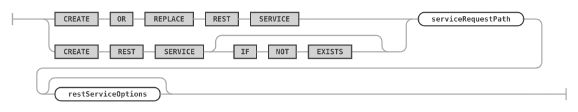
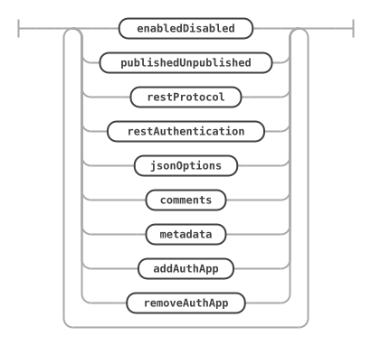
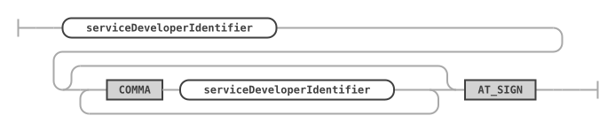
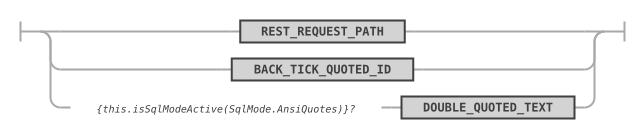
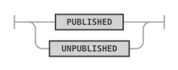
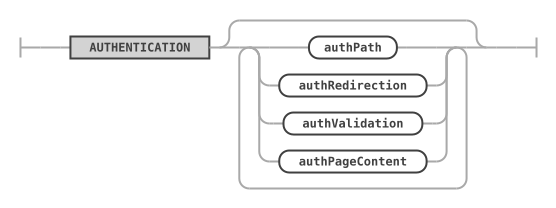
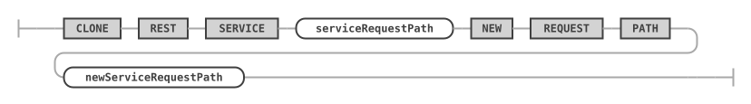
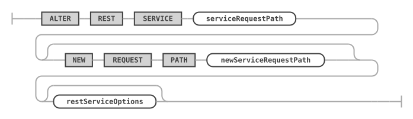
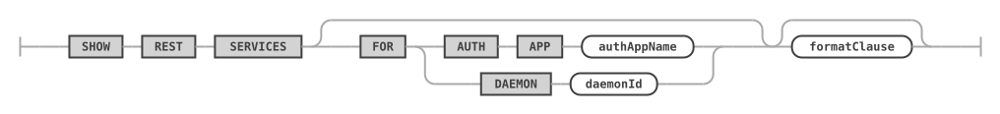
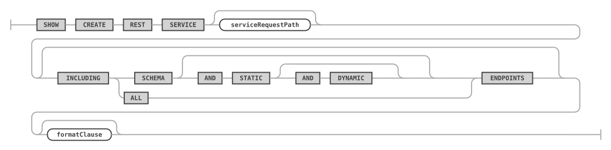

# REST Services

A REST service is the top-level object of the MariaDB REST Service (MRS). It has a request path, its own options and authentication apps, and holds the [REST schemas](rest-schemas.md) and [content sets](rest-content.md) that make up the REST endpoints of an application.

## CREATE REST SERVICE

The `CREATE REST SERVICE` statement creates a new REST service or replaces an existing one.

The MariaDB REST Service supports many individual REST services. Create a separate REST service for each REST application. Each REST service can have its own options and authentication apps, and supports a different set of authentication users.

A new REST service isn't published by default. Only MariaDB REST Daemon instances that run in developer mode serve it. To publish a REST service after all its REST schemas and REST objects have been created, set the `PUBLISHED` option with the [`ALTER REST SERVICE`](#alter-rest-service) statement.

### Syntax

```antlr
createRestServiceStatement:    (
        CREATE OR REPLACE REST SERVICE
        | CREATE REST SERVICE (
            IF NOT EXISTS
        )?
    ) serviceRequestPath restServiceOptions?
;

serviceRequestPath:
    serviceDevelopersIdentifier? requestPathIdentifier
;

restServiceOptions: (
        enabledDisabled
        | publishedUnpublished
        | restProtocol
        | restAuthentication
        | jsonOptions
        | comments
        | metadata
        | addAuthApp
        | removeAuthApp
    )+
;
```

`createRestServiceStatement ::=`



`serviceRequestPath ::=`


`restServiceOptions ::=`



`removeAuthApp` is described under [ALTER REST SERVICE](#alter-rest-service).

### Examples

The following example creates a REST service `/myService`. Set the `PUBLISHED` option to make the REST service publicly available.

```sql
CREATE OR REPLACE REST SERVICE /myService
    COMMENT "A simple REST service";
```

The following example sets the options of the REST service.

```sql
CREATE OR REPLACE REST SERVICE /myTestService
    COMMENT "A simple REST service"
    AUTHENTICATION
        PATH "/authentication"
        REDIRECTION DEFAULT
        VALIDATION DEFAULT
        PAGE CONTENT DEFAULT
    OPTIONS {
        "headers": {
            "Access-Control-Allow-Credentials": "true",
            "Access-Control-Allow-Headers": "Content-Type, Authorization, X-Requested-With, Origin, X-Auth-Token",
            "Access-Control-Allow-Methods": "GET, POST, PUT, DELETE, OPTIONS"
        },
        "http": {
            "allowedOrigin": "auto"
        },
        "logging": {
            "exceptions": true,
            "request": {
                "body": true,
                "headers": true
            },
            "response": {
                "body": true,
                "headers": true
            }
        },
        "returnInternalErrorDetails": true,
        "includeLinksInResults": false
    };
```

### Building a Service Request Path

When you create or access a REST service, you specify a `serviceRequestPath` that uniquely identifies the REST service within the MariaDB REST Service. It consists of two components:

* `serviceDevelopersIdentifier` (optional): when set, the REST service is only available to the developers listed.
* `requestPathIdentifier`: the URL context root path the REST service is served from.

In most cases, the `requestPathIdentifier` is sufficient.

The `serviceDevelopersIdentifier` is set automatically when a developer clones a REST service for development. To make such a REST service available to more developers, extend the list of developers with the [`ALTER REST SERVICE`](#alter-rest-service) statement.

```antlr
serviceDevelopersIdentifier:
    serviceDeveloperIdentifier (
        COMMA serviceDeveloperIdentifier
    )* AT_SIGN
;

requestPathIdentifier:
    REST_REQUEST_PATH
    | BACK_TICK_QUOTED_ID
    | {if AnsiQuotes} DOUBLE_QUOTED_TEXT
;
```

`serviceDevelopersIdentifier ::=`



`requestPathIdentifier ::=`



### Enabling or Disabling a REST Service

The [`enabledDisabled`](rest-metadata.md#enabling-or-disabling-the-mariadb-rest-service) option specifies whether the REST service is enabled or disabled. A new REST service is `ENABLED` by default. Change the state with the [`ALTER REST SERVICE`](#alter-rest-service) statement.

The `publishedUnpublished` option decides whether MariaDB REST Daemon instances serve a REST service.

### Publishing a REST Service

The `publishedUnpublished` option specifies whether the REST service is in the `PUBLISHED` or the `UNPUBLISHED` state. A new REST service is `UNPUBLISHED` by default.

Only MariaDB REST Daemon instances that run in developer mode serve a REST service in the `UNPUBLISHED` state. To make a REST service publicly available on all MariaDB REST Daemon instances, set it to the `PUBLISHED` state with the [`ALTER REST SERVICE`](#alter-rest-service) statement.

```antlr
publishedUnpublished:
    PUBLISHED
    | UNPUBLISHED
;
```

`publishedUnpublished ::=`



### Setting the REST Service Protocol

Run the MariaDB REST Service over HTTPS only. Changing the REST service protocol from its default, HTTPS, isn't required in general.

There are special cases in which serving HTTP from the MariaDB REST Daemon is acceptable, for example with a reverse proxy on the same machine that handles HTTPS, and without MariaDB internal authentication, which transfers passwords in plain text. Even in this case, the REST service protocol must be set to HTTPS, because the reverse proxy offers the REST service over HTTPS.

If a setup requires clients to access the REST service over HTTP, switch the REST service protocol to HTTP.

The setting is used in one place: in an OAuth2 authentication request, the protocol is used to build the redirect URL parameter of the first request to the OAuth2 server. The protocol of the redirect URL must match the external protocol the REST service is reachable on. Behind a reverse proxy, the `X-Forwarded-Proto` request header overrides this setting when the proxy sends it.

```antlr
restProtocol:
    PROTOCOL (HTTP | HTTPS)
;
```

`restProtocol ::=`


### Assigning a REST Authentication App to a REST Service

To enable authentication for a REST service, link a REST authentication app to it. REST authentication apps are created with the [`CREATE REST AUTH APP`](rest-authentication.md#create-rest-auth-app) statement.

You can link REST authentication apps when you create the REST service, or add them later with the [`ALTER REST SERVICE`](#alter-rest-service) statement.

```antlr
addAuthApp:
    ADD AUTH APP authAppName (
        IF EXISTS
    )?
;
```

`addAuthApp ::=`


### REST Service Authentication Settings

Each REST service can have its own authentication settings.

```antlr
restAuthentication:
    AUTHENTICATION (
        authPath
        | authRedirection
        | authValidation
        | authPageContent
    )*
;

authPath:
    PATH quotedTextOrDefault
;

authRedirection:
    REDIRECTION quotedTextOrDefault
;

authValidation:
    VALIDATION quotedTextOrDefault
;

authPageContent:
    PAGE CONTENT quotedTextOrDefault
;
```

`restAuthentication ::=`



`authPath ::=`


`authRedirection ::=`


`authValidation ::=`


`authPageContent ::=`


* `AUTHENTICATION PATH`
  * The HTML path used for authentication handling for this REST service, given as a sub-path of the REST service path. The default is `/authentication`.
  * The following endpoints are made available for `<service_path>/<auth_path>`:
    * `/login`
    * `/status`
    * `/logout`
    * `/completed`
* `AUTHENTICATION REDIRECTION`
  * The URL the authentication workflow redirects to after a successful or failed login, given as a sub-path of the REST service path. If this option isn't set and the `<service_path>/<auth_path>/login?onCompletionRedirect` parameter isn't set either, the workflow redirects to `<service_path>/<auth_path>/completed`.
* `AUTHENTICATION VALIDATION`
  * A regular expression that validates the `<service_path>/<auth_path>/login?onCompletionRedirect` parameter. Use it to limit the URLs an application can specify for this parameter.
* `AUTHENTICATION PAGE CONTENT`
  * If set, this content replaces the page content of the `<service_path>/<auth_path>/completed` page.

### REST Service JSON Options

The [`jsonOptions`](rest-metadata.md#rest-configuration-json-options) set a number of specific options for the service. Specify the `MERGE` keyword to merge the given options with the existing options. Without `MERGE`, the given options replace all existing options.

The options can include the following JSON keys.

* `headers`: HTTP headers to send. See the HTTP header documentation for details.
* `http`
  * `allowedOrigin`: the setting for the `Access-Control-Allow-Origin` HTTP header. Set it to `*`, `null`, `<origin>`, or `auto`. With `auto`, the MariaDB REST Daemon returns the origin of the client that makes the request.
* `httpMethodsAllowedForUnauthorizedAccess`: if a REST object doesn't require authentication, only GET is allowed by default. In a testing environment, you may want to allow all HTTP methods. In that case, set this option to a list of allowed methods, for example `["GET", "POST", "PUT", "DELETE"]`.
* `logging`
  * `exceptions`: whether exceptions are logged.
  * `requests`
    * `body`: whether the content of request bodies is logged.
    * `headers`: whether the content of request headers is logged.
  * `response`
    * `body`: whether the content of response bodies is logged.
    * `headers`: whether the content of response headers is logged.
* `returnInternalErrorDetails`: whether internal errors are returned. This is useful for application development, but turn it off for production deployments.
* `includeLinksInResults`: if set to `false`, the results don't include navigation links.
* `defaultStaticContent`: static content for the request path of the REST service, returned for file paths matching the given JSON keys. If the request path of the REST service is `/myService`, the MariaDB REST Daemon serves a JSON key `index.html` as `/myService/index.html`. The file content needs to be Base64 encoded. If the same JSON key is used in `defaultStaticContent` and in `defaultRedirects`, the redirect takes priority.
* `defaultRedirects`: internal redirects performed by the MariaDB REST Daemon. Use it to expose content on the request path of a REST service. If the request path of the REST service is `/myService`, a JSON key `index.html` holding the value `/myService/myContentSet/index.html` exposes the file from the given path as `/myService/index.html`.
* `directoryIndexDirective`: an ordered list of files to return when a directory path is requested. The first matching file that is available is returned. The `directoryIndexDirective` applies recursively to all directory paths that the MariaDB REST Daemon exposes. To change it for a given REST object, set the corresponding option of that object.
* `sqlQuery`
  * `timeout`: the number of milliseconds a database operation may take while serving an endpoint. Database requests that take longer are interrupted, and an error 504 is returned. The default is 2000. Endpoints can override it.

All other keys are ignored and can store custom metadata about the service. Include a unique prefix in custom keys, so that future MRS options don't overwrite them.

```json
{
    "headers": {
        "Access-Control-Allow-Credentials": "true",
        "Access-Control-Allow-Headers": "Content-Type, Authorization, X-Requested-With, Origin, X-Auth-Token",
        "Access-Control-Allow-Methods": "GET, POST, PUT, DELETE, OPTIONS"
    },
    "http": {
        "allowedOrigin": "auto"
    },
    "logging": {
        "exceptions": true,
        "request": {
            "body": true,
            "headers": true
        },
        "response": {
            "body": true,
            "headers": true
        }
    },
    "returnInternalErrorDetails": true,
    "includeLinksInResults": false
}
```

### REST Service Comments

The comments hold a description of the REST service, of up to 512 characters. The same rule sets the comments of the other REST objects.

```antlr
comments:
    COMMENT textStringLiteral
;
```

`comments ::=`


### REST Service Metadata

The metadata holds any JSON data. A front end can consume it to render certain attributes dynamically, for example a specific icon or color. The same rule sets the metadata of REST schemas and REST objects.

```antlr
metadata:
    METADATA jsonValue
;
```

`metadata ::=`


## CLONE REST SERVICE

The `CLONE REST SERVICE` statement duplicates the contents of a REST service to a newly created one. All endpoints and roles of the given service are copied.

### Syntax

```antlr
cloneRestServiceStatement:
    CLONE REST SERVICE serviceRequestPath NEW REQUEST PATH
        newServiceRequestPath
;
```

`cloneRestServiceStatement ::=`



`newServiceRequestPath` has the same form as [`serviceRequestPath`](#building-a-service-request-path).

### Examples

The following example copies the REST service `/myService` to a new REST service `/myServiceCopy`.

```sql
CLONE REST SERVICE /myService NEW REQUEST PATH /myServiceCopy;
```

## ALTER REST SERVICE

The `ALTER REST SERVICE` statement changes an existing REST service. It uses the same `restServiceOptions` as the [`CREATE REST SERVICE`](#create-rest-service) statement, which describes them.

### Syntax

```antlr
alterRestServiceStatement:
    ALTER REST SERVICE serviceRequestPath (
        NEW REQUEST PATH newServiceRequestPath
    )? restServiceOptions?
;

removeAuthApp:
    REMOVE AUTH APP authAppName (
        IF EXISTS
    )?
;
```

`alterRestServiceStatement ::=`



`removeAuthApp ::=`


`REMOVE AUTH APP` unlinks a REST authentication app from the REST service, the counterpart of [`ADD AUTH APP`](#assigning-a-rest-authentication-app-to-a-rest-service).

### Examples

The following example sets a new comment on the REST service `/myService`.

```sql
ALTER REST SERVICE /myService
    COMMENT "A simple, improved REST service";
```

The following example publishes the REST service `/myService`.

```sql
ALTER REST SERVICE /myService
    PUBLISHED;
```

## DROP REST SERVICE

The `DROP REST SERVICE` statement drops an existing REST service.

### Syntax

```antlr
dropRestServiceStatement:
    DROP REST SERVICE (
        IF EXISTS
    )? serviceRequestPath
;
```

`dropRestServiceStatement ::=`


### Examples

The following example drops the REST service with the request path `/myService`.

```sql
DROP REST SERVICE /myService;
```

## SHOW REST SERVICES

The `SHOW REST SERVICES` statement lists all REST services. With `FOR AUTH APP`, it lists only the REST services the given REST auth app is linked to. With `FOR DAEMON`, it lists only the REST services the given MariaDB REST Daemon instance serves, see [SHOW REST SERVICES FOR DAEMON](rest-daemons.md#show-rest-services-for-daemon).

### Syntax

```antlr
showRestServicesStatement:
    SHOW REST SERVICES (
        FOR (
            AUTH APP authAppName
            | DAEMON daemonId
        )
    )?
;
```

`showRestServicesStatement ::=`



### Examples

The following example lists all REST services.

```sql
SHOW REST SERVICES;
```

The following example lists the REST services the REST auth app `MRS` is linked to.

```sql
SHOW REST SERVICES FOR AUTH APP "MRS";
```

## SHOW CREATE REST SERVICE

The `SHOW CREATE REST SERVICE` statement shows the DDL statement for the given REST service. Without a request path, it shows the current REST service.

### Syntax

```antlr
showCreateRestServiceStatement:
    SHOW CREATE REST SERVICE serviceRequestPath? (
        INCLUDING (
            (
                SCHEMA (
                    AND STATIC (
                        AND DYNAMIC
                    )?
                )?
            )
            | ALL
        ) ENDPOINTS
    )? formatClause?
;
```

`showCreateRestServiceStatement ::=`



Without `INCLUDING ... ENDPOINTS`, only the `CREATE REST SERVICE` statement is shown. The `INCLUDING` clause adds the statements of the endpoints of the service. `DATABASE` and `SCHEMA` are synonyms:

* `DATABASE`: the REST schemas and their REST objects, like TABLE, VIEW, PROCEDURE, and FUNCTION.
* `DATABASE AND STATIC`: also the content sets that don't hold MRS scripts, with their files.
* `DATABASE AND STATIC AND DYNAMIC`: also the content sets that hold MRS scripts, with their files and an `ALTER REST CONTENT SET ... LOAD TYPESCRIPT SCRIPTS` statement.
* `ALL`: short for `DATABASE AND STATIC AND DYNAMIC`.

The result is a REST SQL script that recreates the service when run. See [Dumping and Loading REST Services](#dumping-and-loading-rest-services). For `formatClause`, see [SHOW CREATE ... FORMAT=JSON](rest-metadata.md).

### Examples

The following example shows the DDL statement for the REST service with the request path `/myService`.

```sql
SHOW CREATE REST SERVICE /myService;
```

The following example shows the statements that recreate the service with all its endpoints.

```sql
SHOW CREATE REST SERVICE /myService INCLUDING ALL ENDPOINTS;
```

## Dumping and Loading REST Services

A single REST service is dumped as a REST SQL script, which recreates the service when run. The dump doesn't include the database schemas the service is based on. To create a fully consistent dump that includes them, dump a [REST project](#rest-projects) instead.

REST SQL doesn't read or write files on the client machine. The mrs plugin of MariaDB Shell provides Python functions for this. See [Deploying REST Services](../developer-guide/deploying-rest-services.md) for a guide.

* `mrs.dump.service()` writes the script of a service to a file.
* `mrs.load.service()` runs such a script, optionally creating the service under another request path.
* `mrs.load.content_set()` uploads the files of a directory to a content set, sending one [`CREATE REST CONTENT FILE`](rest-content.md#create-rest-content-file) statement per file, and registers the MRS scripts held by the files with [`ALTER REST CONTENT SET ... LOAD TYPESCRIPT SCRIPTS`](rest-content.md#alter-rest-content-set). By default, the scripts are registered if the directory holds any; `load_scripts` turns this on or off. Files matching the `ignore_list` patterns, by default `*node_modules/*, */.*`, are skipped.

The following example dumps the REST service with the request path `/myService` and loads it again as `/myCopy`.

```python
mrs.dump.service(service_path="/myService", file_path="~/myService.mrs.sql",
                 endpoints="ALL")
mrs.load.service(file_path="~/myService.mrs.sql", as_path="/myCopy")
```

The following example uploads a directory to a new content set and registers its MRS scripts.

```python
mrs.load.content_set(directory="~/myScripts", content_set_path="/scripts",
                     service_path="/myService")
```

In REST SQL, the script of a service is the result of [SHOW CREATE REST SERVICE](#show-create-rest-service) with an `INCLUDING ... ENDPOINTS` clause:

```sql
SHOW CREATE REST SERVICE /myService INCLUDING ALL ENDPOINTS;
```

You choose which endpoints of the service to include:

* `DATABASE`: REST objects, like TABLE, VIEW, PROCEDURE, and FUNCTION.
* `DATABASE AND STATIC`: also the content sets that don't hold MRS scripts.
* `DATABASE AND STATIC AND DYNAMIC`: also the content sets that hold MRS scripts.
* `ALL`: short for `DATABASE AND STATIC AND DYNAMIC`.

Each of these settings is a superset of the former.

The script names the service only in its first two statements: `CREATE OR REPLACE REST SERVICE` and `USE REST SERVICE`. The statements of the endpoints that follow have no `ON SERVICE` clause and act on the current service. To load the service under another request path, change the path in these two statements. Running the script makes the service the current REST service of the session.

String literals in the script are written so that they read the same with and without the `NO_BACKSLASH_ESCAPES` SQL mode: single quotes are doubled, and file content that holds a backslash is written as `BINARY CONTENT`. Only a backslash in another string, such as a comment, is still written with a backslash escape.

```sql
CREATE OR REPLACE REST SERVICE /myService
    COMMENT 'My service';

USE REST SERVICE /myService;

CREATE OR REPLACE REST SCHEMA /sakila
    FROM `sakila`
    AUTHENTICATION NOT REQUIRED;

CREATE OR REPLACE REST VIEW /city
    ON SCHEMA /sakila
    AS `sakila`.`city` CLASS MyServiceSakilaCity {
        cityId: city_id @KEY @SORTABLE,
        city: city
    }
    AUTHENTICATION NOT REQUIRED;
```

## REST Projects

A REST project bundles one or more REST services with the database schemas they are based on, so that you can deploy them together. REST SQL statements don't handle REST projects; you dump and load them with the `mrs.dump.service_project()` and `mrs.load.service_project()` functions of the mrs plugin.

A dumped project is a directory containing the following:

* `mrs.package.json`, containing the project details.
* `*.service.mrs.sql`, containing the REST SQL for each service.
* Other SQL files containing schema dumps.
* Directories containing schema dumps.
* `appIcon.*`, the icon of the project.

The directory can also be written as a ZIP file.

`mrs.dump.service_project()` takes the following options:

* `services`: a list of the REST services to include. Each one gives its request path as `name` and selects the endpoints to include:
  * `include_database_endpoints`: REST objects, like VIEW, PROCEDURE, and FUNCTION.
  * `include_static_endpoints`: content sets that are not of SCRIPT type.
  * `include_dynamic_endpoints`: content sets that are of SCRIPT type.

  Each REST service is written to its own REST SQL file, containing the statements that recreate it.
* `schemas`: a list of the database schemas to include. Each one gives its `name`, and optionally a `file_path` of an SQL file or directory holding a dump of it. Without a `file_path`, the schema is dumped.
* `settings`: the project details stored in `mrs.package.json`: `name` and `version` (in any format, for example `'v1.0'` or `'1.0.0b'`), and optionally a `description`, the `publisher`, and an `icon_path` to copy the project icon from.
* `destination`: the directory or ZIP file to write, and `zip` to write a ZIP file.

Paths may start with `~`.

The following example dumps the REST service with the request path `/myService` to a REST project, including the database schema `sakila` it is based on.

```python
mrs.dump.service_project(
    services=[{"name": "/myService",
               "include_database_endpoints": True,
               "include_static_endpoints": True,
               "include_dynamic_endpoints": True}],
    schemas=[{"name": "sakila"}],
    settings={"name": "myServiceProject", "version": "1.0.0",
              "description": "My first REST project",
              "publisher": "MariaDB"},
    destination="~/myServiceProject.zip",
    zip=True)
```

`mrs.load.service_project()` loads a project from a directory, a ZIP file, a URL, or a GitHub shortcut.

```python
mrs.load.service_project(source="~/myServiceProject.zip")
```
