# REST Users and Roles

The REST users of the MariaDB REST Service (MRS) belong to a [REST authentication app](rest-authentication.md) and are written as `name@app`. REST roles hold the CREATE, READ, UPDATE, and DELETE privileges on REST services, schemas, and objects, and are granted to REST users. For an overview of the authorization models, see [Authorization Management](../developer-guide/authentication-and-authorization.md#authorization-management).

## CREATE REST USER

The `CREATE REST USER` statement adds a REST user to a REST authentication app.

### Syntax

```antlr
createRestUserStatement:    (
        CREATE OR REPLACE REST USER
        | CREATE REST USER (
            IF NOT EXISTS
        )?
    ) userName AT_SIGN authAppName (
        IDENTIFIED BY userPassword
    )? userOptions?
;

userName:
    textOrIdentifier
;

userPassword:
    textStringLiteral
;

userOptions:
 (accountLock | appOptions | jsonOptions)+
;

appOptions:
    APP OPTIONS jsonValue
;

accountLock:
    ACCOUNT (LOCK | UNLOCK)
;

```

`createRestUserStatement ::=`

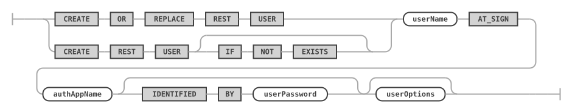

`userName ::=`


`userPassword ::=`


`userOptions ::=`

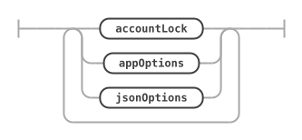

`appOptions ::=`


`accountLock ::=`


For `authAppName`, see [CREATE REST AUTH APP](rest-authentication.md#create-rest-auth-app). For `jsonOptions`, see [REST Configuration JSON Options](rest-metadata.md#rest-configuration-json-options).

### Examples

The following example creates a REST auth app and a REST user that authenticates with a password.

```sql
CREATE REST AUTH APP "TestAuthApp" VENDOR MRS;

CREATE REST USER "ulf"@"TestAuthApp" IDENTIFIED BY "********";
```

## CREATE REST ROLE

The `CREATE REST ROLE` statement creates a REST role in the specified or the current REST service. With `EXTENDS`, the role has the privileges of the parent role in addition to its own. With `ON ANY SERVICE`, the role can be used from any REST service.

### Syntax

```antlr
createRestRoleStatement:    (
        CREATE OR REPLACE REST ROLE
        | CREATE REST ROLE (
            IF NOT EXISTS
        )?
    ) roleName (EXTENDS parentRoleName)? roleService? restRoleOptions?
;

restRoleOptions:
 (jsonOptions | comments)+
;
```

`createRestRoleStatement ::=`

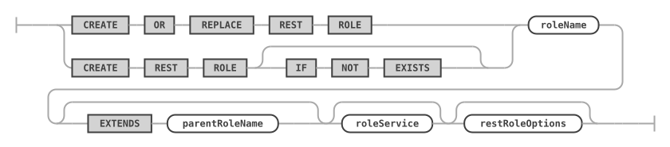

`restRoleOptions ::=`


For `roleService`, see [SHOW CREATE REST ROLE](#show-create-rest-role).

### Examples

The following example creates the role `reader` in the current REST service, and the role `poster`, which extends it.

```sql
CREATE REST ROLE "reader";

CREATE REST ROLE "poster" EXTENDS "reader";
```

The following example creates a role that can be used from any REST service.

```sql
CREATE REST ROLE "globalRole" ON ANY SERVICE;
```

## ALTER REST USER

The `ALTER REST USER` statement changes the password and the options of an existing REST user account. The options are those of [`CREATE REST USER`](#create-rest-user).

### Syntax

```antlr
alterRestUserStatement:
    ALTER REST USER userName AT_SIGN authAppName (
        IDENTIFIED BY userPassword
    )? userOptions?
;
```

`alterRestUserStatement ::=`

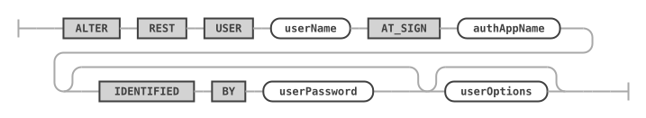

### Examples

The following example locks the account of a REST user.

```sql
ALTER REST USER "ulf"@"TestAuthApp" ACCOUNT LOCK;
```

## DROP REST USER

The `DROP REST USER` statement drops an existing REST user from a REST authentication app.

### Syntax

```antlr
dropRestUserStatement:
    DROP REST USER (IF EXISTS)? userName AT_SIGN
        authAppName
;
```

`dropRestUserStatement ::=`


### Examples

```sql
DROP REST USER "ulf"@"TestAuthApp";
```

## DROP REST ROLE

The `DROP REST ROLE` statement drops the named REST role.

### Syntax

```antlr
dropRestRoleStatement:
    DROP REST ROLE (IF EXISTS)? roleName roleService?
;
```

`dropRestRoleStatement ::=`


### Examples

```sql
DROP REST ROLE IF EXISTS "poster";
```

## GRANT REST

The `GRANT REST` statement grants REST privileges on REST services, schemas, or objects to a role.

### Syntax

```antlr
grantRestPrivilegeStatement:
    GRANT REST privilegeList (
        (ON SERVICE? serviceRequestPathWildcard)
        | (
            ON serviceSchemaSelectorWildcard (
                OBJECT objectRequestPathWildcard
            )?
        )
    )? TO roleName roleService?
;

privilegeList:
    privilegeName
    | privilegeName COMMA privilegeList
;

privilegeName:
    CREATE
    | READ
    | UPDATE
    | DELETE
;
```

`grantRestPrivilegeStatement ::=`

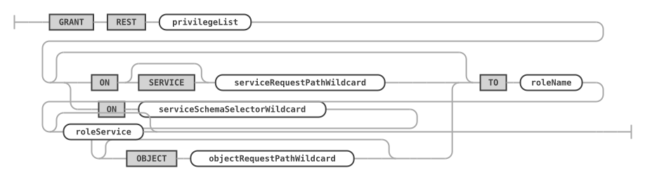

`privilegeList ::=`

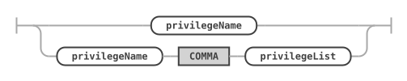

`privilegeName ::=`

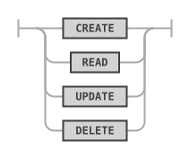

The privileges apply at the level you give: a REST service, a REST schema, or a single REST object. A role with the READ privilege on a REST schema, for example, can read all REST objects of that schema. The request paths can contain the wildcards `*` and `?`.

### Examples

The following example grants the READ privilege on the REST object `/post` of the REST schema `/blog` to the role `reader`, and the CREATE and UPDATE privileges to the role `poster`.

```sql
GRANT REST READ ON SCHEMA /blog OBJECT /post TO "reader";

GRANT REST CREATE, UPDATE ON SCHEMA /blog OBJECT /post TO "poster";
```

## GRANT REST ROLE

The `GRANT REST ROLE` statement grants a REST role to a REST user.

### Syntax

```antlr
grantRestRoleStatement:
    GRANT REST ROLE roleName roleService? TO userName AT_SIGN
        authAppName comments?
;
```

`grantRestRoleStatement ::=`

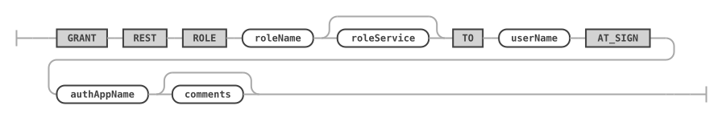

### Examples

```sql
GRANT REST ROLE "reader" TO "ulf"@"TestAuthApp";
```

## REVOKE REST

The `REVOKE REST` statement revokes REST privileges on REST services, schemas, or objects from a role.

### Syntax

```antlr
revokeRestPrivilegeStatement:
    REVOKE REST privilegeList (
        (ON SERVICE? serviceRequestPathWildcard)
        | (
            ON serviceSchemaSelectorWildcard (
                OBJECT objectRequestPathWildcard
            )?
        )
    )? FROM roleName roleService?
;
```

`revokeRestPrivilegeStatement ::=`


### Examples

```sql
REVOKE REST UPDATE ON SCHEMA /blog OBJECT /post FROM "poster";
```

## REVOKE REST ROLE

The `REVOKE REST ROLE` statement revokes a REST role from a REST user.

### Syntax

```antlr
revokeRestRoleStatement:
    REVOKE REST ROLE roleName roleService? FROM userName AT_SIGN
        authAppName
;
```

`revokeRestRoleStatement ::=`

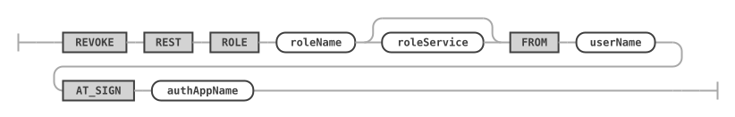

### Examples

```sql
REVOKE REST ROLE "reader" FROM "ulf"@"TestAuthApp";
```

## SHOW REST USERS

The `SHOW REST USERS` statement lists REST user accounts. With a REST service, it lists the users of the REST auth apps linked to that service. With `FOR AUTH APP`, it lists the users of the given REST auth app. You can combine both.

When neither is given, the statement lists the users of the current REST service, or all users if no current REST service is set. When only `FOR AUTH APP` is given, the current REST service isn't taken into account.

Passwords are never shown.

### Syntax

```antlr
showRestUsersStatement:
    SHOW REST USERS (
        (ON | FROM) SERVICE? serviceRequestPath
    )? (FOR AUTH APP authAppName)? formatClause?
;
```

`showRestUsersStatement ::=`

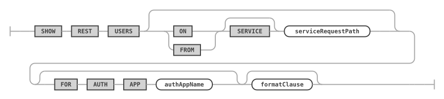

With `FORMAT=JSON`, the result is one JSON array of the REST users, each with its roles; see [Lists in JSON](rest-metadata.md#lists-in-json).

### Examples

The following example lists the users of all REST auth apps linked to the REST service `/myService`.

```sql
SHOW REST USERS ON SERVICE /myService;
```

The following example lists the users of the REST auth app `MRS`.

```sql
SHOW REST USERS FOR AUTH APP "MRS";
```

## SHOW REST ROLES

The `SHOW REST ROLES` statement lists REST roles, optionally filtered by REST service, or by the REST user or REST auth app the roles were granted to.

### Syntax

```antlr
showRestRolesStatement:
    SHOW REST ROLES (
        (ON | FROM) (
            ANY SERVICE
            | SERVICE? serviceRequestPath
        )
    )? (FOR userName? AT_SIGN authAppName)? formatClause?
;
```

`showRestRolesStatement ::=`

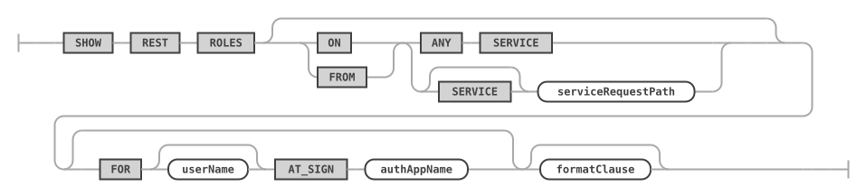

With `FORMAT=JSON`, the result is one JSON array of the REST roles, each with its privileges; see [Lists in JSON](rest-metadata.md#lists-in-json).

### Examples

```sql
SHOW REST ROLES;

SHOW REST ROLES FOR "ulf"@"TestAuthApp";
```

## SHOW REST GRANTS

The `SHOW REST GRANTS` statement lists the REST privileges granted to the given role.

### Syntax

```antlr
showRestGrantsStatement:
    SHOW REST GRANTS FOR roleName (
        (ON | FROM) (
            ANY SERVICE
            | SERVICE? serviceRequestPath
        )
    )?
;
```

`showRestGrantsStatement ::=`


### Examples

```sql
SHOW REST GRANTS FOR "poster";
```

## SHOW CREATE REST USER

The `SHOW CREATE REST USER` statement shows the DDL statement for the given REST user account.

### Syntax

```antlr
showCreateRestUserStatement:
    SHOW CREATE REST USER userName AT_SIGN authAppName formatClause?
;
```

`showCreateRestUserStatement ::=`

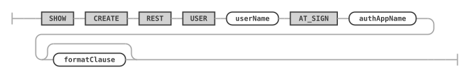

For `formatClause`, see [SHOW CREATE ... FORMAT=JSON](rest-metadata.md).

### Examples

The following example shows the DDL statement for the given REST user.

```sql
SHOW CREATE REST USER myuser@`MRS`;
```

## SHOW CREATE REST ROLE

The `SHOW CREATE REST ROLE` statement shows the DDL statement for the given REST role.

### Syntax

```antlr
showCreateRestRoleStatement:
    SHOW CREATE REST ROLE roleName roleService? formatClause?
;

roleService:
    ON (
        ANY SERVICE
        | SERVICE? serviceRequestPath
    )
;
```

`showCreateRestRoleStatement ::=`


`roleService ::=`


The `roleService` clause selects the REST service of a role in all role statements. Without it, the current REST service is used. `ON ANY SERVICE` refers to a role that can be used from any REST service.

For `formatClause`, see [SHOW CREATE ... FORMAT=JSON](rest-metadata.md).

### Examples

The following example shows the DDL statement for the given REST role.

```sql
SHOW CREATE REST ROLE `myrole` ON SERVICE /myTestService;
```
