# REST Views

A REST data mapping view, or REST view, of the MariaDB REST Service (MRS) serves the data of database tables or views as JSON documents. Its structure is defined with an extended GraphQL syntax. To learn more about REST data mapping views, see [REST Data Mapping Views](../developer-guide/rest-data-mapping-views.md).

In the statements, `REST VIEW`, `REST DATA VIEW`, `REST MAPPING VIEW`, and `REST DATA MAPPING VIEW` are synonyms.

## CREATE REST VIEW

The `CREATE REST DATA MAPPING VIEW` statement adds REST endpoints for database schema tables or views. Their data is served as JSON documents.

The structure of the served JSON documents is defined with an [extended GraphQL syntax](#defining-the-graphql-definition-for-a-rest-view), which lets you define even complex REST data mapping views in a simple and readable way.

### Syntax

```antlr
createRestViewStatement:    (
        CREATE OR REPLACE REST DATA? MAPPING? VIEW
        | CREATE REST DATA? MAPPING? VIEW (
            IF NOT EXISTS
        )?
    ) viewRequestPath (ON serviceSchemaSelector)? AS qualifiedIdentifier (
        CLASS restObjectName
    )? graphQlCrudOptions? graphQlObj? restObjectOptions?
;

serviceSchemaSelector:
    (SERVICE serviceRequestPath)? SCHEMA schemaRequestPath
;

restObjectOptions: (
        enabledDisabledPrivate
        | authenticationRequired
        | itemsPerPage
        | jsonOptions
        | comments
        | metadata
        | restViewMediaType
        | restViewFormat
        | restViewAuthenticationProcedure
    )+
;
```

`createRestViewStatement ::=`

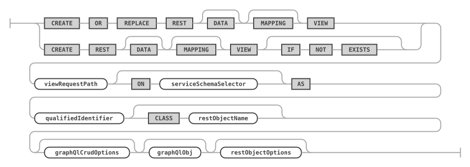

`serviceSchemaSelector ::=`


`restObjectOptions ::=`

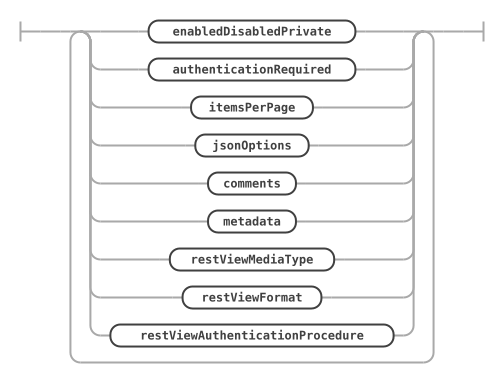

The `serviceSchemaSelector` selects the REST service and the REST schema. Without it, the current REST service and schema are used, see [USE REST](rest-metadata.md#use-rest). [REST procedures and functions](rest-routines.md) use the same `serviceSchemaSelector` and `restObjectOptions`.

### Examples

The following example adds a REST data mapping view for the `sakila.city` database schema table.

```sql
CREATE REST VIEW /city
ON SERVICE /myService SCHEMA /sakila
AS `sakila`.`city` {
    cityId: city_id @SORTABLE,
    city: city,
    countryId: country_id,
    lastUpdate: last_update
}
AUTHENTICATION REQUIRED;
```

A query of the REST data mapping view with the TypeScript SDK returns the following JSON document.

```typescript
ts> myService.sakila.city.findFirst();
{
   "city": "A Corua (La Corua)",
   "links": [
      {
         "rel": "self",
         "href": "/myService/sakila/city/1"
      }
   ],
   "cityId": 1,
   "countryId": 87,
   "lastUpdate": "2006-02-15 04:45:25.000000",
   "_metadata": {
      "etag": "EE93452B41984F3F5BBB0395CCB2CED00F5C748FEEA4A36CCD749CC3F85B7CEA"
   }
}
```

The following example adds the referenced table `sakila.country` to the REST data mapping view.

```sql
CREATE OR REPLACE REST VIEW /city
ON SERVICE /myService SCHEMA /sakila
AS `sakila`.`city` {
    cityId: city_id @SORTABLE,
    city: city,
    countryId: country_id,
    lastUpdate: last_update,
    country: sakila.country {
        countryId: country_id @SORTABLE,
        country: country,
        lastUpdate: last_update
    }
}
AUTHENTICATION REQUIRED;
```

This is what the REST data mapping view looks like in the interactive REST Object dialog of MariaDB Shell for VS Code.


A TypeScript SDK query against the new REST endpoint returns the following JSON document.

```typescript
ts> myService.sakila.city.findFirst();
{
    "city": "A Corua (La Corua)",
    "links": [
        {
            "rel": "self",
            "href": "/myService/sakila/city/1"
        }
    ],
    "cityId": 1,
    "country": {
        "country": "Spain",
        "countryId": 87,
        "lastUpdate": "2006-02-15 04:44:00.000000"
    },
    "countryId": 87,
    "lastUpdate": "2006-02-15 04:45:25.000000",
    "_metadata": {
        "etag": "FFA2187AD4B98DF48EC40B3E807E0561A71D02C2F4F5A3B953AA6CB6E41CAD16"
    }
}
```

### Preconditions

You define a REST data mapping view against a set of tables related by primary key (PK), foreign key (FK), or unique key (UK) constraints. The following rules apply:

* The constraints must be declared in the database.
* The relationship type can be 1-to-1, 1-to-N, or N-to-M (using a mapping table with two FKs). You can think of an N-to-M relationship as the combination of a 1-to-N and a 1-to-1 relationship.
* Columns of two or more tables with 1-to-1 or N-to-1 relationships can be merged into the same JSON object with `@UNNEST`. Otherwise, a nested JSON object is created.
* Tables with a 1-to-N relationship create a nested JSON array.
* Each item in the data mapping view is one JSON object, which is typically a hierarchy of nested objects and arrays.
* Each application object is built from values that originate from one or more rows of the underlying tables of the view. Typically, each table contributes one (nested) JSON object.

### Enabling or Disabling a REST View

The [`enabledDisabledPrivate`](rest-schemas.md#enabling-or-disabling-a-rest-object) option specifies whether the REST data mapping view is enabled, disabled, or private when it is created.

Setting a REST data mapping view to private disables public access through HTTPS, but keeps it available for private access from MRS scripts.

### Requiring Authentication

The `authenticationRequired` option specifies whether a REST data mapping view requires authentication before its REST endpoints can be accessed. The same option applies to [REST schemas](rest-schemas.md#create-rest-schema), [REST procedures and functions](rest-routines.md), and [content sets and files](rest-content.md).

```antlr
authenticationRequired:
    AUTHENTICATION NOT? REQUIRED
;
```

`authenticationRequired ::=`


### Specifying the Page Size for REST Views

The [`itemsPerPage`](rest-schemas.md#specifying-the-default-page-size) option specifies the number of items returned for queries run against the REST data mapping view.

### Setting the Media Type for REST Views

If the REST data mapping view returns a specific MIME type, set it with the `restViewMediaType` option. To have MRS detect the type from the content, use the `AUTODETECT` option.

```antlr
restViewMediaType:
    MEDIA TYPE (
        textStringLiteral
        | AUTODETECT
    )
;
```

`restViewMediaType ::=`


### Setting the Result Format for REST Views

A REST data mapping view returns one of the following formats, set with the `restViewFormat` option:

* `FEED`: a list of result JSON objects.
* `ITEM`: a single result item.
* `MEDIA`: a single BLOB item. The `restViewMediaType` option sets the corresponding MIME type in this case.

```antlr
restViewFormat:
    FORMAT (FEED | ITEM | MEDIA)
;
```

`restViewFormat ::=`

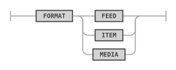

### Using a Custom Authentication Procedure for a REST View

If the built-in authentication handling doesn't cover the use case of a REST data mapping view, a stored procedure can handle the authentication check for the given user and the requested CRUD operation.

The stored procedure has to be in the same schema as the database schema object, and it has to accept the following parameters: `(IN user_id BINARY(16), IN schema VARCHAR(255), IN object VARCHAR(255), IN crud_operation VARCHAR(4))`. It needs to return `true` or `false`.

```antlr
restViewAuthenticationProcedure:
    AUTHENTICATION PROCEDURE qualifiedIdentifier
;
```

`restViewAuthenticationProcedure ::=`


### Defining the GraphQL Definition for a REST View

The GraphQL definition maps the columns of the table or view, and of the tables it references, to the fields of the JSON documents. [REST procedures and functions](rest-routines.md) use the same syntax to describe their parameters and results.

```antlr
graphQlObj:
    OPEN_CURLY graphQlPair (COMMA graphQlPair)* CLOSE_CURLY
    | OPEN_CURLY CLOSE_CURLY
;

graphQlCrudOptions: (
        AT_INSERT
        | AT_NOINSERT
        | AT_UPDATE
        | AT_NOUPDATE
        | AT_DELETE
        | AT_NODELETE
        | AT_CHECK
        | AT_NOCHECK
    )+
;

graphQlPair:
    graphQlPairKey COLON graphQlPairValue (
        AT_IN
        | AT_OUT
        | AT_INOUT
    )? graphQlValueOptions? (
        AT_DATATYPE OPEN_PAR graphQlDatatypeValue CLOSE_PAR
    )? graphQlCrudOptions? graphQlValueJsonSchema? graphQlObj?
;

graphQlValueOptions: (
        AT_NOCHECK
        | AT_SORTABLE
        | AT_NOFILTERING
        | AT_ROWOWNERSHIP
        | AT_UNNEST
        | AT_KEY
    )+
;

graphQlValue:
    qualifiedIdentifier
    | graphQlObj
;

graphQlValueJsonSchema:
    JSON SCHEMA jsonValue
;
```

`graphQlObj ::=`

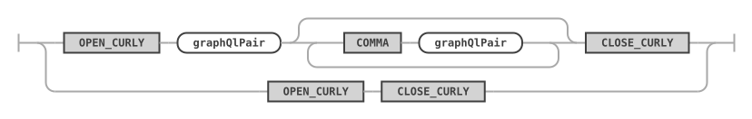

`graphQlCrudOptions ::=`

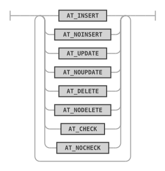

`graphQlPair ::=`

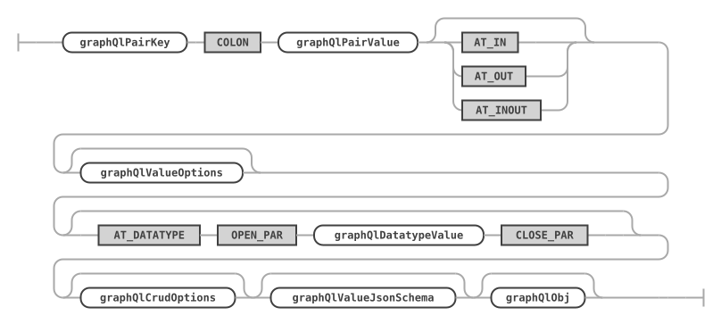

`graphQlValueOptions ::=`

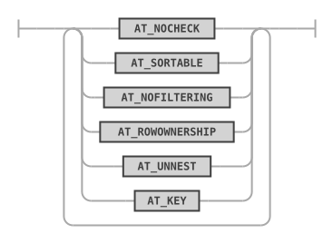

`graphQlValue ::=`

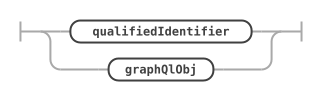

`graphQlValueJsonSchema ::=`


The data type given with `@DATATYPE` can be written as an identifier or in single or double quotes, for example `@DATATYPE(int)`, `@DATATYPE('varchar(20)')`, or `@DATATYPE("varchar(20)")`.

### REST View Comments and Metadata

The comments hold a description of the REST view, see [REST Service Comments](rest-services.md#rest-service-comments). The metadata holds any JSON data. A front end can consume it to render certain attributes dynamically, for example a specific icon or color. See [REST Service Metadata](rest-services.md#rest-service-metadata).

### JSON Options for REST Objects

The [`jsonOptions`](rest-metadata.md#rest-configuration-json-options) set a number of specific options for the REST view. Specify the `MERGE` keyword to merge the given options with the existing options. Without `MERGE`, the given options replace all existing options.

The following options can be set for most database object endpoints, REST views as well as REST procedures and functions, in a JSON object in the `OPTIONS` clause (indentation means JSON object nesting):

* `http`
  * See [REST Service JSON Options](rest-services.md#rest-service-json-options).
* `logging`
  * See [REST Service JSON Options](rest-services.md#rest-service-json-options).
* `metadata`
  * `gtid` (_bool_)
    * If `true`, embeds the GTID assigned to database change operations into the metadata of the response JSON object. Enable it with replication topologies, so that changes made to an object are reflected when it is read, regardless of where the read happens. The default is `true`.
* `sqlQuery`
  * `embedWait` (_bool_)
    * If `true`, performs the wait described in the `wait` option directly in the database query, instead of in a separate statement before it.
  * `timeout` (_number_)
    * The number of milliseconds to wait for the database query to execute before it is terminated. The default is taken from the global `sqlQuery`.`timeout` option.
  * `wait` (_bool_)
    * When data is queried from a secondary server, controls whether to wait until the transaction GTID specified in the `asof` clause has been applied. This enables read-your-own-writes semantics.
* `result`
  * `cacheTimeToLive` (_double_)
    * Enables caching for GET requests. Specifies the number of seconds (including fractions of a second) to keep the response in the cache, after which it is discarded until a new request comes in, or when the cache fills up.
  * `includeLinks` (_bool_)
    * Whether to include links in returned JSON objects. The default is `true`.
* `returnInternalErrorDetails` (_bool_)
  * Controls debug logging.
* `disableAutomaticGrants` (_bool_)
  * When you create or alter REST objects, a list of privileges is automatically granted to the `mysql_rest_service_data_provider` role, so that the MariaDB REST Daemon can access the referenced data in MariaDB Server. In some cases, you may want to turn off this automatic grant of privileges and use the `grants` option to specify a custom list of grants.
* `grants` (_object_ | _list_)
  * Either a single grant object or a list of grant objects that are executed in addition to the automatically generated grant statements for the REST object. These additional grants are needed when, for example, a stored procedure works with database tables or views, or calls other procedures and functions.
  * `privileges` (_string_ | _list_)
    * A single privilege name, a list of privilege names, or a list of privilege objects. The following privileges are allowed: "ALTER" | "ALTER ROUTINE" | "CREATE" | "CREATE ROUTINE" | "CREATE TEMPORARY TABLES" | "CREATE VIEW" | "DELETE" | "DROP" | "EVENT" | "EXECUTE" | "INDEX" | "INSERT" | "LOCK TABLES" | "REFERENCES" | "SELECT" | "SHOW DATABASES" | "SHOW VIEW" | "TRIGGER" | "UPDATE" | "USAGE". A privilege object has two fields, `privilege` and `columnList`, the latter holding a list of column names.
  * `objectType` (_string_)
    * The object type, either "TABLE" | "FUNCTION" | "PROCEDURE".
  * `schema` (_string_)
    * The name of the database schema or `*`, without backticks.
  * `object` (_string_)
    * The name of the database table, view, procedure, or function, or `*`, without backticks.

The following example grants the `SELECT` privilege on the `mysql_rest_service_metadata`.`mrs_user` table.

```json
{
    "grants": {
        "privileges": "SELECT",
        "schema": "mysql_rest_service_metadata",
        "object": "mrs_user"
    }
}
```

The following example grants the `SELECT` and `UPDATE` privileges on the `mysql_rest_service_metadata`.`mrs_user` table.

```json
{
    "grants": {
        "privileges": [ "SELECT", "UPDATE" ],
        "schema": "mysql_rest_service_metadata",
        "object": "mrs_user" }
}
```

The following example grants two privileges.

```json
{
    "grants": [
        {
            "privileges": "SELECT",
            "schema": "mysql_rest_service_metadata",
            "object": "msm_schema_version"
        },
        {
            "privileges": "SELECT",
            "schema": "mysql_rest_service_metadata",
            "object": "mrs_user_schema_version"
        }
    ]
}
```

The following example grants the `SELECT` privilege only on the `id` and `name` columns of the `mysql_rest_service_metadata`.`mrs_user` table.

```json
{
    "grants": {
        "privileges": [
            {
                "privilege": "SELECT",
                "columnList": [
                    "id",
                    "name"
                ]
            }
        ],
        "schema": "mysql_rest_service_metadata",
        "object": "mrs_user"
    }
}
```

## ALTER REST VIEW

The `ALTER REST DATA MAPPING VIEW` statement changes an existing REST data mapping view. To design the GraphQL definition, see [Defining the GraphQL Definition for a REST View](#defining-the-graphql-definition-for-a-rest-view). The options are the `restObjectOptions` of [`CREATE REST VIEW`](#create-rest-view).

### Syntax

```antlr
alterRestViewStatement:
    ALTER REST DATA? MAPPING? VIEW viewRequestPath (
        ON serviceSchemaSelector
    )? (NEW REQUEST PATH newViewRequestPath)? (
        CLASS restObjectName graphQlCrudOptions? graphQlObj?
    )? restObjectOptions?
;
```

`alterRestViewStatement ::=`

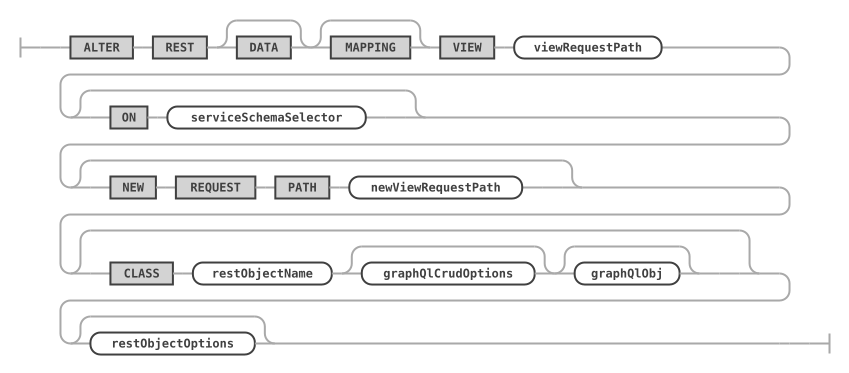

### Examples

The following example changes the REST data mapping view `/city` for the `sakila.city` database schema table and sets a new list of fields.

```sql
ALTER REST VIEW /city
ON SERVICE /myService SCHEMA /sakila
CLASS MyServiceSakilaCity {
    cityId: city_id @SORTABLE,
    city: city
};
```

## DROP REST VIEW

The `DROP REST DATA MAPPING VIEW` statement drops an existing REST data mapping view.

### Syntax

```antlr
dropRestViewStatement:
    DROP REST DATA? MAPPING? VIEW (
        IF EXISTS
    )? viewRequestPath (FROM serviceSchemaSelector)?
;
```

`dropRestViewStatement ::=`

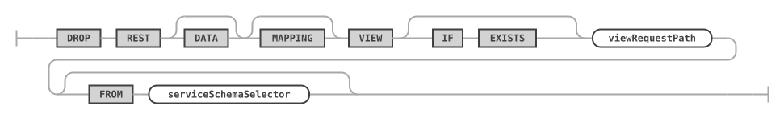

### Examples

The following example drops the REST data mapping view with the request path `/city`.

```sql
DROP REST VIEW /city
FROM SERVICE /myService SCHEMA /sakila;
```

## SHOW REST VIEWS

The `SHOW REST DATA MAPPING VIEWS` statement lists all REST data mapping views of the given or the current REST schema.

### Syntax

```antlr
showRestViewsStatement:
    SHOW REST DATA? MAPPING? VIEWS (
        (ON | FROM) serviceSchemaSelector
    )?
;
```

`showRestViewsStatement ::=`

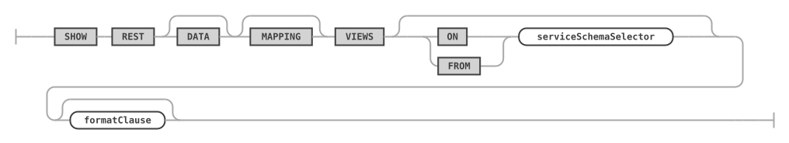

### Examples

The following example lists all REST data mapping views of the given REST schema.

```sql
SHOW REST VIEWS FROM SERVICE /myService SCHEMA /sakila;
```

## SHOW CREATE REST VIEW

The `SHOW CREATE REST DATA MAPPING VIEW` statement shows the DDL statement for the given REST data mapping view.

### Syntax

```antlr
showCreateRestViewStatement:
    SHOW CREATE REST DATA? MAPPING? VIEW viewRequestPath (
        (ON | FROM) serviceSchemaSelector
    )? formatClause?
;
```

`showCreateRestViewStatement ::=`

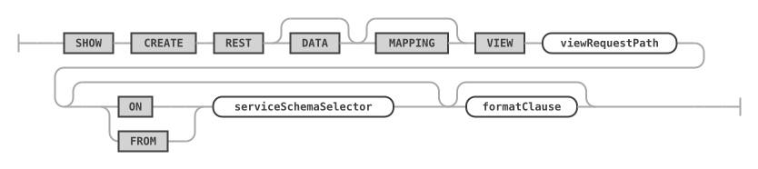

For `formatClause`, see [SHOW CREATE ... FORMAT=JSON](rest-metadata.md).

### Examples

The following example shows the DDL statement for the given REST data mapping view.

```sql
SHOW CREATE REST VIEW /city ON SERVICE /myService SCHEMA /sakila;
```
