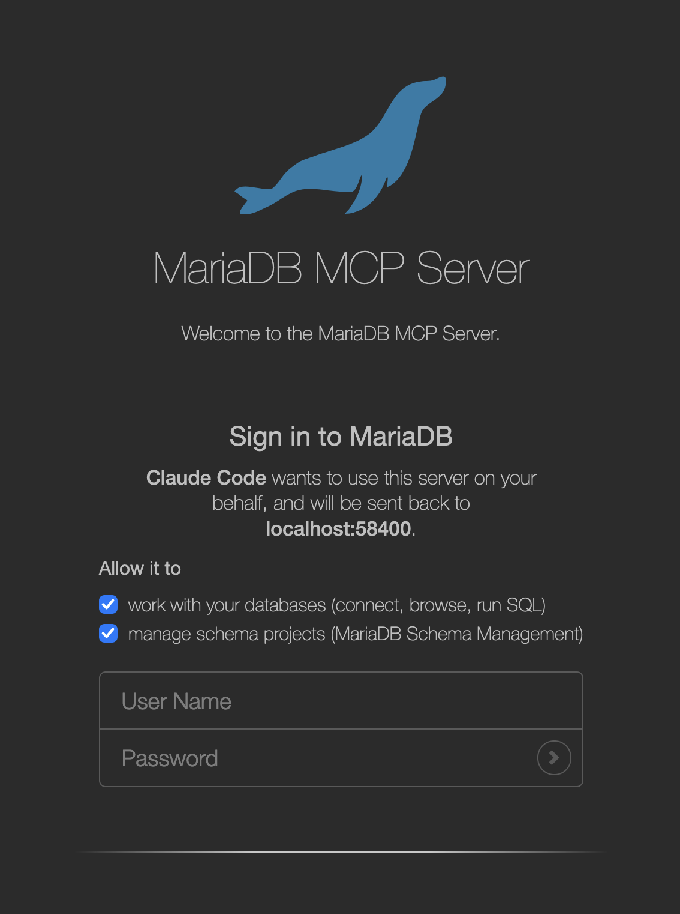

# OAuth Authentication

A [multi-tenant](multi-tenant-mode.md) MCP server authenticates every request. Besides API keys, it can accept OAuth2 access tokens, so that users sign in through their browser instead of handling a key, and so that their access ends when their sign-in ends. The server supports two OAuth2 modes:

| Mode | Who signs users in | Who the database session runs as |
| --- | --- | --- |
| `keycloak` | A Keycloak realm, or another OpenID Connect provider that works the same way | The connections an administrator configured for the user |
| `builtin` | The MCP server itself, with the user's MariaDB user name and password | The MariaDB account the user signed in with |

API keys keep working in both modes, for example for scripts.

The server follows the [MCP authorization specification](https://modelcontextprotocol.io/specification/2026-07-28/basic/authorization). MCP clients that implement it, such as Claude Code, discover the authorization server by themselves: you register only the server's URL, and the client runs the sign-in when it first connects.

## Before You Begin

* Turn on multi-tenant mode and add at least one user, as described in [Multi-Tenant Mode](multi-tenant-mode.md).
* Serve the MCP server over HTTPS. Plain HTTP is accepted only on the loopback address, for testing.
* Decide on the URL that clients use to reach the server. This is the server's public URL.

## Configure OAuth2 with mcp setup-oauth

OAuth2 has its own setup command, `mcp setup-oauth`. Like `mcp setup`, it shows a menu when you run it without options, and carries out exactly what the options say when you pass any:

```bash
mariadb-shell -- mcp setup-oauth
```

```bash
mariadb-shell -- mcp setup-oauth --publicUrl=https://mcp.example.com/mcp --mode=builtin
```

The menu offers only the settings of the selected mode. To print the configuration, run `mcp setup-oauth --show`, and add `--json` for machine-readable output. For all options, see [Options of mcp setup-oauth](#options-of-mcp-setup-oauth).

Restart the MCP server after you change the OAuth2 configuration, except for the changes that the following sections say take effect immediately.

## The Public URL

Access tokens are issued for one MCP server, which they name by its URL. The server accepts only tokens issued for its own public URL, and refuses tokens issued for any other resource:

```bash
mariadb-shell -- mcp setup-oauth --publicUrl=https://mcp.example.com/mcp
```

The public URL is the complete URL of the MCP endpoint, including the `/mcp` path, as clients reach it, for example through a reverse proxy. It can't be derived from the address the server binds to. The server publishes it in its [OAuth Protected Resource Metadata](https://datatracker.ietf.org/doc/html/rfc9728) at `/.well-known/oauth-protected-resource/mcp`, and accepts its host name in the `Host` header without `--allowedHosts`. To override it for one run, pass `--publicUrl` to `mcp start-server`.

## Scopes and Database Privileges

A token carries the scopes that the user granted the client when they signed in:

| Scope | Tools |
| --- | --- |
| `mcp:db` | The `db` tools |
| `mcp:msm` | The `msm` tools |

A client sees only the tools of the scopes its token grants. A token that grants none of the scopes is answered with status `403 Forbidden` and `error="insufficient_scope"`, which tells the client which scopes to request. A token never grants more than the user's [scopes](multi-tenant-mode.md#scopes) in the configuration.

There are no read-only or read-write scopes. What a user can do in a database is decided by the database: the privileges of the account the session runs as, and of the role it runs under. To give users different privileges, give them different accounts, or [default roles](multi-tenant-mode.md#default-role).

## Using Keycloak

In `keycloak` mode, Keycloak signs users in and issues the access tokens. The MCP server checks each token and maps it to a user of the server. The server connects to the database with the connections and passwords that an administrator configured for that user. The token itself never reaches the database.

### Prepare the Realm

The realm needs the following, all of which `mcp setup-keycloak-realm` creates for you:

* The client scopes `mcp:db` and `mcp:msm`, each with an **Audience** mapper that adds the MCP server's public URL to the `aud` claim of the access token. The server refuses tokens without it.
* The realm role `mcp-user`, which a token must carry for the server to create a user automatically at their first sign-in.
* A public client for MCP clients that don't register themselves, by default `mariadb-mcp`, with PKCE required and redirect URIs on the loopback address.

Run the command as a Keycloak administrator. It asks for every value that you don't pass as an option, and for the administrator password with a password prompt:

```bash
mariadb-shell -- mcp setup-keycloak-realm --server=https://kc.example.com --realm=mariadb \
  --adminUser=admin --mcpUrl=https://mcp.example.com/mcp --grantRealmRoleTo=ada
```

```text
Keycloak administrator password:
Client scope mcp:db created.
Audience https://mcp.example.com/mcp added to mcp:db.
Client scope mcp:msm created.
Audience https://mcp.example.com/mcp added to mcp:msm.
Realm role mcp-user created.
Realm role mcp-user given to ada.
Client mariadb-mcp created.
Client mariadb-mcp may request mcp:db, mcp:msm.
Realm 'mariadb' is prepared for https://mcp.example.com/mcp. Issuer: https://kc.example.com/realms/mariadb
Public URL set to https://mcp.example.com/mcp.
OAuth mode: keycloak.
Keycloak issuer: https://kc.example.com/realms/mariadb.
```

The command leaves everything that already exists unchanged, so you can run it again, for example to give more users the role. Unless you pass `--configureServer=false`, it also configures the MCP server: it sets the public URL, the mode `keycloak`, and the realm's issuer.

The command doesn't change the realm's client registration policies. By default, Keycloak refuses anonymous dynamic client registration from hosts that aren't trusted, with its **Trusted Hosts** policy. If your MCP clients register themselves, add their hosts to that policy; otherwise, configure them to use the `mariadb-mcp` client.

### Prepare the Realm in the Admin Console

To prepare the realm by hand instead, in the Keycloak admin console of the realm:

1. Create the client scopes `mcp:db` and `mcp:msm`, of type **Optional**, with **Include in token scope** on.
2. In each of them, add a mapper by configuration of type **Audience**. Set **Included Custom Audience** to the MCP server's public URL, exactly as configured with `--publicUrl`, and turn **Add to access token** on.
3. Create the realm role `mcp-user`, and give it to the users who may use the MCP server.
4. Create an OpenID Connect client for the MCP clients, with client authentication off, the standard flow on, PKCE method `S256`, and valid redirect URIs `http://127.0.0.1/*` and `http://localhost/*`. Add `mcp:db` and `mcp:msm` as optional client scopes.

Then configure the MCP server:

```bash
mariadb-shell -- mcp setup-oauth --publicUrl=https://mcp.example.com/mcp \
  --mode=keycloak --issuer=https://kc.example.com/realms/mariadb
```

The setup reads the realm's OpenID configuration to check the issuer. To save an issuer that isn't reachable yet, add `--noVerify`.

The audience is a name, not an address that Keycloak contacts. A public URL on the loopback address, such as `http://127.0.0.1:8080/mcp` for a test server on your own machine, works with a remote Keycloak server.

### How the Server Checks a Keycloak Token

For every request, the server:

1. Checks the signature against the realm's keys, which it reads from the realm's JWKS endpoint and caches. It accepts only asymmetric signatures. When the realm rotates its keys, the server reads them again, at most every 30 seconds.
2. Checks that the issuer is the configured one, that the token hasn't expired, that it is an access token and not an ID token, and that its audience contains the public URL.
3. If you configured a list of clients with `--clientIds`, checks that the token was issued to one of them.
4. Maps the token to a user, in this order:
   1. The user whose OAuth2 identity is the token's issuer and subject.
   2. If none exists, and the token carries a **verified** email address, the user whose email identity is that address. The server adds the OAuth2 identity to that user, so that the next request finds them by step 1. Turn this off with `--linkByVerifiedEmail=false`.
   3. If none exists, and the token carries the realm role `mcp-user`, a new user, created with the OAuth2 identity, the verified email address, and the default scopes. Turn this off with `--autoProvision=false`, or require another role with `--requiredRealmRole`.
   4. Otherwise, the server refuses the request.
5. Refuses the request if the user is disabled, or if the user's tokens were revoked after the token was issued.

A user created at sign-in has no connections. An administrator adds them with `mcp setup --user=… --addConnection`.

Keycloak access tokens are valid for a few minutes by default, so a user that you disable in Keycloak can use the MCP server until their current token expires. To have the server ask Keycloak about every token instead, use token introspection. The server then caches each answer for 30 seconds:

```bash
mariadb-shell -- mcp setup-oauth --verification=introspection \
  --introspectionClientId=mariadb-mcp-introspection --introspectionSecretEnv=KC_INTROSPECTION_SECRET
```

The introspection client is a confidential client of the realm. Its secret is stored in the credential store.

## Using the Built-In Authorization Server

In `builtin` mode, the MCP server is its own authorization server, and **the MariaDB account is the user's identity**. A client sends the user's browser to the server's sign-in page, where the user enters their MariaDB user name and password. The server checks them by connecting to the database with them, and issues the client an access token. The tools then open sessions as that account, under its default role. What the user can do is what the database grants their account.

This follows the model of Snowflake's MCP server, without changes to the database server.

### Configure the Login Servers

Add the MariaDB servers that users sign in to. A login server is a connection URI without a user name:

```bash
mariadb-shell -- mcp setup-oauth --publicUrl=https://mcp.example.com/mcp --mode=builtin \
  --addLoginServer='mariadb://db.example.com:3306?ssl-mode=VERIFY_IDENTITY' \
  --requiredRole=mcp_access
```

With more than one login server, the sign-in page lets the user choose. The password travels to the database server, so the server always connects to a non-loopback login server with TLS, and sets `ssl-mode=REQUIRED` when the URI doesn't ask for more. Use `VERIFY_IDENTITY`, as in the example, to also verify the server's certificate.

`--requiredRole` is the MariaDB role that an account must hold to sign in at all. A role granted through another role counts. Grant it to the accounts that may use the MCP server:

```sql
CREATE ROLE mcp_access;
GRANT mcp_access TO 'ada'@'%';
SET DEFAULT ROLE mcp_access FOR 'ada'@'%';
```

Without a required role, every account that can connect may sign in.

### The Sign-In

The sign-in page shows the client's name and the address it sends the user back to, and lets the user choose which of the requested scopes to grant.

<figure><figcaption><p>The sign-in page, opened by Claude Code</p></figcaption></figure>

When the user signs in:

1. The server connects to the chosen login server with the user name and password, reads the account (`CURRENT_USER()`) and its roles, and disconnects.
2. It refuses the sign-in if the account doesn't hold the required role.
3. It maps the account to a user: the user with that MariaDB account identity, or, if none exists, a new user, unless you turned that off with `--autoProvision=false`. A sign-in never adds an account to an existing user; to let one user sign in with several accounts, add them with `mcp setup --addIdentity=mariadb:<server>|<account>`.
4. It refuses the sign-in if the user's default role isn't granted directly to the account, or if the client allows only certain roles and the session's role isn't one of them.
5. It creates a **grant** for the user and the client, and sends the browser back to the client with an authorization code.

Every failed sign-in shows the same message, whatever the reason. After 5 failures for one account, or 30 from one address, within 15 minutes, the page refuses further attempts until that time has passed.

### Grants

A grant is one user's authorization of one client. It lasts 90 days by default, and ends earlier when:

* the client hasn't refreshed its token for the idle timeout, if you set one with `--grantIdleTimeout`;
* the user revokes it in the client, or an administrator revokes the user's tokens with `mcp setup-oauth --revokeTokens`;
* the user is disabled or removed, or the client is removed;
* the client presents a refresh token that was already used.

The access tokens of a grant are valid for one hour; the client renews them with its refresh token. Every refresh issues a new refresh token. If an old refresh token is presented again, the server assumes that it was stolen and ends the grant. A client that sends the same refresh token twice within 30 seconds, for example from two workers at once, receives the same new tokens both times. Change this period with `--refreshGracePeriod`.

When a grant ends, the client's next request is answered with status `401 Unauthorized`, and the client asks the user to sign in again.

### The Login Connection

The account and password that a user signed in with become a connection of their grant, so the user can use the `db` tools without an administrator configuring a connection. `db.list_connections` lists it, and `db.connect` opens it. Only the client of that grant can use it.

The server keeps the password exactly as long as the grant lives, and deletes it when the grant ends. By default, it keeps it in the user's secret group, so that the grant survives a restart of the server. With `--loginConnectionStore=memory`, it keeps it only in the server's memory; a restart then ends all grants.

### Clients

The built-in server accepts three kinds of clients:

| Kind | How it is registered | Example |
| --- | --- | --- |
| Client ID Metadata Document | The client uses an HTTPS URL as its client ID, and the server reads the client's metadata from that URL. | Claude Code, with `https://claude.ai/oauth/claude-code-client-metadata` |
| Dynamically registered client | The client registers itself at `/register`. | Clients without a metadata document |
| Administrator-registered client | You register it with `mcp setup-oauth --addClient`. | A gateway such as Arcade |

Client ID Metadata Documents and dynamic registration are on by default. Turn them off with `--cimd=false` and `--dynamicClientRegistration=false`. The server reads a metadata document only from public addresses, without following redirects, and accepts it only if its `client_id` is its own URL. Dynamically registered clients that haven't been used for 30 days are removed.

Redirect URIs must match a registered URI exactly, with one exception: for a registered redirect URI on the loopback address, the client may use another port, because native applications such as Claude Code choose a free port for each sign-in.

To register a client, give it a name. A confidential client, such as a server-side gateway, authenticates with a secret, which the setup prints:

```bash
mariadb-shell -- mcp setup-oauth --addClient=arcade --confidential
```

```text
OAuth client 'arcade' registered.
Client ID:     3767ac94-e021-4237-a9d1-254c737e30b0
Client secret: GQgKAXR9tO3Rma_aHP1AbUfn3BUcdP49ApomWq88PFs
It has no redirect URI yet: set it with --setClientRedirectUris=3767ac94-e021-4237-a9d1-254c737e30b0 --redirectUris=<uri>.
```

You can set the redirect URIs later, once the client has shown them, and show or replace the secret at any time:

```bash
mariadb-shell -- mcp setup-oauth --setClientRedirectUris=arcade --redirectUris=https://cloud.arcade.dev/api/v1/oauth/callback
mariadb-shell -- mcp setup-oauth --showClientSecret=arcade
mariadb-shell -- mcp setup-oauth --rotateClientSecret=arcade
```

A confidential client may send its secret in an HTTP Basic `Authorization` header or in the request body.

To allow sessions through a client only under certain roles, list them. A sign-in through the client is refused unless the session's role is one of them:

```bash
mariadb-shell -- mcp setup-oauth --setClientAllowedRoles=arcade --roles=mcp_access
```

Removing a client ends all its grants:

```bash
mariadb-shell -- mcp setup-oauth --removeClient=arcade
```

### Restrict the Networks Clients Connect From

To accept requests to the MCP endpoint and to the token, registration, and revocation endpoints only from certain networks, list them:

```bash
mariadb-shell -- mcp setup-oauth --allowedClientNetworks=203.0.113.0/24,198.51.100.0/24
```

The sign-in page isn't restricted, because users' browsers can be anywhere. The server compares the network address of the connection. Behind a reverse proxy, that is the proxy's address, so the list must contain the proxy.

### The Signing Key

The server signs its access tokens with an ES256 key, which it creates at its first start and stores in the credential store. To replace the key, rotate it:

```bash
mariadb-shell -- mcp setup-oauth --rotateSigningKey
```

```text
New token signing key 79a465822b5eab5e. Tokens signed with the previous key stay valid until they expire, at most 3600s; --dropPreviousSigningKey ends that now.
```

New tokens are signed with the new key, and tokens signed with the previous key stay valid until they expire, so clients don't have to sign in again. A running server picks up the new key within a minute, without a restart. If the previous key may have been disclosed, end its validity immediately:

```bash
mariadb-shell -- mcp setup-oauth --dropPreviousSigningKey
```

Clients then renew their access tokens with their refresh tokens.

## Connecting Through a Gateway Such as Arcade

A gateway, such as [Arcade](https://docs.arcade.dev/), connects to the MCP server on behalf of many users. It is a confidential client: it runs the sign-in for each user separately and stores each user's tokens. With the built-in authorization server, the setup corresponds to the setup that Arcade documents for Snowflake:

| Snowflake | MariaDB MCP server |
| --- | --- |
| `CREATE SECURITY INTEGRATION … OAUTH_CLIENT_TYPE = 'CONFIDENTIAL'` | `mcp setup-oauth --addClient=arcade --confidential` |
| `SYSTEM$SHOW_OAUTH_CLIENT_SECRETS(…)` | `mcp setup-oauth --showClientSecret=arcade` |
| Authorization URL and token URL left empty in Arcade | The same: Arcade discovers them from the public URL |
| `ALTER SECURITY INTEGRATION … SET OAUTH_REDIRECT_URI = …` | `mcp setup-oauth --setClientRedirectUris=arcade --redirectUris=<Arcade's redirect URI>` |
| `ALLOWED_ROLES_LIST = (…)` | `mcp setup-oauth --setClientAllowedRoles=arcade --roles=mcp_access` |
| `GRANT USAGE ON MCP SERVER … TO ROLE …` | `mcp setup-oauth --requiredRole=mcp_access`, and `GRANT mcp_access TO …` on the database |
| `ALTER USER … SET DEFAULT_ROLE = …` | `SET DEFAULT ROLE mcp_access FOR …` on the database |
| Network policy for Arcade's addresses | `mcp setup-oauth --allowedClientNetworks=<Arcade's networks>` |

To set it up:

1. Register the client, and note the client ID and secret.
2. In Arcade, add the MCP server with its public URL, and enter the client ID and secret. Leave the authorization and token URLs empty.
3. Set the redirect URI that Arcade shows as the client's redirect URI.
4. Grant the required role to the database accounts of the users, and make it their default role.

All of a gateway's requests come from its own addresses. Raise `--maxConnections` of `mcp start-server` for the number of users you expect. A gateway discovers the server's tools once, with the administrator's sign-in, so grant both scopes in that sign-in.

## Connecting a Client with OAuth2

Register only the server's URL, without an `Authorization` header. The client discovers the authorization server and runs the sign-in when it first connects, or when you ask it to.

In Claude Code, register the server, then run `/mcp`, select the server, and choose **Authenticate**. Claude Code opens the sign-in page in your browser:

```bash
claude mcp add --scope user --transport http mariadb https://mcp.example.com/mcp
```

## Revoking Access

| To end | Run | Takes effect |
| --- | --- | --- |
| All OAuth2 access of a user, and their built-in sign-ins | `mcp setup-oauth --revokeTokens=<user>` | With the user's next request |
| All access of a user, including API keys | `mcp setup --disableUser=<user>` | With the user's next request |
| All sign-ins through a client | `mcp setup-oauth --removeClient=<client>` | With the client's next request |
| The validity of tokens signed with the previous key | `mcp setup-oauth --dropPreviousSigningKey` | Within a minute |

For a user who signs in with Keycloak, also end their sessions in Keycloak.

## Options of mcp setup-oauth

| Option | Description |
| --- | --- |
| `--publicUrl=<url>` | The URL clients reach the MCP endpoint at. An empty value clears it. |
| `--mode=<mode>` | `none`, `keycloak`, or `builtin`. |
| `--issuer=<url>` | The Keycloak realm's issuer URL, for example `https://kc.example.com/realms/mariadb`. |
| `--noVerify` | Saves `--issuer` without reading its OpenID configuration. |
| `--verification=<method>` | How Keycloak tokens are checked: `jwt` (default) or `introspection`. |
| `--introspectionClientId=<id>` | The Keycloak client that introspection authenticates as. |
| `--introspectionSecretEnv=<name>` | The name of an environment variable that holds that client's secret. |
| `--clientIds=<list>` | The Keycloak clients whose tokens are accepted. Empty accepts any. |
| `--linkByVerifiedEmail=<bool>` | Links a Keycloak sign-in to the user with the token's verified email address. Default: on. |
| `--requiredRealmRole=<role>` | The Keycloak realm role a token needs for its user to be created. Default: `mcp-user`. |
| `--addLoginServer=<list>` | MariaDB servers that users sign in to, as connection URIs without a user. |
| `--removeLoginServer=<list>` | Removes login servers. |
| `--requiredRole=<role>` | The MariaDB role an account needs to sign in. Empty allows every account. |
| `--grantMaxLifetime=<seconds>` | How long a built-in sign-in lasts. Default: 7776000 (90 days). |
| `--grantIdleTimeout=<seconds>` | How long a built-in sign-in lasts without a token refresh. `0` turns it off, which is the default. |
| `--accessTokenLifetime=<seconds>` | How long a built-in access token is valid. Default: 3600. |
| `--refreshGracePeriod=<seconds>` | How long a replaced refresh token is still answered with the same new tokens. Default: 30. |
| `--loginConnectionStore=<store>` | Where a sign-in's connection is kept: `secret-store` (default) or `memory`. |
| `--allowedClientNetworks=<list>` | The networks the MCP endpoint and the token endpoints accept requests from. Empty accepts any. |
| `--dynamicClientRegistration=<bool>` | Lets clients register themselves. Default: on. |
| `--cimd=<bool>` | Accepts clients with a Client ID Metadata Document. Default: on. |
| `--autoProvision=<bool>` | Creates a user at their first sign-in, in the selected mode. Default: on. |
| `--defaultScopes=<list>` | The scopes of users created at sign-in. Default: `mcp:db,mcp:msm`. |
| `--addClient=<name>` | Registers a client, and prints its ID and, if confidential, its secret. |
| `--confidential` | Makes the client of `--addClient` authenticate with a secret. |
| `--redirectUris=<list>` | The redirect URIs for `--addClient` or `--setClientRedirectUris`. |
| `--setClientRedirectUris=<client>` | Sets a client's redirect URIs to `--redirectUris`. |
| `--setClientAllowedRoles=<client>` | Sets the roles a client's sessions may run under to `--roles`. |
| `--roles=<list>` | The roles for `--setClientAllowedRoles`. Empty allows any. |
| `--showClientSecret=<client>` | Prints a client's secret. |
| `--rotateClientSecret=<client>` | Gives a client a new secret. |
| `--removeClient=<client>` | Removes a client, and ends all sign-ins through it. |
| `--listClients` | Prints the registered clients. |
| `--rotateSigningKey` | Replaces the key access tokens are signed with. |
| `--dropPreviousSigningKey` | Ends the validity of tokens signed with the previous key. |
| `--revokeTokens=<list>` | Revokes all OAuth2 tokens of users, and ends their built-in sign-ins. |
| `--show` | Prints the OAuth2 configuration. |
| `--json` | Prints `--show`, and the client IDs and secrets of `--addClient`, `--showClientSecret`, `--rotateClientSecret`, and `--listClients`, as JSON. |

Clients are named by their client ID or by their name.

## Options of mcp setup-keycloak-realm

| Option | Description |
| --- | --- |
| `--server=<url>` | The Keycloak base URL, for example `https://kc.example.com`. |
| `--realm=<name>` | The realm to prepare. |
| `--adminRealm=<name>` | The realm the administrator signs in to. Default: `master`. |
| `--adminUser=<name>` | The administrator's user name. |
| `--adminPasswordEnv=<name>` | The name of an environment variable that holds the administrator's password. |
| `--adminPassword=<password>` | The administrator's password. Not recommended: a command line is visible to other processes. |
| `--mcpUrl=<url>` | The MCP server's public URL. Default: the URL set with `mcp setup-oauth --publicUrl`. |
| `--clientId=<id>` | The ID of the client for MCP clients. Default: `mariadb-mcp`. |
| `--directGrant` | Also allows the password grant on that client. For testing only. |
| `--grantRealmRoleTo=<list>` | User names or email addresses to give the realm role `mcp-user`. |
| `--configureServer=<bool>` | Also configures the MCP server for the realm. Default: on. |
| `--nonInteractive` | Never prompts. A value that isn't given is an error. |

## Troubleshooting

| Message or symptom | Cause | Solution |
| --- | --- | --- |
| *OAuth mode '…' needs the server's public URL* | The server was started in an OAuth2 mode without a public URL. | Set it with `mcp setup-oauth --publicUrl`. |
| *OAuth mode 'keycloak' needs the realm's issuer URL.* | No issuer is configured. | Set it with `--issuer`, or run `mcp setup-keycloak-realm`. |
| *OAuth mode 'builtin' signs users in against a MariaDB server, and none is configured.* | No login server is configured. | Add one with `--addLoginServer`. |
| *Could not read the OpenID configuration of '…'* | The issuer URL is wrong, or Keycloak isn't reachable from the setup. | Check the URL, or save it with `--noVerify`. |
| The client receives `401 Unauthorized` for a Keycloak token. | The token wasn't issued for the public URL, was issued by another realm, has expired, or belongs to nobody who may use the server. The server log says which. | Check the Audience mapper of the client scopes, and that the user has the realm role `mcp-user` or a verified email address of a configured user. |
| The client receives `403 Forbidden` with `insufficient_scope`. | The token grants neither `mcp:db` nor `mcp:msm`. | Let the client request the scopes. In Keycloak, add them as optional client scopes of the client. |
| The sign-in page shows *Your account is not allowed to use this server.* | The account doesn't hold the required role, or new users aren't created automatically. | Grant the role, or add the account to a user with `mcp setup --addIdentity`. |
| The sign-in page shows *Too many failed attempts. Try again later.* | Too many failed sign-ins for the account or from the address. | Wait 15 minutes. |
| Keycloak refuses the client's registration with *Policy 'Trusted Hosts' rejected request*. | The realm doesn't allow anonymous dynamic registration from the client's host. | Trust the host in the realm's client registration policies, or configure the client with the `mariadb-mcp` client. |
| *Keycloak refused the administrator sign-in* | The administrator credentials or the administrator realm are wrong. | Check `--adminUser` and `--adminRealm`. |
